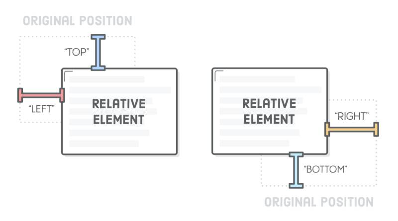
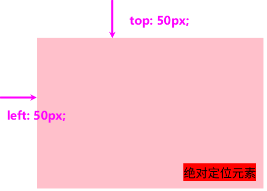
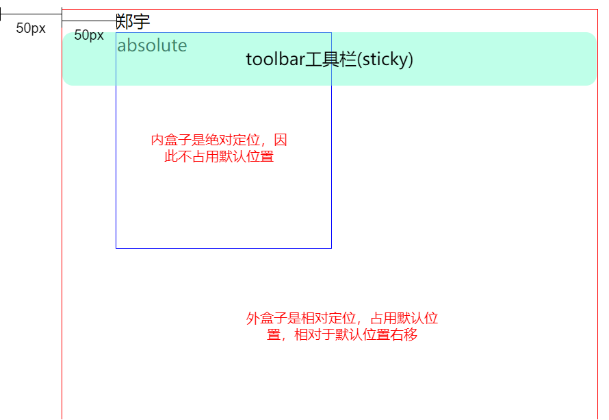
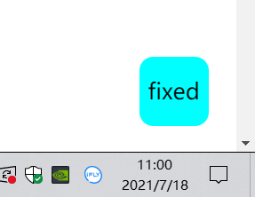

# CSS-position 关键字
## position 属性

| 值         | 定位参考               | 是否脱离文档流 | 常用场景                       |
| :--------- | :--------------------- | :------------- | :----------------------------- |
| `static`   | 无（正常流）           | 否             | 默认值，重置定位               |
| `relative` | 自身在正常流中的位置   | 否（保留占位） | 微调元素、作为绝对定位的包含块 |
| `absolute` | 最近的非 `static` 祖先 | 是             | 弹出层、图标、悬浮元素         |
| `fixed`    | 视口（viewport）       | 是             | 固定导航栏、回到顶部按钮       |
| `sticky`   | 滚动容器 + 父容器边界  | 否（混合）     | 吸顶效果、表头固定             |

## static

`static` 是 `position` 属性的默认值。如果省略 `position` 属性，浏览器就认为该元素是 `static` 定位。

这时，浏览器会按照源码的顺序，决定每个元素的位置，这称为 "正常的页面流"（normal flow）。每个块级元素占据自己的区块（block），元素与元素之间不产生重叠，这个位置就是元素的默认位置。

在 static 状态下 `top`、`bottom`、`left`、`right`、`z-index` 这四个属性无效。

## relative

相对于默认位置进行偏移，**元素仍在文档流中，保留原本占位空间**。必须搭配 `top`、`bottom`、`left`、`right` 这四个属性一起使用，用来指定偏移的方向和距离。



## absolute

**相对于上一级元素** 进行偏移，**元素完全脱离文档流，不占据空间**。

定位参考：**最近的非 `static` 祖先元素**（即 `position` 为 `relative`、`absolute`、`fixed` 或 `sticky` 的祖先）。如果不存在，则相对于 **初始包含块**（通常为 `<html>` 或视口，不同浏览器略微差异）。

`absolute` 定位也必须搭配 `top`、`bottom`、`left`、`right` 这四个属性一起使用。

```html
<style>
    .parent {
        position: relative;
        width: 300px;
        height: 200px;
        background: pink;
        left: 50px;
    	top: 50px;
    }
    .child {
        position: absolute;
        bottom: 10px;
        right: 10px;
        background: red;
    }
</style>

<div class="parent">
    <div class="child">绝对定位元素</div>
</div>
```


## fixed

`fixed` 表示，相对于视口（viewport，浏览器窗口）进行偏移，即定位基点是浏览器窗口。
它如果搭配 `top`、`bottom`、`left`、`right`  这四个属性一起使用，表示元素的初始位置是基于视口计算的。滚动页面时，元素位置固定不动。

常见：顶部导航栏、右侧悬浮客服按钮、回到顶部按钮。

```css
.fixed-header {
  position: fixed;
  top: 0;
  left: 0;
  width: 100%;
  background: white;
  z-index: 1000;
}
```

## sticky

`sticky` 表示混合模式，即 **相对定位+固定定位** 的效果。

它的具体规则是，当页面滚动，父元素开始脱离视口时（即部分不可见），只要与 `sticky` 元素的距离达到生效门槛，`relative` 定位自动切换为 `fixed` 定位；等到父元素完全脱离视口时（即完全不可见），`fixed` 定位自动切换回 `relative` 定位。

`sticky` 生效的前提是，必须搭配 `top`、`bottom`、`left`、`right` 这四个属性一起使用，不能省略，否则等同于 `relative` 定位，不产生 "动态固定" 的效果。原因是这四个属性用来定义 "偏移距离"，浏览器把它当作 `sticky` 的生效门槛。

```css
#toolbar {
  position: -webkit-sticky; /* safari 浏览器 */
  position: sticky; /* 其他浏览器 */
  top: 20px;
}
```
上面代码中，页面向下滚动时，`#toolbar` 的父元素开始脱离视口，**一旦视口的顶部与 `#toolbar` 的距离小于 20px**（门槛值），`#toolbar` 就自动变为 `fixed` 定位，保持与视口顶部 20px 的距离。页面继续向下滚动，父元素彻底离开视口（即整个父元素完全不可见），`#toolbar` 恢复成 `relative` 定位。

## 例子
```html
<!DOCTYPE html>
<html lang="en">

<head>
  <meta charset="UTF-8">
  <meta http-equiv="X-UA-Compatible" content="IE=edge">
  <meta name="viewport" content="width=device-width, initial-scale=1.0">
  <title>Document</title>
  <style>
    .container {
      width: 500px;
      height: 1500px;
      border: 1px solid red;
      /* 相对于根html节点 */
      position: relative;
      left: 50px;
    }

    .name {
      position: relative;
      left: 50px;
    }

    .box {
      width: 200px;
      height: 200px;
      border: 1px solid blue;
      position: absolute;
      left: 50px;
    }

    .navigation {
      width: 50px;
      height: 50px;
      border-radius: 10px;
      background-color: aqua;
      text-align: center;
      line-height: 50px;
      position: fixed;
      bottom: 20px;
      right: 20px;

    }

    .toolbar {
      width: 500px;
      height: 50px;
      background-color: rgba(127, 255, 212, 0.5);
      border-radius: 10px;
      text-align: center;
      line-height: 50px;

      position: sticky;
      top: 0px;
    }
  </style>
</head>

<body>
  <div class="container">
    <div class="name">郑宇</div>
    <div class="box">absolute</div>
    <div class="toolbar">toolbar工具栏(sticky)</div>
  </div>
  <nav class="navigation">fixed</nav>
</body>

</html>
```


fixed 是一直固定在右下角：



效果查看：[https://codepen.io/jonnylong/pen/poPPmrR](https://codepen.io/jonnylong/pen/poPPmrR)
