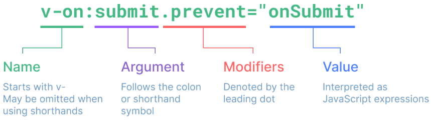

<script setup>
import Test from './Test.vue'
</script>


# Vue3 官方教程

## 一、基础

### 创建应用

```js
import { createApp } from 'vue'
import App from './App.vue'
// 创建应用实例
const app = createApp(App)
// 挂载应用到#app
app.mount('#app')
```

应用会暴露一个 `.config` 对象允许配置一些选项，如定义错误处理器，用来捕获所有子组件的错误：

```js
app.config.errorHandler = (err) => {}
```

应用实例还提供一些方法注册应用范围内可用的资源：
```js
// ElementPlus注册图标的例子
import * as ElementPlusIconsVue from '@element-plus/icons-vue'
const app = createApp(App)
for (const [key, component] of Object.entries(ElementPlusIconsVue)) {
  app.component(key, component)
}
```

### 模板语法

#### 文本插值

```vue
<span>Message: {{ msg }}</span>
```

#### 原始 HTML

使用 `v-html` 插入 HTML，最终会在 span 内部插入 rawhtml：

```vue
<p>Using v-html directive: <span v-html="rawHtml"></span></p>
```

> [!TIP]
>
> 指令由 `v-` 作为前缀，表明是 Vue 提供的特殊 attribute，它们将为渲染的 DOM 应用特殊的响应式行为。

#### 双向绑定

使用 `v-bind` 能响应式地绑定 attribute，当然 `v-bind` 可以省略：

```vue
<div v-bind:id="dynamicId"></div>
<div :id="dynamicId"></div>
<!-- 同名简写，与:id="id"相同，3.4版本以上支持 -->
<div :id></div>
```

布尔型 attribute：

```vue
<!-- 表示disabled为true -->
<button disabled>Button</button>
```

通过不带参数的 `v-bind`，可以绑定多个值到单个元素上：

```vue
<script setup>
const objectOfAttrs = {
  id: 'container',
  class: 'wrapper',
  style: 'background-color:green'
}
</script>
<div v-bind="objectOfAttrs"></div>
```

#### JavaScript 表达式

JavaScript 表达式能使用在如下场景：

- 文本插值（双大括号）
- 任何 Vue 指令（`v-` 开头的特殊 attribute）

```
{{ number + 1 }}
{{ ok ? 'YES' : 'NO' }}
{{ message.split('').reverse().join('') }}
<div :id="`list-${id}`"></div>
```

绑定表达式可以调用方法：

```vue
<time :title="toTitleDate(date)" :datetime="date">
  {{ formatDate(date) }}
</time>
```

如果不是单一表达式，是无效的：

```vue
<!-- 这是一个语句，而非表达式 -->
{{ var a = 1 }}
<!-- 条件控制也不支持，请使用三元表达式 -->
{{ if (ok) { return message } }}
```

#### 指令

动态参数：

这里的 `attributeName` 会作为一个 JavaScript 表达式被动态执行，计算得到的值会被用作最终的参数。

```vue
<a :[attributeName]="url"> ... </a>
<a @[eventName]="doSomething"> ... </a>
```

> [!warning]
>
> 注意：动态参数中的表达式值应当是字符串或 null，其他类型值会触发警告。

如果想传入复杂的动态参数，应使用计算属性或替换复杂表达式。

> [!CAUTION]
>
> 使用 DOM 内嵌模板 (直接写在 HTML 文件里的模板) 时，我们需要避免在名称中使用大写字母，因为浏览器会强制将其转换为小写。
>
> ```vue
> <a :[someAttr]="value"> ... </a>
> ```
>
> 上面的例子将会在 DOM 内嵌模板中被转换为 `:[someattr]`。如果你的组件拥有 “someAttr” 属性而非 “someattr”，这段代码将不会工作。

修饰符：

```vue
<!-- 对触发的事件调用 event.preventDefault() -->
<form @submit.prevent="onSubmit">...</form>
```



### 响应式基础

#### 声明响应式状态

使用 `ref()` 函数：

```js
import { ref } from 'vue'
const count = ref(0)
// 通过.value访问
console.log(count.value)
```

通过方法调用修改状态：

```vue
<script setup>
import { ref } from 'vue'
const count = ref(0)
function increment() {
  count.value++
}
</script>

<template>
  <button @click="increment">
    {{ count }}
  </button>
</template>
```

