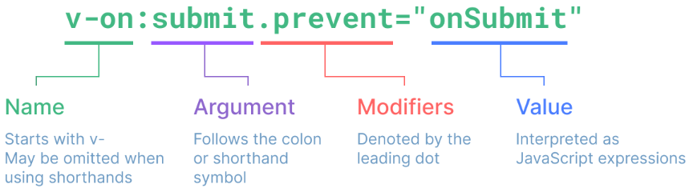
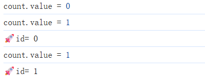
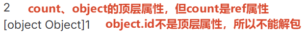
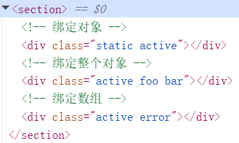

<script setup>
import Test from './Test.vue'
</script>


# Vue3 官方教程

## 一、基础

### 创建应用

```js
import { createApp } from 'vue'
import App from './App.vue'
// 创建应用实例
const app = createApp(App)
// 挂载应用到#app
app.mount('#app')
```

应用会暴露一个 `.config` 对象允许配置一些选项，如定义错误处理器，用来捕获所有子组件的错误：

```js
app.config.errorHandler = (err) => {}
```

应用实例还提供一些方法注册应用范围内可用的资源：
```js
// ElementPlus注册图标的例子
import * as ElementPlusIconsVue from '@element-plus/icons-vue'
const app = createApp(App)
for (const [key, component] of Object.entries(ElementPlusIconsVue)) {
  app.component(key, component)
}
```

### 模板语法

#### 文本插值

```vue
<span>Message: {{ msg }}</span>
```

#### 原始 HTML

使用 `v-html` 插入 HTML，最终会在 span 内部插入 rawhtml：

```vue
<p>Using v-html directive: <span v-html="rawHtml"></span></p>
```

> [!TIP]
>
> 指令由 `v-` 作为前缀，表明是 Vue 提供的特殊 attribute，它们将为渲染的 DOM 应用特殊的响应式行为。

#### 双向绑定

使用 `v-bind` 能响应式地绑定 attribute，当然 `v-bind` 可以省略：

```vue
<div v-bind:id="dynamicId"></div>
<div :id="dynamicId"></div>
<!-- 同名简写，与:id="id"相同，3.4版本以上支持 -->
<div :id></div>
```

布尔型 attribute：

```vue
<!-- 表示disabled为true -->
<button disabled>Button</button>
```

通过不带参数的 `v-bind`，可以绑定多个值到单个元素上：

```vue
<script setup>
const objectOfAttrs = {
  id: 'container',
  class: 'wrapper',
  style: 'background-color:green'
}
</script>
<div v-bind="objectOfAttrs"></div>
```

#### JavaScript 表达式

JavaScript 表达式能使用在如下场景：

- 文本插值（双大括号）
- 任何 Vue 指令（`v-` 开头的特殊 attribute）

```
{{ number + 1 }}
{{ ok ? 'YES' : 'NO' }}
{{ message.split('').reverse().join('') }}
<div :id="`list-${id}`"></div>
```

绑定表达式可以调用方法：

```vue
<time :title="toTitleDate(date)" :datetime="date">
  {{ formatDate(date) }}
</time>
```

如果不是单一表达式，是无效的：

```vue
<!-- 这是一个语句，而非表达式 -->
{{ var a = 1 }}
<!-- 条件控制也不支持，请使用三元表达式 -->
{{ if (ok) { return message } }}
```

#### 指令

动态参数：

这里的 `attributeName` 会作为一个 JavaScript 表达式被动态执行，计算得到的值会被用作最终的参数。

```vue
<a :[attributeName]="url"> ... </a>
<a @[eventName]="doSomething"> ... </a>
```

> [!warning]
>
> 注意：动态参数中的表达式值应当是字符串或 null，其他类型值会触发警告。

如果想传入复杂的动态参数，应使用计算属性或替换复杂表达式。

> [!CAUTION]
>
> 使用 DOM 内嵌模板 (直接写在 HTML 文件里的模板) 时，我们需要避免在名称中使用大写字母，因为浏览器会强制将其转换为小写。
>
> ```vue
> <a :[someAttr]="value"> ... </a>
> ```
>
> 上面的例子将会在 DOM 内嵌模板中被转换为 `:[someattr]`。如果你的组件拥有 “someAttr” 属性而非 “someattr”，这段代码将不会工作。

修饰符：

```vue
<!-- 对触发的事件调用 event.preventDefault() -->
<form @submit.prevent="onSubmit">...</form>
```



### 响应式基础

#### ref()

使用 `ref()` 函数：

```js
<script setup>
import { ref } from 'vue'
const count = ref(0)
function increment() {
  // 通过.value访问和修改
  count.value++
}
</script>

<template>
  <!-- 模板解包，不需要附带.value -->
  <button @click="increment">
    {{ count }}
  </button>
</template>
```

使用 ref 并改变其值时，Vue 会自动检测到变化并更新 DOM。当一个组件首次渲染时，Vue 会追踪在渲染过程中使用的每一个 ref。然后，当一个 ref 被修改时，它会触发追踪它的组件的一次重新渲染。

#### 深层响应性

ref 会使值具有深层响应性：

```js
import { ref } from 'vue'

const obj = ref({
  nested: { count: 0 },
  arr: ['foo', 'bar']
})

function mutateDeeply() {
  // 以下都会按照期望工作
  obj.value.nested.count++
  obj.value.arr.push('baz')
}
```

#### DOM 更新时机

当修改响应式状态时，DOM 会被自动更新。注意 DOM 更新不是同步的，在 `next tick` 更新周期中缓冲所有状态修改，每个组件都只会被更新一次。

`nextTick()` 可以在状态改变后立即使用，以等待 DOM 更新完成。

```vue
<script setup lang="ts">
import { ref, nextTick } from 'vue'

const count = ref(0)

async function increment() {
  console.log('count.value =', count.value)
  count.value++
  // DOM 还未更新
  console.log('count.value =', count.value)
  console.log('🚀id=', document.getElementById('counter').textContent) // 0
  await nextTick()
  // DOM 此时已经更新
  console.log('count.value =', count.value)
  console.log('🚀id=', document.getElementById('counter').textContent) // 1
}
</script>

<template>
  <div>
    <button id="counter" v-on:click="increment">{{ count }}</button>
  </div>
</template>
```



#### reactive()

reactive 使对象本身具有响应性。

```vue
<script setup lang="ts">
import { reactive } from 'vue'
const state = reactive({ count: 0 })
</script>

<template>
  <div>
    <button @click="state.count++">
      {{ state.count }}
    </button>
  </div>
</template>
```

reactive 返回的是原始对象的 Proxy，它和原始对象是不相等的。

```js
const raw = {}
const proxy = reactive(raw)

// 代理对象和原始对象不是全等的
console.log(proxy === raw) // false
```

为了爆炸访问一致性，对同一原始对象调用 reactive 总是返回同样的代理对象，而已存在的代理对象调用 reactive 会返回其本身：

```js
// 在同一个对象上调用 reactive() 会返回相同的代理
console.log(reactive(raw) === proxy) // true
// 在一个代理上调用 reactive() 会返回它自己
console.log(reactive(proxy) === proxy) // true
```

---

reactive 是有局限性的：

1.有限类型。只能用于对象类型（对象、数组、Map、Set 等），不能是原始类型（string、number、boolean）

2.不能替换整个对象

```js
let state = reactive({ count: 0 })
// 上面的 ({ count: 0 }) 引用将不再被追踪
// (响应性连接已丢失！)
state = reactive({ count: 1 })
```

3.解构会出现问题。解构操作会丧失响应式链接。

```js
const state = reactive({ count: 0 })
// 当解构时，count 已经与 state.count 断开连接
let { count } = state
// 不会影响原始的 state
count++
// 该函数接收到的是一个普通的数字
// 并且无法追踪 state.count 的变化
// 我们必须传入整个对象以保持响应性
callSomeFunction(state.count)
```

> [!TIP]
>
> 鉴于 reactive 这么多坑，建议使用 ref 为主要 API。

#### ref 解包细节

为了让 JavaScript 级别类型变得响应式，ref 把它包装成带有 `.value` 属性的对象。因此 Vue 提供解包机制。

1.在模板中，会自动解包，不用写 `.value`

2.作为 reactive 对象属性时，也会被自动解包。如果作为 shallowreactive 对象属性时，则不会自动解包。

```js
const count = ref(0)
// 自动解包
const state = reactive({
  count
})

console.log(state.count) // 0
state.count = 1
console.log(count.value) // 1
```

3.只有顶层的 ref 才会被解包

`count` 和 `object` 是顶级属性，但 `object.id` 不是

```js
<script setup lang="ts">
import { ref } from 'vue'
const count = ref(1)
const object = { id: ref(1) }
</script>

<template>
  <div>
    <div>{{ count + 1 }}</div>
    <div>{{ object.id + 1 }}</div>
  </div>
</template>
```



为了解决这个问题，可以将 id 解构为顶层属性，这时候渲染就正确了：

```vue
<script setup lang="ts">
import { ref } from 'vue'
const count = ref(1)
const object = { id: ref(1) }
// 解构为顶层属性
const { id } = object
</script>

<template>
  <div>
    <div>{{ count + 1 }}</div>
    <div>{{ id + 1 }}</div>
  </div>
</template>
```

### 计算属性

#### 基本使用

`computed()` 方法期望接收一个 getter 函数，返回计算属性 ref。和一般 ref 类似，可以通过 `.value` 访问，也会在模板中自动解包。计算属性会自动追踪响应式依赖，当依赖改变时候，会同步计算更新。

```js
import { reactive, computed } from 'vue'
const author = reactive({
  name: 'John Doe',
  books: [
    'Vue 2 - Advanced Guide',
    'Vue 3 - Basic Guide',
    'Vue 4 - The Mystery'
  ]
})
const publishedBooksMessage = computed(() => {
  return author.books.length > 0 ? 'Yes' : 'No'
})
```

使用方法调用也能实现功能：
```js
// 组件中
function calculateBooksMessage() {
  return author.books.length > 0 ? 'Yes' : 'No'
}
```

从结果上看两种完全相同，但 **计算属性会基于响应式依赖被缓存**，只要 `author.books` 不改变无论访问多少次 publishedBooksMessage 都是先前结果。

> [!CAUTION]
>
> 注意：**计算属性的 getter 应该只做计算而没有其他任何副作用**。不要改变其他状态、更不能做异步请求、更改 DOM。
>
> ```js
> // 错误的写法：计算属性里面更改状态或异步请求
> const badComputed = computed(() => {
>   // 更改状态
>   count.value++
>   // 异步
>   return fetch(...)
> })
> ```

> [!WARNING]
>
> 计算属性返回值不要写成函数，虽然能用，但彻底破坏缓存机制，每次访问都会返回一个新函数。
>
> ```js
> const computedFn = computed(() => {
>   return (param) => param * count.value
> })
> // 模板中调用：{{ computedFn(5) }}
> ```

#### setter 属性

```js
import { ref, computed } from 'vue'

const firstName = ref('John')
const lastName = ref('Doe')

const fullName = computed({
  // getter
  get() {
    return firstName.value + ' ' + lastName.value
  },
  // setter
  set(newValue) {
    // 注意：我们这里使用的是解构赋值语法
    [firstName.value, lastName.value] = newValue.split(' ')
  }
})
```

当运行 `fullName.value = 'John Doe'` 时，setter 会被调用而 `firstName` 和 `lastName` 会随之更新。

#### 获取上一个值

getter 可以传入参数，第一个参数能获取计算属性返回的上一个值：

```js
const alwaysSmall = computed((previous) => {
  if (count.value <= 3) {
    return count.value
  }
  return previous
})
```

### 类和样式的绑定

#### 绑定 class

```vue
<script setup lang="ts">
import { ref } from 'vue'
const classObject = ref({
  active: true,
  'foo': true,
  'bar': true,
})
</script>

<template>
  <section>
    <!-- 绑定对象 -->
    <div
      class="static"
      :class="{ active: true, 'text-danger': false }"
    ></div>
    <!-- 绑定整个对象 -->
    <div :class="classObject"></div>
    <!-- 绑定数组 -->
    <div :class="['active', 'error']"></div>
  </section>
</template>
```



封装的组件，也是可以使用 class 的，这些 class 会被添加到根元素上并与已有的合并。如果组件有多个根元素，通过组件的 `$attrs` 属性来指定接收的元素：

```vue
<p :class="$attrs.class">Hi!</p>
<span>This is a child component</span>
```

#### 绑定 style

```vue
<script setup lang="ts">
import { ref } from 'vue'
const styleObject = ref({
  color: 'cyan',
  fontWeight: 'bolder',
})
const overrideStyle = ref({
  color: 'orange',
  fontSize: '24px',
})
</script>

<template>
  <section>
    <!-- 绑定对象 -->
    <div :style="{ color: 'red', fontSize: '20px' }">纸上得来终觉浅，绝知此事要躬行</div>
    <!-- 绑定整个对象 -->
    <div :style="styleObject">纸上得来终觉浅，绝知此事要躬行</div>
    <!-- 绑定对象数组 -->
    <div :style="[styleObject, overrideStyle]">纸上得来终觉浅，绝知此事要躬行</div>
  </section>
</template>
```


### 条件渲染

#### v-if

- `v-if`
- `v-else`
- `v-else-if`

> [!TIP]
>
> `v-if` 可以用在 `<template>` 上的，最终渲染结果不包含这个 `<template>` 元素。

```vue
<div v-if="type === 'A'">A</div>
<div v-else-if="type === 'B'">B</div>
<div v-else>Not A/B</div>
```

#### v-show

元素始终存在于 DOM 树中，切换 `display` 的 CSS 属性。

```vue
<h1 v-show="ok">Hello!</h1>
```

#### 区别

|                  | v-if                                                         | v-show                                                    |
| ---------------- | ------------------------------------------------------------ | --------------------------------------------------------- |
| 核心机制         | 条件渲染：为 false 时，会从 DOM 树上把元素删掉；为 true 时，会重新从头创建这个元素及其所有子组件。 | 条件显示：元素始终存在于 DOM 树中，切换 `display` 的 CSS 属性。 |
| `<template>` 使用 | 可以使用                                                     | 不能使用                                                  |
| 生命周期 | 切换时内部组件会经历完整生命周期 | 不触发生命周期 |

### 列表渲染

#### v-for

```vue
<script setup lang="ts">
import { ref } from 'vue'
const messageList = ref([
  { message: 'Foo', id: 1},
  { message: 'Bar', id: 2},
  { message: 'Batterfly', id: 3},
])

const myObject = ref({
  title: 'How to do lists in Vue',
  author: 'Jane Doe',
  publishedAt: '2016-04-10'
})
</script>

<template>
  <!-- 访问对象数组，对象可以结构访问 -->
  <div v-for="({ message, id }, index) in messageList" :key="id">{{ index }} - {{ message }}</div>
  <!-- 迭代器语法访问 -->
  <div v-for="({ message, id }) of messageList" :key="id">{{ message }}</div>
  <!-- 访问对象 -->
  <div v-for="(v, k, i) in myObject" :key="i">{{ i }}- {{ k }} - {{ v }}</div>
  <!-- 使用范围值 -->
  <div v-for="n in 10" :key="n">{{ n }}</div>
</template>
```

#### 优先级

当它们同时存在于一个节点上时，`v-if` 比 `v-for` 的优先级更高。这意味着 `v-if` 的条件将无法访问到 `v-for` 作用域内定义的变量别名：

```vue
<!--
 这会抛出一个错误，因为属性 todo 此时
 没有在该实例上定义
-->
<li v-for="todo in todos" v-if="!todo.isComplete">
  {{ todo.name }}
</li>
```

正确写法，包装一层 `<template>` 再在其上使用 `v-for`：

```vue
<template v-for="todo in todos">
  <li v-if="!todo.isComplete">
    {{ todo.name }}
  </li>
</template>
```

#### 通过 key 管理状态

为了给 Vue 一个提示，以便它可以跟踪每个节点的标识，从而重用和重新排序现有的元素，你需要为每个元素对应的块提供一个唯一的 `key` attribute：

```vue
<template v-for="todo in todos" :key="todo.name">
  <li>{{ todo.name }}</li>
</template>
```

#### 组件使用 v-for

子组件：

```vue
<script setup>
defineProps(['title'])
defineEmits(['remove'])
</script>

<template>
  <li>
    {{ title }}
    <button @click="$emit('remove')">Remove</button>
  </li>
</template>
```

父组件调用：

```vue
<todo-item
  v-for="(todo, index) in todos"
  :key="todo.id"
  :title="todo.title"
  @remove="todos.splice(index, 1)"
></todo-item>
```

#### 数组变化侦测

变更方法：调用后对原数组进行变更。

- `push()`
- `pop()`
- `shift()`
- `unshift()`
- `splice()`
- `sort()`
- `reverse()`

不可变（immutable）方法：不会更改原数组，总是返回一个新数组。

- `filter()`
- `concat()`
- `slice()`

对于非变更方法时候，需要进行数组替换：

```js
// `items` 是一个数组的 ref
items.value = items.value.filter((item) => item.message.match(/Foo/))
```

在计算属性中使用 `reverse()` 和 `sort()` 的时候务必小心！这两个方法将变更原始数组，计算函数中不应该这么做。请在调用这些方法之前创建一个原数组的副本：

```JS
return numbers.reverse()	// [!code --]
return [...numbers].reverse()	// [!code ++]
```

### 事件

使用 `v-on` 指令 (简写为 `@`) 来监听 DOM 事件，并在事件触发时执行对应的 JavaScript。用法：`v-on:click="handler"` 或 `@click="handler"`。

#### 事件处理器

内联事件处理器：事件被触发时执行的内联 JavaScript 语句 (与 `onclick` 类似)。

```vue
<script setup>
function warn(message, event) {
  // 这里可以访问原生事件
  if (event) {
    event.preventDefault()
  }
  alert(message)
}
</script>

<template>
    <button @click="count++">Add 1</button>
    <!-- 使用特殊的 $event 变量 -->
    <button @click="warn('Form cannot be submitted yet.', $event)">
      Submit
    </button>
    <!-- 使用内联箭头函数 -->
    <button @click="(event) => warn('Form cannot be submitted yet.', event)">
      Submit
    </button>
</template>
```

方法事件处理器：一个指向组件上定义的方法的属性名或是路径。

```vue
<script setup>
const name = ref('Vue.js')

function greet(event) {
  alert(`Hello ${name.value}!`)
  // `event` 是 DOM 原生事件
  if (event) {
    alert(event.target.tagName)
  }
}
</script>

<template>
	<button @click="greet">Greet</button>
</template>
```

#### 事件修饰符

- `.stop`：阻止冒泡，调用 `event.stopPropagation()`
- `.prevent`：阻止默认行为（入 form 表单提交、a 链接跳转）
- `.self`：只触发自身。子元素冒泡上来的事件，不会触发该元素的监听。
- `.capture`：捕获模式
- `.once`：只执行一次后自动移除。
- `.passive`：提升滚动性能。告诉浏览器“该监听器 **不会** 调用 `preventDefault()`”，让浏览器立即滚动，不用等待 JS 执行完毕。

#### 按键修饰符

键盘按键：

- `.enter`
- `.tab`
- `.delete` (捕获“Delete”和“Backspace”两个按键)
- `.esc`
- `.space`
- `.up`
- `.down`
- `.left`
- `.right`
- `.ctrl`
- `.alt`
- `.shift`
- `.meta`

鼠标：

- `.left`
- `.right`
- `.middle`

特殊：

- `.exact`：允许精确控制触发事件所需的系统修饰符的组合

```vue
<!-- 当按下 Ctrl 时，即使同时按下 Alt 或 Shift 也会触发 -->
<button @click.ctrl="onClick">A</button>
<!-- 仅当按下 Ctrl 且未按任何其他键时才会触发 -->
<button @click.ctrl.exact="onCtrlClick">A</button>
```

### 双向绑定

#### 基本用法

处理表单时候，正常需要受到连接值绑定和更改事件监听器：

```vue
<input :value="text" @input="event => text = event.target.value">
```

但 `v-model` 简化这一步骤：

```vue
<input v-model="text">

<select v-model="selected" multiple>
  <option>A</option>
  <option>B</option>
  <option>C</option>
</select>
```

#### 值绑定

