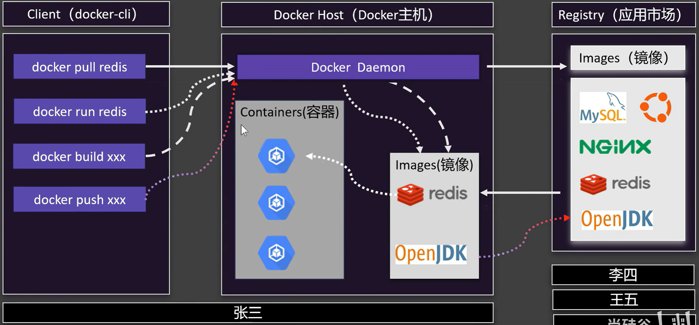
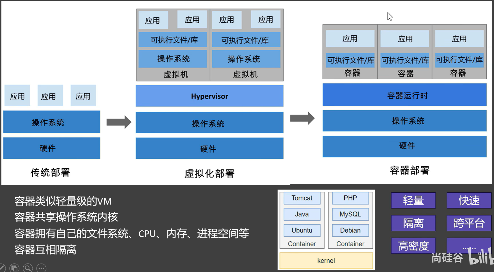
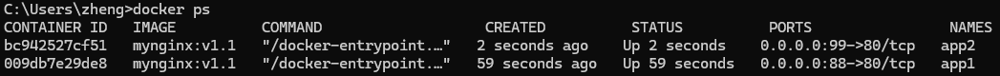
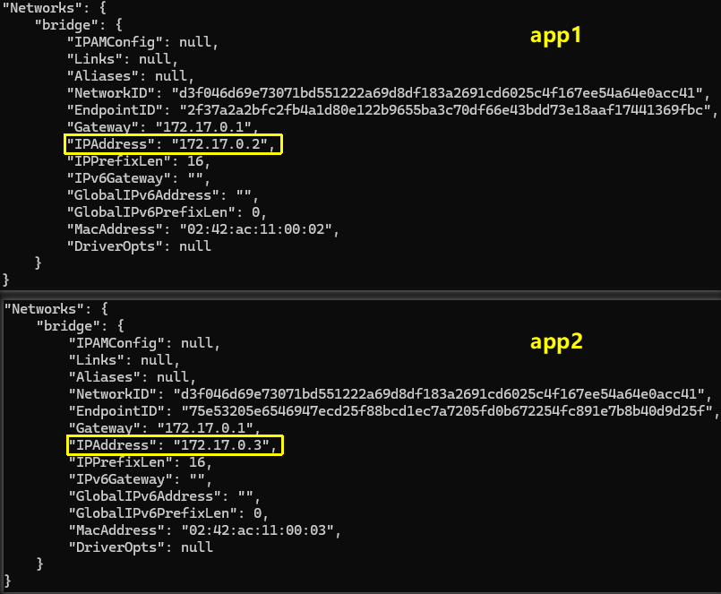
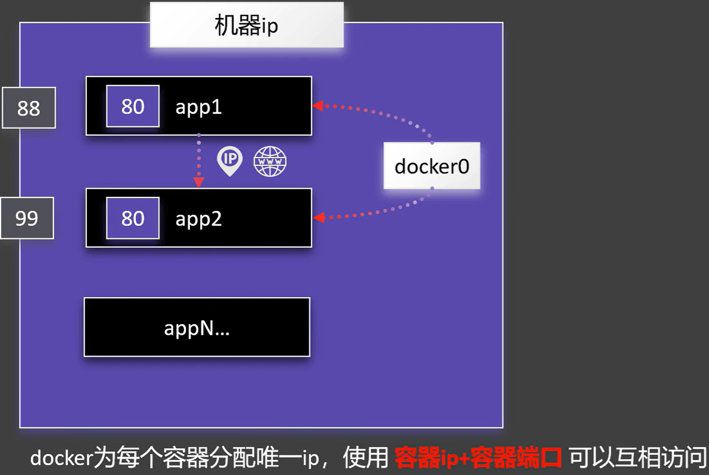
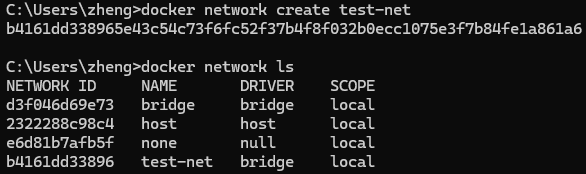
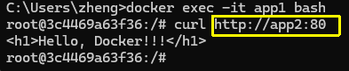
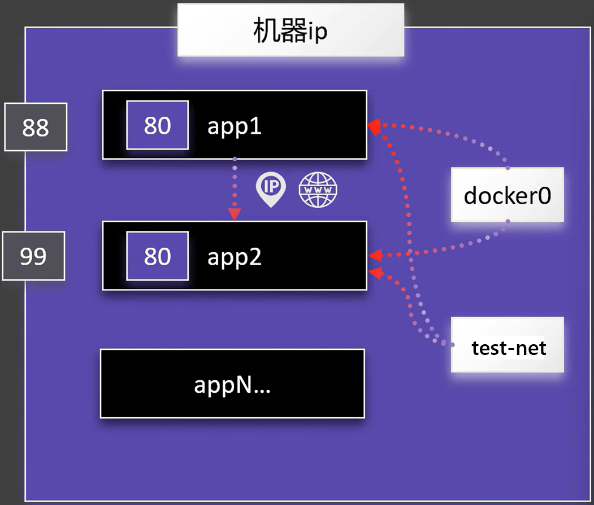
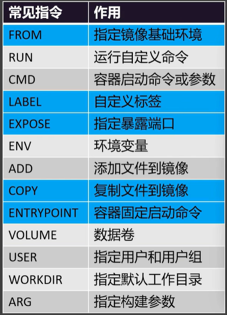

# Docker 尚硅谷速通

## 一、初识 Docker

### Docker 架构与容器化

`docker pull redis`：连接 Docker 应用市场，下载 redis 镜像到本机

`docker run redis`：在本机找 redis 镜像，并启动 redis 应用，启动的应用称作 **容器**。

`docker build xxx`：制作镜像

`docker push xxx`：推动制作的镜像到应用市场

> [!tip]
>
> 镜像可以理解为软件包，而容器则理解为通过软件包启动的应用。



理解容器：



### 安装 Docker Engine

#### Debian

```bash
# 删除旧版本
sudo apt remove $(dpkg --get-selections docker.io docker-compose docker-doc podman-docker containerd runc | cut -f1)
# 设置Docker的apt仓库
## 添加 Docker 的官方 GPG 密钥
sudo apt update
sudo apt install ca-certificates curl
sudo install -m 0755 -d /etc/apt/keyrings
sudo curl -fsSL https://download.docker.com/linux/debian/gpg -o /etc/apt/keyrings/docker.asc
sudo chmod a+r /etc/apt/keyrings/docker.asc
## 将仓库添加到Apt源中
sudo tee /etc/apt/sources.list.d/docker.sources <<EOF
sudo apt update
# 安装Docker软件包
sudo apt install docker-ce docker-ce-cli containerd.io docker-buildx-plugin docker-compose-plugin
# 验证Docker是否启动
sudo systemctl status docker
# 手动启动Docker
sudo systemctl start docker
# 开机启动Docker
sudo systemctl enable docker --now
```

## 二、命令

### 镜像操作

- `docker search nginx`：搜索 Docker Hub 中与 nginx 相关的镜像。
- `docker pull nginx`：下载最新版本的 nginx 镜像。
- `docker pull nginx:1.26.0`：下载指定版本（1.26.0）的 nginx 镜像。
- `docker images`：列出本地已下载的所有镜像。
- `docker rmi IMAGE-ID`：根据指定的镜像 ID 删除本地镜像。


### 容器操作

- `docker run nginx`：启动容器
- `docker run -d --name mynginx -p 8080:80 nginx`：在后台运行基于 nginx 镜像的容器并命名为 mynginx，将 nginx 的 80 端口映射到外部的 8080，能通过 `http://localhost:8080` 访问到。
  - `-d`：后台运行
  - `--name mynginx`：为容器指定名称
  - `-p 8080:80`：端口映射
- `docker ps`：查看运行的容器
- `docker ps -a`：查看所有容器，包括未运行的
- `docker start xxx`：启动容器
- `docker stop xxx`：停止容器
- `docker restart xxx`：重启容器
- `docker stats CONTAINER-ID`：查询容器状态
- `docker logs CONTAINER-ID`：查询容器日志
- `docker rm CONTAINER-ID`：删除容器
- `docker exec -it CONTAINER-ID /bin/bash`：进入容量内部的文件系统

```bash
C:\Users\zheng>docker exec -it d488a0d22ff0 /bin/bash
root@d488a0d22ff0:/# cd /usr/share/nginx/html
root@d488a0d22ff0:/usr/share/nginx/html# ls
50x.html  index.html
root@d488a0d22ff0:/usr/share/nginx/html# cat > index.html << 'EOF'
<h1>Hello, Docker!!!</h1>
EOF
root@d488a0d22ff0:/usr/share/nginx/html# cat index.html
<h1>Hello, Docker!!!</h1>
root@d488a0d22ff0:/usr/share/nginx/html# exit
exit
```

### 保存分享镜像

- `docker commit`：从容器创建镜像
  - `docker commit -m "update index.html" myngnix mynginx:v1.1`：根据容器 myngnix 创建镜像 `myngix:v1.1`，提交信息为 `update index.html`
- `docker save`：保存镜像
  - `docker save -o mynginx.tar mynginx:v1.1`：保存镜像 `mynginx:v1.1` 为 `mynginx.tar`
- `docker load`：加载镜像
  - `docker load -i mynginx.tar`：加载 `mynginx.tar` 镜像
- `docker login`：登录 Docker
- `docker tag`：设置标签
- `docker push`：推动到 docker hub 远端仓位

## 三、存储和网络

### 目录挂载

`-v /app/nghtml:/usr/share/nginx/html`：目录挂载。将本机的 `/app/nghtml` 目录挂载到 docker 容器中的 `/usr/share/nginx/html`，这样不用进入容器内部，只需要修改本机的文件就行。而且当前容器被删除时，本机目录数据没被删除，后续再次创建新容器也能使用 `/app/nghtml` 下的数据。

### 卷映射

`-v ngconf:/etc/nginx`：卷映射。在目录 `/var/lib/docker/volumes/<volume-name>` 可以查看到卷。将本机 docker 的 `ngconf` 卷映射到 `/etc/nginx` 目录。

- `docker volume create <volume-name>`：创建卷
- `docker volume ls`：查看卷列表
- `docker volume inspect <volume-name>`：查看卷

### 自定义网络

执行 `docker run -d -p:88:80 --name app1 mynginx:v1.1` 和 `docker run -d -p:99:80 --name app2 mynginx:` 创建两个容器：



执行 `docker container inspect app1` 和 `docker container inspect app2`，查看容器内部情况，可以找到内部的 IP 地址。而网关就是共同的 `172.17.0.1`。



而两个容器之间是可以通过共同网关互相访问的，只需要使用 `容器IP+容器端口` 就行。



---

默认的 docker0 就是桥接网络，当然是可以自定义的：



以新桥接网络创建两个新容器 `docker run -d -p 88:80 --network test-net --name app1 mynginx:v1.1`。

这样就能在 app1 容器通过域名访问到 app2 了：





## 四、Dockers Compose

- `docker compose up -d`：上线
- `docker compose down`：下线
- `docker compose start x1 x2 x3`：启动
- `docker compose stop x1 x2 x3`：停止
- `docker compose scale x2=3`：扩容

`compose.yaml`例子：

```yaml
version: '3.8'
services:
  mysql:
    image: mysql:8.0
    container_name: mysql_db
    restart: always
    environment:
      MYSQL_ROOT_PASSWORD: 123456
      MYSQL_DATABASE: app_db
      MYSQL_USER: app_user
      MYSQL_PASSWORD: app_pass
    volumes:
      - mysql_data:/var/lib/mysql
    ports:
      - "3306:3306"
    networks:
      - app_network

  nginx:
    image: nginx:latest
    container_name: web_server
    restart: always
    ports:
      - "80:80"
      - "443:443"
    volumes:
      - ./nginx/conf.d:/etc/nginx/conf.d
      - ./html:/usr/share/nginx/html
    depends_on:
      - mysql
    networks:
      - app_network

volumes:
  mysql_data:

networks:
  app_network:
    driver: bridge
```

## 五、Dockerfile

[Dockerfile reference | Docker Docs](https://docs.docker.com/reference/dockerfile/)



具体如何书写，需要结合项目实践。


