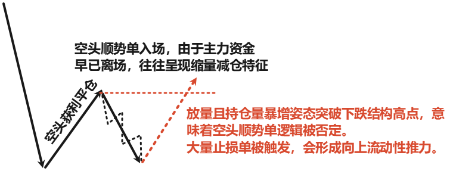

# ⭐右侧交易的起爆点

真正的安全感，不来自预判，来自你对对手盘资金防守逻辑的彻底证伪。

价格在跌破前期调整高点后，会持续寻求更低的价值区间进行筹码交换。这个过程由空头资金持续压制，形成一段具有统治力的下行趋势结构。你需要标记这段下跌的起始高点，以及被不断向下刷新低点的过程，这构成了空方控盘的主维度框架。但等待这个宏观结构被破坏，仅仅是逻辑链条的第一环。

当主要的下行结构运行至末端，盘面通常会催生出一段由空头获利平仓所驱动的技术性反弹。这段反弹的本质并非主动性买盘的回归，很多时候是一次流动性陷阱。它利用短暂的强势，吸引那些此前踏空、正迫切寻求顺势做空机会的资金集中入场。当这段回补动能耗尽，价格再一次向下进行试探，便构筑出了一个次级别的下跌结构。这个位置，才是多空双方在微观层面的真正角力点。因为它密集地聚集了这一阶段内最坚定、最顺势的那一批空头头寸，而他们的防守止损单，通常就机械性地挂在这个子结构的起始高点上方。

次级下跌结构的成立，什么时候才算真正出现，价格的幅度没有太大参考价值，必须引入持仓量的量化验证。你需要观察到在这段反弹修正中，总持仓量出现显著且持续的萎缩。这表面主导前期下跌的空头主力，正利用反弹进行大规模主动平仓，而非建立新的攻势。这种由空头回补驱动的价格修正，本质上是一种被动失衡，是空方撤退造成的短暂流动性真空，并非多头在主动进攻。

当空头回补的动力耗尽，价格会自然向下进行二次测试。但这一波下压，由于主力资金早已离场，往往呈现出缩量减仓的特征，下跌斜率钝化，K线实体持续收敛。这个无法创出新低、波动率与持仓量均极度压缩的第二次下探，就是我们一直在等待的那个小时间下跌结构。

此时的盘面语言在告诉你，卖方流动性已经彻底枯竭，而下方恰好又是前期多头赖以生存的关键支撑区域。走到这一步，极限入场的逻辑就形成了。我们并非看到宏观大趋势逆转才入场，那已经太迟且止损成本过高。我们等待的，是那个**聚集了最多顺势做空订单的子结构，被反向的主动失衡力量彻底贯穿。当价格以放量且持仓量同步暴增的姿态，果断突破这个小时间下跌结构的高点时，意味着在这个局部区域，绝大多数空头的逻辑被市场彻底否定。**他们的止损单被强制触发，形成向上的流动性推升力，而你的多单，恰好就坐在这个推升的起点上。

::: details 批注

:::

多空博弈多空博弈，逻辑是对称的，这个入场点，就是空头资金逻辑被证伪，当然就是多头资金的起爆点。止损可以直接放置在这个被破坏的小时间下跌结构的最低点下方。因为一旦这个位置被有效跌穿，说明空头力量重新掌握了定价权，形成了新的下跌秩序，你入场的逻辑前提自然失效。止损距离足够紧凑，逻辑足够清晰，才是右侧交易最重要的艺术。

熟练掌握，自然就会重仓，自然知道怎么在这个市场合法抢钱。