# 期货大资金投机系统 v1 版

## 市场结构分析

### 线段的定义

## 市场力量分析

### 冲力

```
0:0;

// 观察的K线根数，可调整（如5、10、14
N:=9;
净动能:= (2*C - H - L)/REF(C,1)*100;
总能耗:= SUM(ABS(净动能), N);
// 期末净动能百分比
价格净变化:= (C - REF(C,N)) / REF(C,N) * 100;
冲力系数:= IF(总能耗>0.01, 价格净变化 / 总能耗, 0);

// MACD参数
SHORT:=5;
LONG:=20;

冲力5日平滑: EMA(冲力系数, SHORT), COLORWHITE;
冲力20日平滑:= EMA(冲力系数, LONG), COLORYELLOW;
DIFF:= 冲力5日平滑 - 冲力20日平滑, COLORRED;
DEA:= EMA(DIFF, N), COLORGREEN;
冲力变化速率: (DIFF - DEA) * 2, COLORGRAY;

冲力变化速率死叉零轴:= 冲力变化速率<=0 AND REF(冲力变化速率, 1)>0;
冲力变化速率金叉零轴:= 冲力变化速率>=0 AND REF(冲力变化速率, 1)<0;
DRAWICON(冲力变化速率死叉零轴, 冲力5日平滑, 'ICO4');
DRAWICON(冲力变化速率金叉零轴, 冲力5日平滑, 'ICO3');
```

### 假突破和真突破

假突破定义：价格对某一价位突破后失败，又回到原先位置。

市场中充满了假突破，可以说大部分突破行为最终都是假突破，在假突破位置追涨杀跌，就会被套住，然后频繁止损。**假突破能实现流动性清洗，让本来持仓的单子被迫挂单成交。**


真突破：价格对某一价格突破后短时间内没用再回到原先位置。

真突破出现时候往往是两种情况：

1. 价格以大阳线或大阴线突破，随后价格走了很远没回来。
2. 价格突破后出现 K 线回调，最终走了很远没回来。


### 水平阻力位

阻力位定义：**价格两次以上** 到达同一水平位置价格受阻。

受阻行为：价格到达某一关键水平位置后出现假突破，K 线会出现长上影线/长下影线，或者 2~3 根反包 K 线。

**阻力位附近的价格行为观察是非常重要的**！因为价格可能突破，也可能再次受阻导致价格反向。


### 交易区间的力量分析

1.到达阻力位后返回，说明维持 **均衡** 交易区间状态

2.**下跌段低点未接触到下方阻力位就返回，说明偏多；上涨段高度未接触到上方阻力位就返回，说明偏空。阻力位抬高，说明偏多；阻力位降低，说明偏空。**【主要判断力量不均衡的方式】

如图是 PTA2609 合约 5 分钟走势图，可以看到在两个阻力位限定的交易区间内部，出现下跌段未接触下方阻力位就返回，说明偏多。


如图是焦煤 2609 合约 5 分钟走势图，可以看到是交易区间，价格以突破后，**支阻互换且低点抬高，说明多头偏强**，是不错的开多位置。


3.穿过阻力位置，构成真突破

如图是菜油 2609 合约 5 分钟走势图，① 处出现真突破上破阻力位，说明多头偏强。随后在 ② 处构建了新的上方阻力位，相对于之前上方阻力位抬高，说明多头偏强。那么此时是绝对不能做空的。


### EMA 阻力位

在趋势行情中，5F 的 EMA20、30F 的 EMA20 是可以作为本级别的阻力位的，宽通道的回调往往是到达 EMA20 受阻后继续延续之前方向运动。

> [!CAUTION]
>
> 在盘整行情中，不能使用 EMA 阻力位。

在盘整行情中，不能使用 EMA 阻力位。

如图是菜油 2609 合约 5 分钟走势图，可以看到是一段非常明显的趋势行情，虽然后续趋向性不断衰弱，但仍旧是在回调到 EMA20 受阻后继续维持上涨趋势的。


### 反转

根据长期观察，反转无非就是下面三种图形，其中 1 是出现概率最大，2 次之，3 最小。可以说绝大多数反转都是要经历交易区间进行状态转化，然后才有走势反转。

当然在某些情况直接 V 型反转，这个概率就更小了，一般来说是受到消息或者外盘影响居多。

#### 1.交易区间两次以上受阻

三种情况都符合 2 次受阻，就是价格朝某个方向运动，对某个点位之后 2 次都突破不了：

- 假突破+低点抬高
- 2 次假突破
- 2 次低点抬高

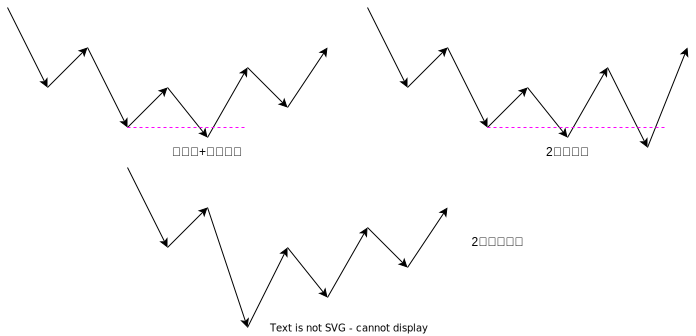

在一些技术分析中，会提到双底、头肩底图形，但实战下来双底效果并不好，单纯的看头肩底图形也不太行，有时候头肩底的底过低，对左肩突破远离太远，此时右肩要求一次其实就不太合适了。综合来说，**要求两次受阻是操作反转胜率最高且又不会太多错过机会的选择**。

#### 2.三推楔形

三推楔形的特点是斜率较小的宽通道，且最后一推要构成假突破，当符合这样的结构时候，预示着反转。

如图是豆一 2609 合约 30F 走势图，可以看到 4H 回调段经过 30F 构成的三推楔形完成终结，最终迎来一段较大幅度的上涨。

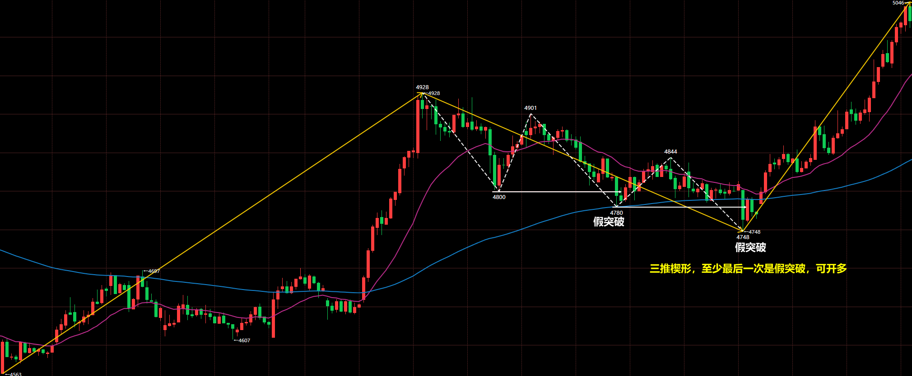

#### 3.突破交易区间后回拉

有些时候，价格会突破交易区间然后会拉，从 K 线间隔数量上看又不是假突破，但是有假突破的意味的，就是流动性清洗。当价格后续回到区间内时候则可以开仓。

如图是不锈钢 2607 合约 5F 走势图，可以看到价格下破交易区间下轨间隔一段时间后回拉，此时可开多。

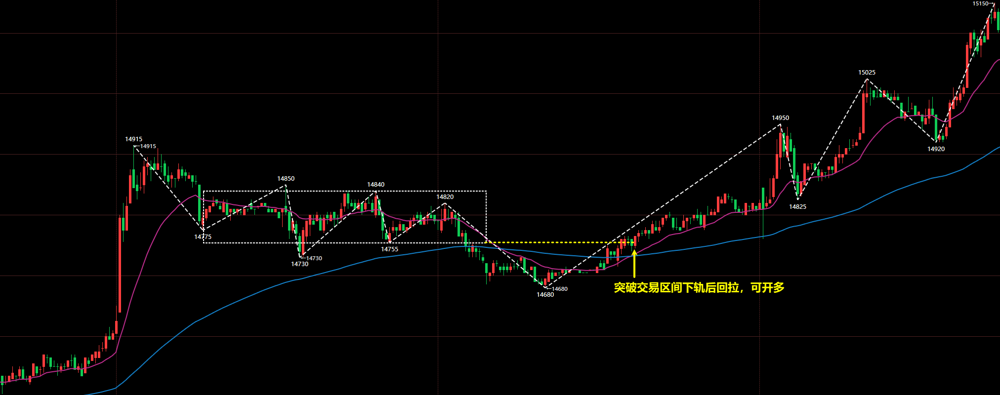

## 敛散分析

### 收敛与发散的循环

无论哪个级别，市场始终处于发散和收敛的循环。

### ADX 指标

```
N:=14;      // ADX周期，可自行修改
20:20;     // 阈值线，可自行修改

// 真实波幅 TR
TR0:=MAX(HIGH-LOW, ABS(HIGH-REF(CLOSE,1)));
TR:=MAX(TR0, ABS(LOW-REF(CLOSE,1)));

// 方向移动 +DM 与 -DM
DM_PLUS:=IF(HIGH-REF(HIGH,1) > REF(LOW,1)-LOW, MAX(HIGH-REF(HIGH,1),0), 0);
DM_MINUS:=IF(REF(LOW,1)-LOW > HIGH-REF(HIGH,1), MAX(REF(LOW,1)-LOW,0), 0);

// Wilder 平滑（相当于 SMA(X,N,1)）
SMOOTH_TR:=SMA(TR,N,1);
SMOOTH_DMP:=SMA(DM_PLUS,N,1);
SMOOTH_DMM:=SMA(DM_MINUS,N,1);

// DI+ 与 DI- （仅内部计算用，不绘制）
DI_PLUS:=SMOOTH_DMP/SMOOTH_TR*100;
DI_MINUS:=SMOOTH_DMM/SMOOTH_TR*100;

// DX 与 ADX
DX:=IF(DI_PLUS+DI_MINUS=0, 0, ABS(DI_PLUS-DI_MINUS)/(DI_PLUS+DI_MINUS)*100);
ADX:MA(DX,N);
```

### ADX 分析

#### ADX 收敛与发散

#### 敛散性对行情影响

## 比价与共振

## 短线投机的交易哲学

### 大行情不相连

### 市场的不确定性

### 短线投机的目标

### 有些行情注定难以操作

## 风控设计

### 风控目标

以 100 万模拟账户为基准进行仓位设计，要求盘整动态回撤小于 6%，静态权益回撤小于 5%。

### 开仓手数

可以通过如下公式，把盘面价格波动和账户对应，即盘面波动 1%对应账户波动 1%：
$$
一万近似跳动 =\lfloor \frac{10000 *最小变动单位}{当前价格* 一手最小波动*0.01} \rfloor
$$

> [!WARNING]
>
> 由于有些品种如焦煤、多晶硅波动较大，所以会在映射的结果上稍微减少手数。

| 品种   | 合约前缀 | 最小变动单位 | 一手最小波动 | 100 万资金开仓手数 |
| ------ | -------- | ------------ | ------------ | ----------------- |
| 焦煤   | jm       | 0.5          | 30           | 10               |
| 铁矿石 | i        | 0.5          | 50           | 10                |
| 烧碱   | SH       | 1            | 30           | 16                |
| 甲醇   | MA       | 1            | 10           | 30                |
| 乙二醇 | eg       | 1            | 10           | 20                |
| 苯乙烯 | eb       | 1            | 5            | 22                |
| PTA    | TA       | 2            | 10           | 30                |
| 塑料   | l        | 1            | 5            | 25                |
| 豆一   | a        | 1            | 10           | 20                |
| 菜粕   | RM       | 1            | 10           | 40                |
| 橡胶   | ru       | 5            | 50           | 5                 |
| 菜油   | OI       | 1            | 10           | 10                |
| 棕榈油 | p        | 2            | 20           | 10                |
| 沪镍   | ni       | 10           | 10           | 6                 |
| 沪锡   | sn       | 10           | 10           | 2                 |
| 鸡蛋   | jd       | 1            | 10           | 22                |
| 多晶硅 | ps | 5 | 15 | 4 |

### 持仓数量

为了避免同时回撤大幅回撤打到 6%，所以规定 **品种持仓最多为 4 个，且这 4 个品种要分属于不同板块**。

## 综合分析

市场的分析由四个方面影响：市场结构、力量、周期轮转、品种共振。

### 分析步骤

#### Step1：市场结构和力量

1.分析 30F

从 30F 级别主要得到两个结论：30F 线段方向、30F 阻力位。

首先的当前 30F 方向，然后分析当前 30F 线段类型，标记 30F 级别的潜在阻力位到 5F 图上。30F 是趋势推动段或趋势回调段，那么 EMA120 就是阻力位；30F 是区间内部段，那么 30F 交易区间上下轨就是阻力位。

2.分析 5F

5F 主要得到两个结论：5F 市场状态

**如果对某个位置连续两次突破都受阻，那么考虑 30F 线段可能反向。如果没有，都按照 30F 线段延续。**

#### Step2：ADX 分析

ADX 是收敛、蓄力、发散的哪种情况。

当发散时候，是偏多还是偏空。收敛时候，要注意价格运动空间有限。

#### Step3：品种共振

当同板块的其他品种也出现开仓点时候，开仓的成功率会大幅增高。

### 分析案例

#### RM609 2026/6/10

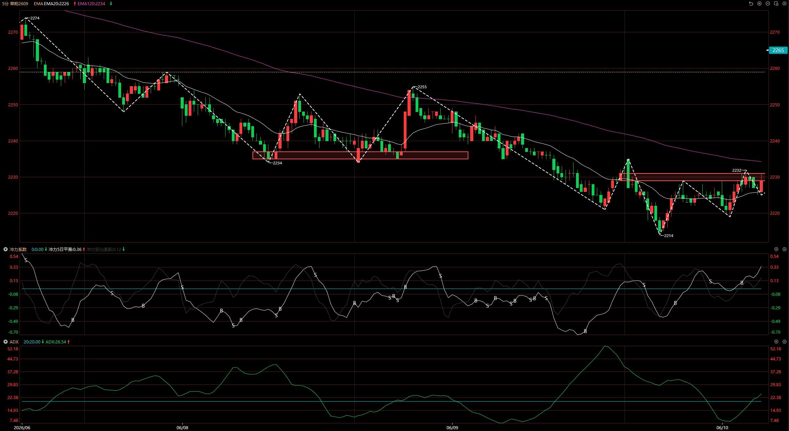

| 步骤     | 分析结论                                                     |
| -------- | ------------------------------------------------------------ |
| 市场结构 | 30F 趋势推动段，价格并没有到达 EMA120 附近。5F 出现头肩底，从最低点算到当前收阳位置，2 次低点抬高，所以 30F 很有可能反转。 |
| ADX      | ADX 从 20 下逐渐提升，说明行情发散。发散时候价格不断抬高，因此偏多。 |
| 品种共振 | 无                                                           |
| 综合     | 行情有较大可能上涨发散，然后触碰到 EMA120 构成 30F 趋势回调段。  |

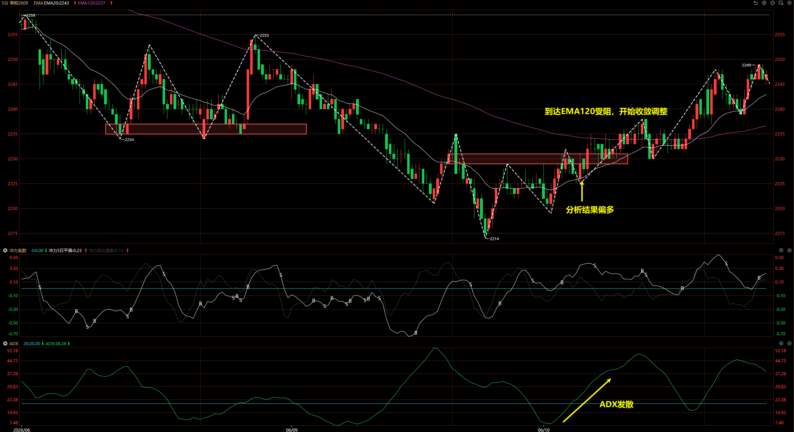

#### jm2609 2026/6/12

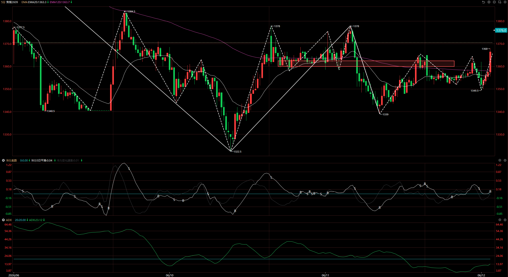

| 步骤     | 分析结论                                                     |
| -------- | ------------------------------------------------------------ |
| 市场结构 | 30F 区间内部段，价格处于交易区间中间位置。5F 从 1239 低点到现在出现两次低点抬高，所以 30F 下跌段很可能反转。 |
| ADX      | ADX 逐渐抬升，说明行情发散。发散时候价格不断抬高，因此偏多。  |
| 品种共振 | 无                                                           |
| 综合     | 行情有较大可能上涨发散，然后触碰到 30F 区间上轨受阻。          |

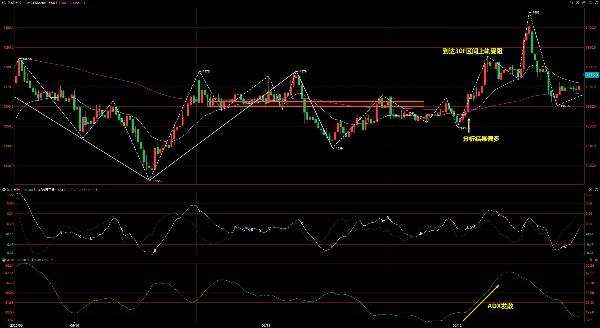

#### ru2609 2026/6/12

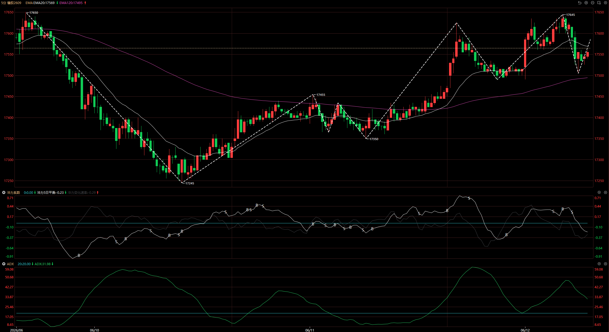

| 步骤     | 分析结论                                                     |
| -------- | ------------------------------------------------------------ |
| 市场结构 | 30F 趋势回调段，价格突破 EMA120，说明回调段转化为了新的趋势推动段。5F 低点抬高，说明行情偏多，后续延续上涨。 |
| ADX      | ADX 从高点降低，说明行情收敛。                                |
| 品种共振 | 无                                                           |
| 综合     | 5F 低点抬高符合开多机会，但 ADX 收敛则说明 5F 上涨段可能空间不会太大，所以操作的多单要在前高挂单离场。 |

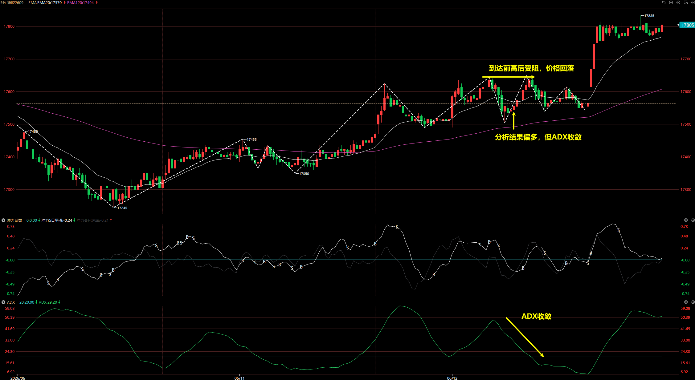

#### PTA 2026/6/9

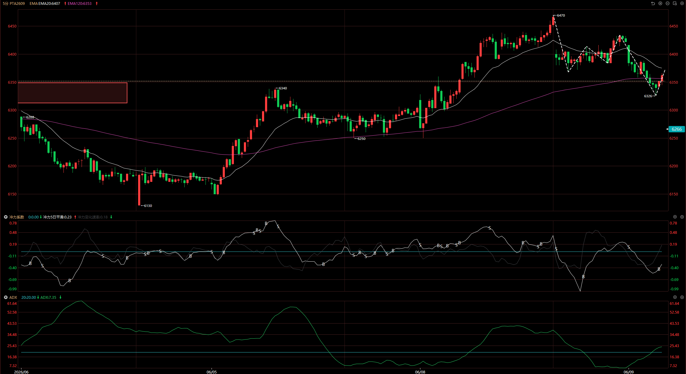

| 步骤     | 分析结论                                                     |
| -------- | ------------------------------------------------------------ |
| 市场结构 | 30F 是上涨趋势的回调段，因此关注 EMA120 阻力位。5F 看当前位置未有受阻迹象，所以 5F 仍旧看空。 |
| ADX      | ADX 逐渐抬升，说明行情发散。发散时候价格不断降低，因此偏空。  |
| 品种共振 | 甲醇、乙二醇、苯乙烯等化工品都处于下跌趋势                   |
| 综合     | 5F 高点降低，符合下跌趋势并到达 EMA120 阻力位，但 ADX 发散说明阻力位有较大可能被打破，所以仍旧操作空单。 |

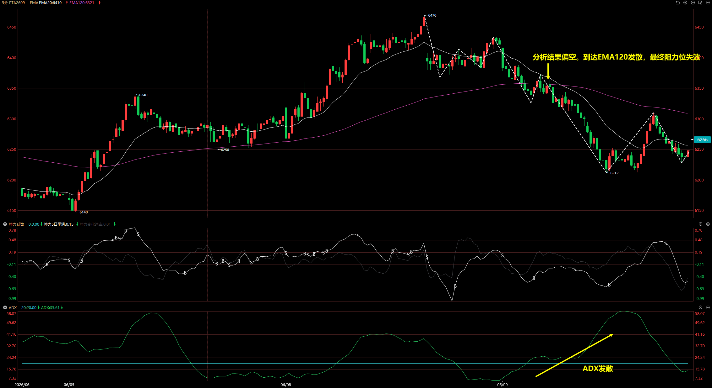

## 交易操作

### 开仓信号

#### 顺势结构

#### 反转结构

