<script setup>
import OpenNumCalc from './OpenNumCalc.vue'
</script>

# 期货大资金投机系统 v1 版

## 图形学定义

### 走势段

#### 段的起点定义

走势段起点的定义：选取最小级别图，在该图上以价格上穿下穿 EMA20，且顶底之间满足最少 5 根 K 线，就构成段。

特殊处理：强势跳空也可以看作是一段。

#### 递归段

### 趋势和盘整

#### 以高低点变化定义

趋势：

- 上涨趋势：对应 N 字，符合下面三种的某种
  - `H1 < H2` and `L1 < L2`
  - `H1 = H2` and `L1 < L2`
  - `H1 < H2` and `L1 = L2`

- 下跌趋势：对应反 N 字，符合下面三种的某种
  - `H1 > H2` and `L1 > L2`
  - `H1 = H2` and `L1 > L2`
  - `H1 > H2` and `L1 = L2`

盘整：

- `H1 > H2` and `L1 < L2`
- `H1 < H2` and `L1 > L2`
- `H1 = H2` and `L1 = L2`

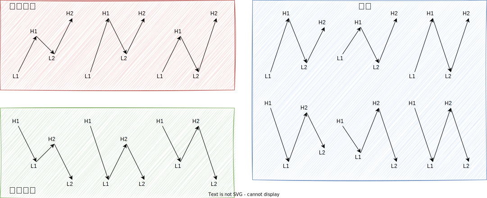

#### 趋势与盘整的演化

趋势结束：高点、低点同向变化规则打破。

盘整结束：价格突破盘整区间上轨下轨后回调不进入区间内部。

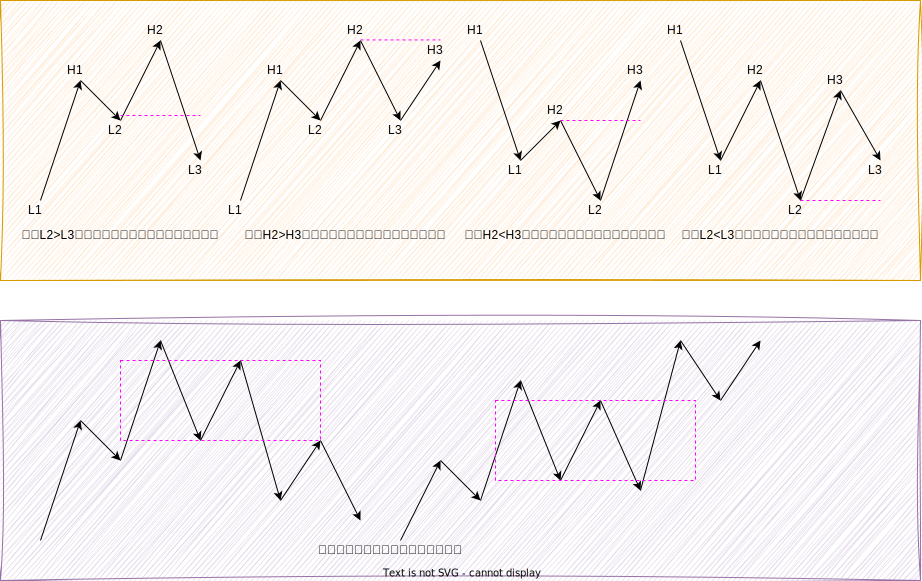

## 动力分析

### EMA 阻力位

在趋势行情中，5F 的 EMA20、30F 的 EMA20 是可以作为本级别的阻力位的，宽通道的回调往往是到达 EMA20 受阻后继续延续之前方向运动。

> [!CAUTION]
>
> 在盘整行情中，不能使用 EMA 阻力位。

在盘整行情中，不能使用 EMA 阻力位。

如图是菜油 2609 合约 5 分钟走势图，可以看到是一段非常明显的趋势行情，虽然后续趋向性不断衰弱，但仍旧是在回调到 EMA20 受阻后继续维持上涨趋势的。

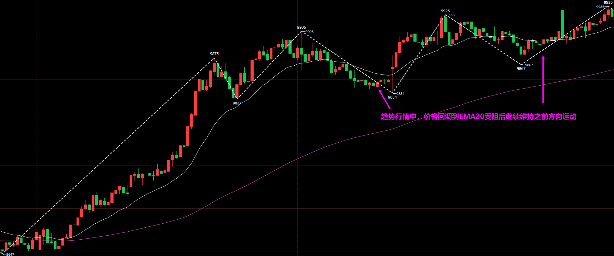

### 假突破和真突破

假突破定义：价格对某一价位突破后失败，又回到原先位置。

市场中充满了假突破，可以说大部分突破行为最终都是假突破，在假突破位置追涨杀跌，就会被套住，然后频繁止损。**假突破能实现流动性清洗，让本来持仓的单子被迫挂单成交。主力会借此诱多诱空，完成出货或建仓。**

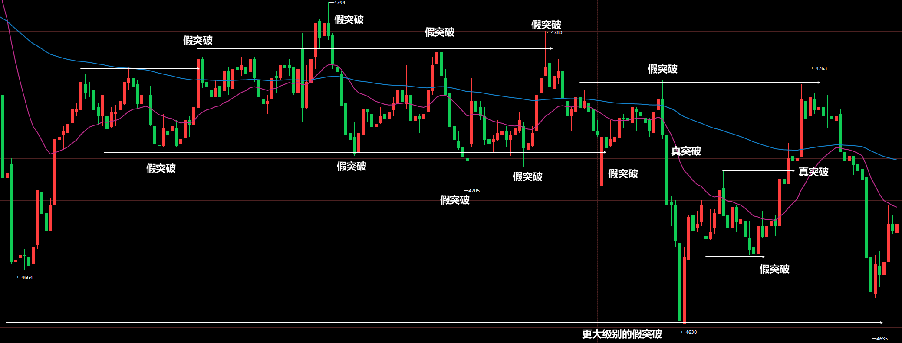

真突破：价格对某一价格突破后短时间内没用再回到原先位置。

真突破出现时候往往是两种情况：

1. 价格以大阳线或大阴线突破，随后价格走了很远没回来。
2. 价格突破后出现 K 线回调，最终走了很远没回来。

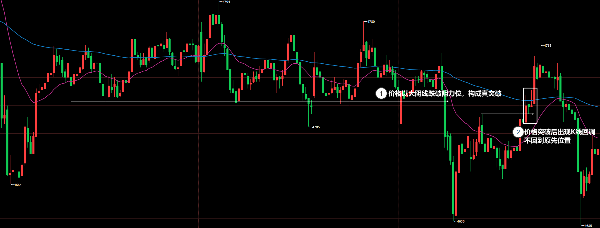

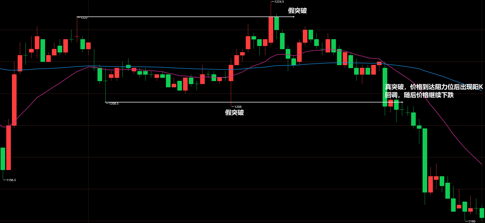

### 水平阻力位

阻力位定义：**价格两次以上** 到达同一水平位置价格受阻。

受阻行为：价格到达某一关键水平位置后出现假突破，K 线会出现长上影线/长下影线，或者 2~3 根反包 K 线。

**阻力位附近的价格行为观察是非常重要的**！因为价格可能突破，也可能再次受阻导致价格反向。

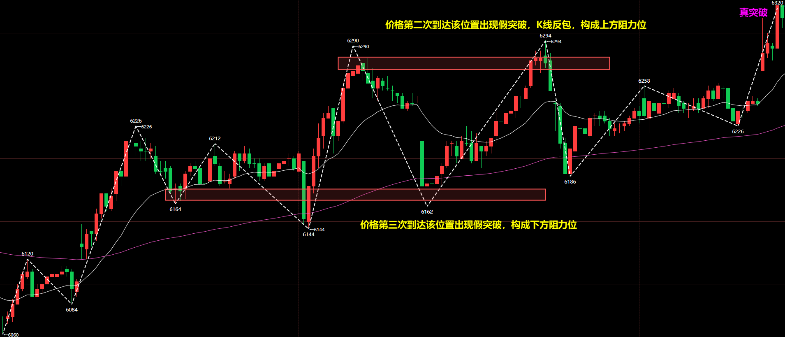

### 动力学视角的趋势和盘整

趋势：不断突破阻力位的过程，突破是趋势的必要条件。只有突破，才能打开价格运行空间。

盘整：在上下阻力位不断受阻，价格维持平衡状态。

#### 盘整力量分析

1.到达阻力位后返回，说明维持 **均衡** 盘整区间状态

2.**下跌段低点未接触到下方阻力位就返回，说明偏多；上涨段高度未接触到上方阻力位就返回，说明偏空。阻力位抬高，说明偏多；阻力位降低，说明偏空。**【主要判断力量不均衡的方式】

如图是 PTA2609 合约 5 分钟走势图，可以看到在两个阻力位限定的盘整区间内部，出现下跌段未接触下方阻力位就返回，说明偏多。

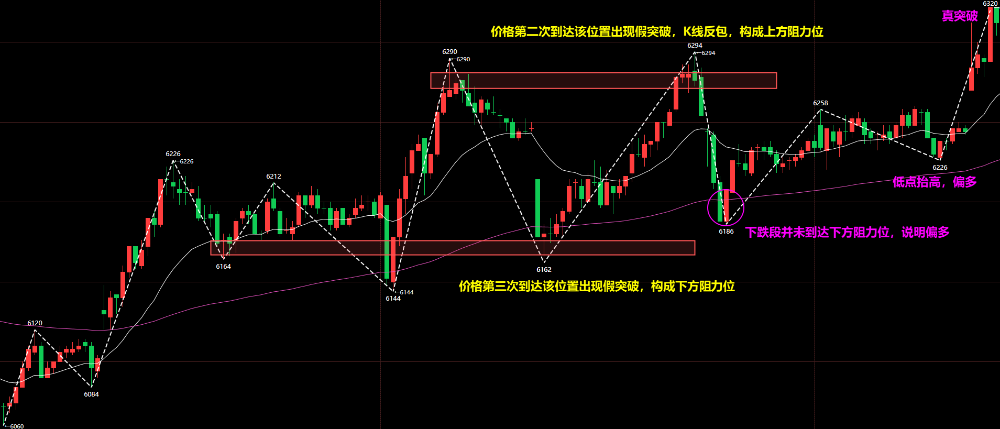

如图是焦煤 2609 合约 5 分钟走势图，可以看到是盘整区间，价格以突破后，**支阻互换且低点抬高，说明多头偏强**，是不错的开多位置。

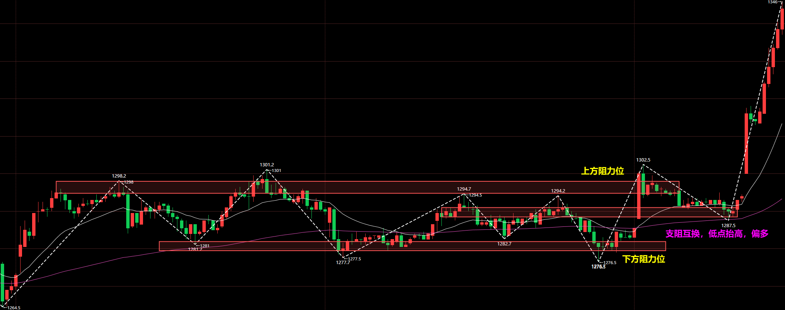

3.穿过阻力位置，构成真突破

如图是菜油 2609 合约 5 分钟走势图，① 处出现真突破上破阻力位，说明多头偏强。随后在 ② 处构建了新的上方阻力位，相对于之前上方阻力位抬高，说明多头偏强。那么此时是绝对不能做空的。

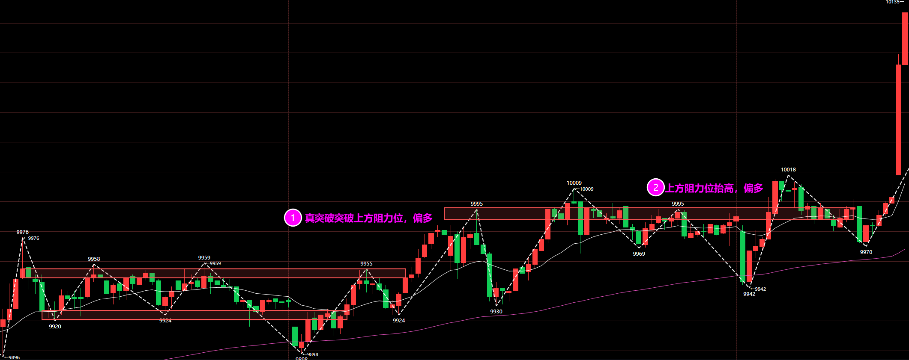

## 敛散分析

### 收敛与发散的循环

无论哪个级别，市场始终处于发散和收敛的循环。

### ADX 指标

```
N:=14;      // ADX周期，可自行修改
20:20;     // 阈值线，可自行修改

// 真实波幅 TR
TR0:=MAX(HIGH-LOW, ABS(HIGH-REF(CLOSE,1)));
TR:=MAX(TR0, ABS(LOW-REF(CLOSE,1)));

// 方向移动 +DM 与 -DM
DM_PLUS:=IF(HIGH-REF(HIGH,1) > REF(LOW,1)-LOW, MAX(HIGH-REF(HIGH,1),0), 0);
DM_MINUS:=IF(REF(LOW,1)-LOW > HIGH-REF(HIGH,1), MAX(REF(LOW,1)-LOW,0), 0);

// Wilder 平滑（相当于 SMA(X,N,1)）
SMOOTH_TR:=SMA(TR,N,1);
SMOOTH_DMP:=SMA(DM_PLUS,N,1);
SMOOTH_DMM:=SMA(DM_MINUS,N,1);

// DI+ 与 DI- （仅内部计算用，不绘制）
DI_PLUS:=SMOOTH_DMP/SMOOTH_TR*100;
DI_MINUS:=SMOOTH_DMM/SMOOTH_TR*100;

// DX 与 ADX
DX:=IF(DI_PLUS+DI_MINUS=0, 0, ABS(DI_PLUS-DI_MINUS)/(DI_PLUS+DI_MINUS)*100);
ADX:MA(DX,N);
```

### ADX 分析

#### ADX 收敛与发散

#### 敛散性对行情影响

## 风控设计

### 风控目标

以 100 万模拟账户为基准进行仓位设计，要求盘整动态回撤小于 6%，静态权益回撤小于 5%。

### 开仓手数

可以通过如下公式，把盘面价格波动和账户对应，即盘面波动 1%对应账户波动 1%：
$$
一万近似跳动 =\lfloor \frac{10000 *最小变动单位}{当前价格* 一手最小波动*0.01} \rfloor
$$

> [!WARNING]
>
> 由于有些品种如焦煤、多晶硅波动较大，所以会在映射的结果上稍微减少手数。

<OpenNumCalc />

| 品种   | 合约前缀 | 最小变动单位 | 一手最小波动 | 100 万资金开仓手数 |
| ------ | -------- | ------------ | ------------ | ------------------ |
| 焦煤   | jm       | 0.5          | 30           | 10                 |
| 焦炭   | j        | 0.5          | 50           | 3                  |
| 铁矿石 | i        | 0.5          | 50           | 10                 |
| 烧碱   | SH       | 1            | 30           | 16                 |
| 甲醇   | MA       | 1            | 10           | 35                 |
| 乙二醇 | eg       | 1            | 10           | 20                 |
| 苯乙烯 | eb       | 1            | 5            | 22                 |
| PTA    | TA       | 2            | 10           | 30                 |
| 塑料   | l        | 1            | 5            | 25                 |
| 豆一   | a        | 1            | 10           | 20                 |
| 菜粕   | RM       | 1            | 10           | 40                 |
| 橡胶   | ru       | 5            | 50           | 5                  |
| 菜油   | OI       | 1            | 10           | 10                 |
| 棕榈油 | p        | 2            | 20           | 10                 |
| 沪银   | ag       | 1            | 15           | 3                  |
| 沪镍   | ni       | 10           | 10           | 6                  |
| 沪锡   | sn       | 10           | 10           | 2                  |
| 鸡蛋   | jd       | 1            | 10           | 22                 |
| 多晶硅 | ps       | 5            | 15           | 4                  |
| 碳酸锂 | lc       | 20           | 20           | 5                  |

### 持仓数量

为了避免同时回撤大幅回撤打到 6%，所以规定 **品种持仓最多为 4 个，且这 4 个品种要分属于不同板块**。

## 综合分析

市场的分析由四个方面影响：市场结构、力量、周期轮转、品种共振。

## 交易哲学

### 多周期问题

#### 看大做小的陷阱

如图是菜油 2609 合约 5 分钟走势图，站在更大级别视角看，就是 30F 回调段，那么后续则是等到 30F 回调段结束开多即可。

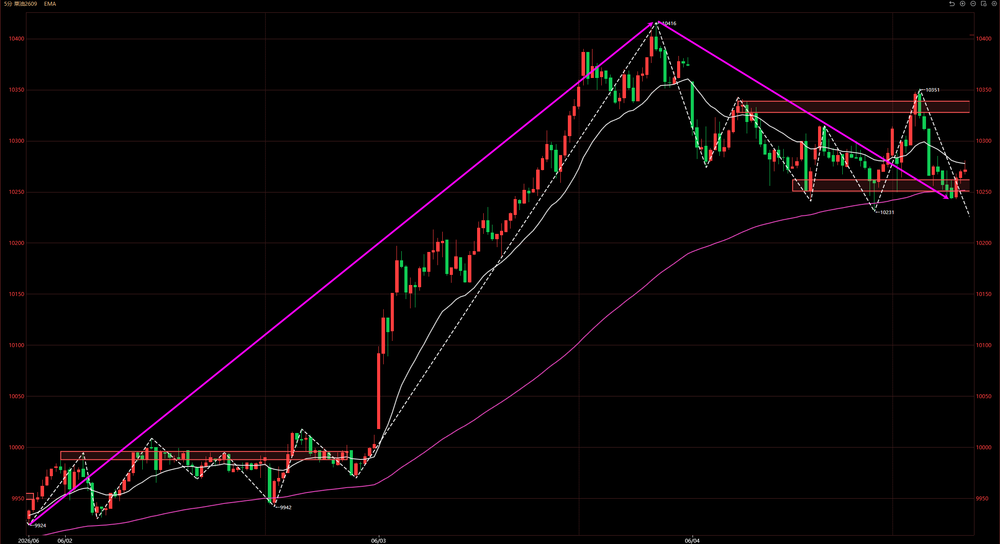

可现实最终走成这样，30F 回调段并没有结束后开启 30F 上涨段，而且暴跌。这 30F 回调段变成了 30F 下跌推动段。

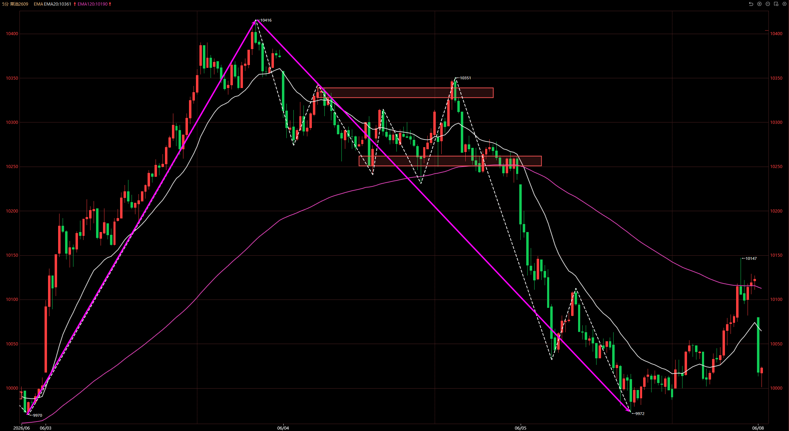

这说明按照看大做小的逻辑是有问题的，

- 如果是趋势推动段，那么顺趋势推动段方向操作。
- 如果是趋势回调段，正常思路是等回调段结束操作顺势方向。但也 **要注意趋势回调段可能变成新的反向推动段**。
- 如果是盘整内部段，那么顺内部段方向操作。

#### 顺势交易

先说顺势交易，这是非常重要的，因为顺势交易的胜率才会更高，盈利空间才会更大。

在下跌趋势中，只有一次开空会开在最低点，同理只有一次开多会开在最低点。

在上涨趋势中，只有一次开多会开在最高点，同理只有一次开空会开在最高点。

理论上讲，顺势操作，只会错最后一次，即趋势转折的那次。如果长期抄底摸顶，那么胜率一定小于 50%。瞎操作的胜率就是 50%，而抄底摸顶比瞎操作还低，所有说 **抄底摸顶必死**。

#### 确定操作级别为主心骨

确定操作级别的主心骨是非常重要的，在实际操作中，不应该反反复复在多个级别切换，操作级别是主心骨，其他级别是辅助作用。

大级别是趋势推动段就一定走的很远吗？不一定，很可能在前高前低位置受阻，都变成盘整内部段了。

大级别是趋势回调段就一定等回调结束继续顺原方向操作吗？不一定，趋势回调段有可能变成趋势推动段。

大级别是盘整内部段就一定在上下轨受阻反向吗？不一定，盘整内部段也有可能变成趋势推动段。

如果以大级别为骨架，就是陷入一种预设模式的状态。而市场总是不断变化的，千奇百怪的走势，很多诡异的走势在当下是没法确认的。

既然不预设，那么就要跟随市场本身的变化，那么到底怎么跟随？确定操作级别为主心骨。30F 级别如果是趋势，那么 5F 图上的 EMA120 就是潜在阻力位；30F 级别如果是盘整，那么 30F 盘整区间上下轨就是潜在阻力位，把这些阻力位标注在 5F 级别上，后续就只需要看 5F 级别。

**5F 在 30F 的阻力位附近出现反转结构，那么就要小心 30F 可能反转；5F 在 30F 阻力位附近走势顺畅，那么就大概率会突破。**

如此，只需要在 5F 图上跟随即可。

### 胜率、盈亏比、频率

#### 三者的权衡

所有的交易系统，都面临胜率、盈亏比、频率三种的权衡，这是市场本身结构决定的。

市场大部分情况就是盘整，趋势情况占少数部分，所有捕捉趋势的策略必然频率更低，由于是顺势操作，胜率一般都在 50% 以上，盈亏比能做到 2:1，趋势交易不是每次出手都能有不错的盈利空间。而捕捉盘整的策略频率会更高，由于盘整范围不好确定且空间首先，所以盈亏比很较低，一般是 1:1。

我之前做过盘整区间高抛低吸，发现并不适合我，这种交易方式不好做。所以我选择趋势交易，频率低的问题可以通过盯盘多品种来弥补。

#### 复杂的分析不见得有好结果

学习过一段时间 Al Brooks 的价格行为交易法，使用价格行为交易往往是盯盘一个品种重点分析，运用很主观的方式去分析市场，然后剥头皮或波段交易。价格行为分析会让交易者对市场理解更深，但作为一种主观分析方法在盘中交易时候稳定性不足。

我曾想通过主观分析盘整区间来分析其方向选择，在实际操作中往往是频繁打止损，每次以为盘整区间要结束了入场，结果还是没结束。

根据后续的交易单，我发现我在盘整区间止损频率是过高的，所以我决定，不做盘整区间，采用 **固定入场模型对多品种进行筛选** 操作。

## 交易操作

### 趋势交易的入场模型

> [!TIP]
>
> 5F 为 **确定趋势类型**，或者 **盘整 -> 趋势**。如果 5F 是确定交易区间或趋势 -> 交易区间，不操作。

做多：

- 低点条件三选一：
  - L1 < L2 < L3
  - L1 = L2 < L3
  - L1 < L2 = L3
- 高点条件二选一：
  - H1 < H2
  - H1 = H2

一共应该是 5 种情况，当 `L1 < L2 = L3 and H1 = H2` 不操作。

另外在这个基础上，需要添加反向突破的情况，即 `L1 > L2 < L3 and H1 < H2`，此时反向突破且回调不破前低，也是不错的做多条件。

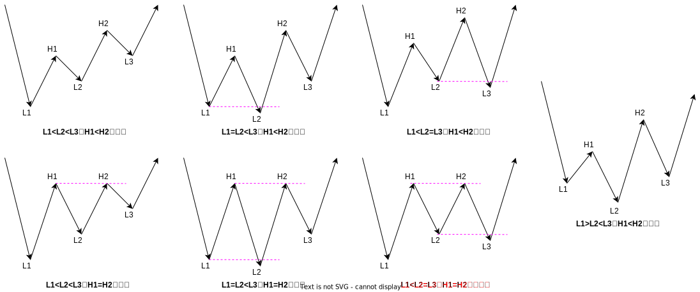

> [!CAUTION]
>
> 做多先看低点，再看高点。低点决定趋势，高点决定力量。
>
> <u>低点被下破，高点不上破</u>，两个条件只要有一个满足就要谨慎了。

做空：

- 高点条件三选一：
  - H1 > H2 > H3
  - H1 = H2 > H3
  - H1 > H2 = H3
- 低点条件二选一：
  - L1 > L2
  - L1 = L2

一共应该是 5 种情况，当 `H1 > H2 = H3 and L1 = L2` 不操作。

做空同理，考虑一种反向突破情况，即 `H1 < H2 > L3 and L1 > L2`，此时反向突破且回调不破前高，也是不错的做空条件。

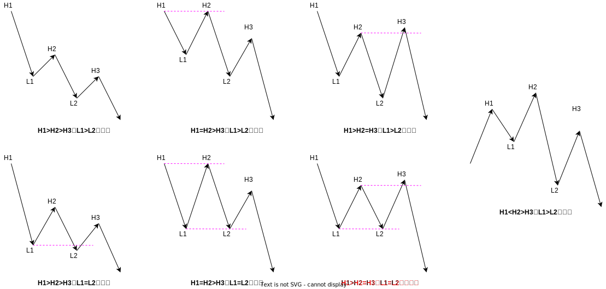

> [!CAUTION]
>
> 做空先看高点，再看低点。高点决定趋势，低点决定力量。
>
> <u>高点被上破，低点不下破</u>，两个条件只要有一个满足就要谨慎了。

### ADX 敛散性筛选

### 持仓与盯盘

持仓多单，只要低点下破，或者高点不上破，就要小心谨慎了。持仓空单，只要高点上破，低点不下破，就要小心谨慎了。

