[toc]

# 期货短线交易系统v2版

## 走势结构划分

## 回调

### 回调的形成及要求

回调的形成：上涨/下跌**趋势**中，多头/空头投资者为了防止风险过大会逐步获利了结，市场就会出现回调，并可能陷入横盘整理。

回调的最低要求：

- 上涨趋势中的回调：指某根 K 线的最低点低于前一根 K 线的最低点。
- 下跌趋势中的回调：指某根 K 线的最高点高于前一根 K 线的最高点。

回调交易的目的：**回调是趋势中的暂时停顿，为交易者提供高胜率的入场机会**。

### 回调的3种模式

1.反向K线作为回调

常见于窄通道行情，回调不足以改变趋势。因此回调是不错的入场点。

2.反向段作为回调

常见于宽通道行情，回调不足以改变趋势，但回调力度比反向K线更强。由于整体没有改变趋势，回调是不错的入场点。

3.反向通道作为回调

出现反向通道或交易区间构成回调，这种回调在更高周期图上看就是反向段。出现反向通道时候，趋势方向其实已经改变了，这是站着更高周期看的。

如图是纸浆2605合约5分钟走势图，可以看到三种回调方式：

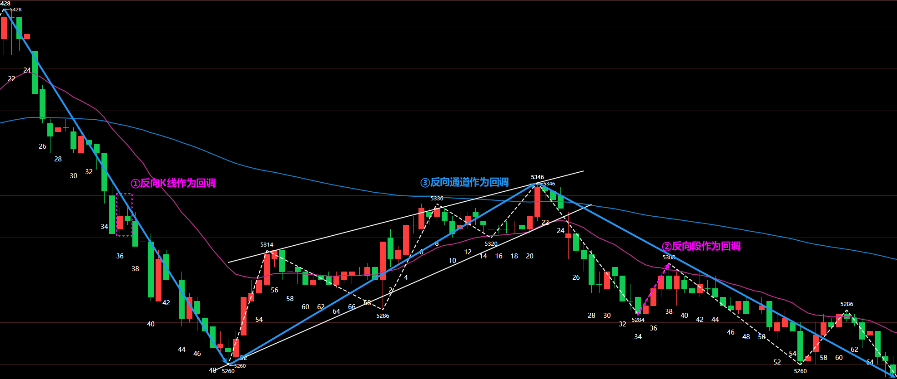

如图是纸浆2605合约30分钟走势图，可以看到在5分钟图上的反向通道构成的回调，在30分钟图上就是反向段。

### 50%回调

核心逻辑：在一段趋势段的50%位置，**顺势交易者和逆势交易者的潜在盈亏比是相同的**（1:1）（目标为前期高/低点，止损为波段起/终点）。

概率优势：在趋势背景下，顺势方的胜率更高（例如60% vs 40%）。这使得50%水平成为一个具有数学优势的、机构非常青睐的入场点。

应用：交易者常在上涨趋势的50%回调位挂限价单买入，或在下降趋势的50%反弹位挂限价单卖出。

如图是纸浆2605合约30分钟走势截图，也就是上图中的30分钟周期，可以看到很多次回调到底50%附近，然后继续之前的趋势。

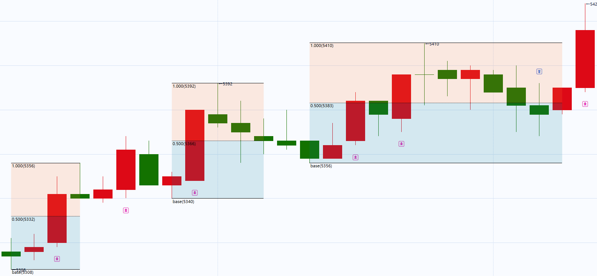

### 回调时间过长是风险

**如果回调继续发展，可能会演变成相反的趋势**。当回调增长到20或更多K线，则是无休止的回调，多头突破的可能性降低到与空头突破大致相同。

如图是棕榈油2605合约5分钟走势，本来是上涨趋势，但由于回调时间过长，最终转变为下跌趋势了。

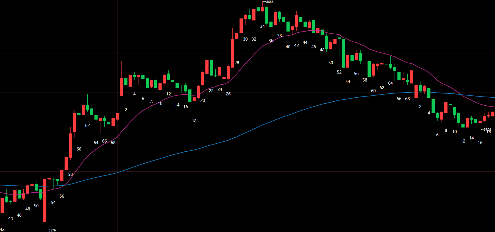

## 市场状态及演变

### 市场的4种状态

市场分为4种状态：**突破、窄通道、宽通道、交易区间**。

| 市场周期 | 特征                                                         |
| -------- | ------------------------------------------------------------ |
| 突破     | 一段结构，方向明确，该段由**一系列强趋势K构成**，K线之间重叠很少，几乎没有回调。 |
| 窄通道   | 一段结构，方向明确，该段**回调短暂（1~3根K线）且幅度浅**。   |
| 宽通道   | 多段结构，方向明确，段作为回调，**回调深入且持久（5~20根K线）**。 |
| 交易区间 | 多段结构，**方向不明**，持续20根K线以上整理，**80%突破尝试会失败**。 |

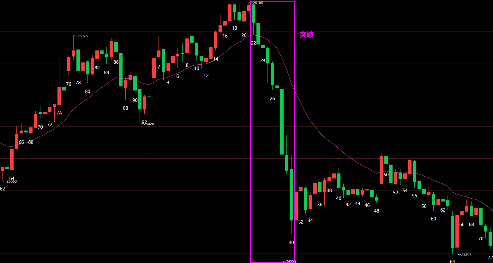

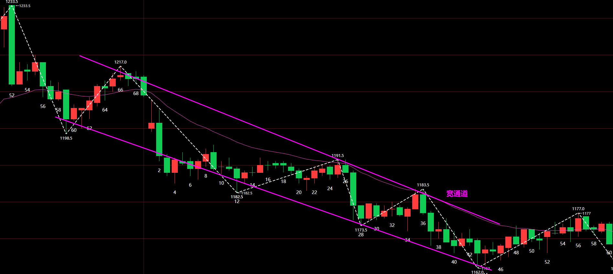

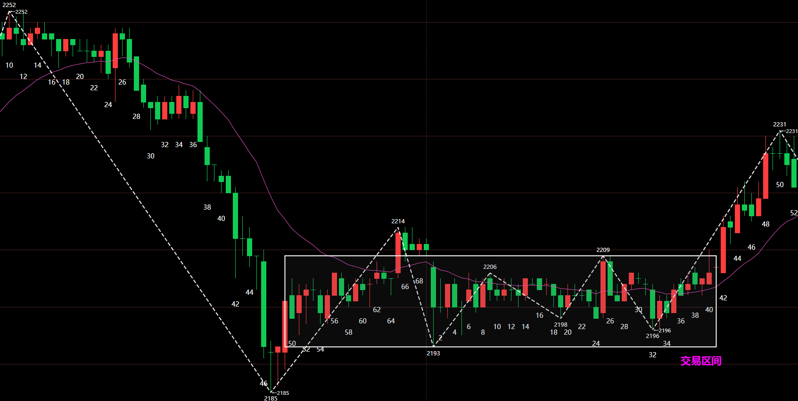

### 市场的2种走势类型

市场分为2种走势类型：**趋势和盘整**。

1. 趋势的高低点同向抬高或同向变低，显示为有方向；而盘整的高低点并不同向变化，显示为无方向。

2. 一段式结构一定是趋势，因为其内部构成趋向性。                                                                                                                                                                                                                                                                                                                                                                                                                                                                                                                                                    多段式结构需要根据段的高低点位置判断是否有趋向性。
3. **特征序列重叠范围越大，趋向性越弱；特征序列重叠范围越小，趋向性越强**。特征序列没有重叠范围，趋向性非常强。

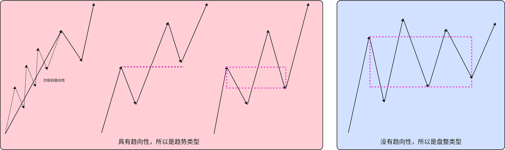

按照趋向性强度，可以这样排列，越靠近两端趋向性越强：

突破、窄通道是标准的趋势行情，交易区间是标准的盘整行情，而宽通道需要关注其斜率大小来判断趋向性如何。

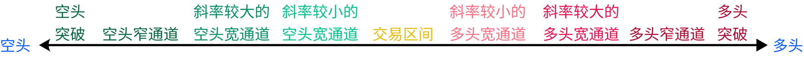

### 突破

#### 真假突破

**当出现突破行为时，需要后续确认和跟随**。在突破位置出现如下现象，就是成功率高的突破：

- 突破K线为大阳线大阴线，或者连续阳线连续阴线。
- 阳线上影线很短，阴线下影线很短。
- 收盘价让另一方套牢
  - 阴线收盘在震荡区间下轨下方，阳线收盘在震荡区间上轨上方。
  - 被套牢的K线数量越多说明被套牢的筹码越多
- 突破K线形成时候不磨磨唧唧，而是一气呵成。

有时候出现真突破会有小段失败反转尝试，这只是次级别的回调。

#### 突破的特征

突破行为，大多数情况下会出现如下特征：

1. **左侧出现交易区间或宽通道**，突破的价格到达区间外部。
2. 当前出现**大阳线或连续阳线向上突破**，出现**大阴线或连续阴线向下突破**。

从K线看特征①不是必要的，但大部分情况下都会有，突破可以说就是完成对交易区间或宽通道的终结。

### 交易区间

#### 交易区间范围的动态确定

对于交易区间，范围**上轨定义为次高点，下轨定义为次低点**。

**在上涨趋势中，以下跌段为起始段；在下跌趋势中，以上涨段为起始段。**

如图是纸浆2605合约5分钟走势图，到达①时，高点低点都抬高，所以仍旧是宽通道；到达②时，高点没有抬高了，此时开始构筑交易区间，区间为白色；到达③时，交易区间范围逐渐扩大，区间为黄色；到达⑤时，交易区间范围逐渐扩大，区间为紫红色。

#### 市场状态划分的多义性

##### 交易区间切割

还是以上面的纸浆2605合约5分钟走势图为例，同一张图可以有多种划分方式，这些方式都是可以的。

由于斜率较小的宽通道和交易区间很近似，所以很多时候会有多种划分方式。

方式一：把前面两段划分给宽通道，交易区间范围缩小，价格可以看到大概在交易区间中运行，所以这种划分方式会更贴切走势一些。

方式二：以中间某段连接两个交易区间，显示出价格重心上移的现象，也是可以的。

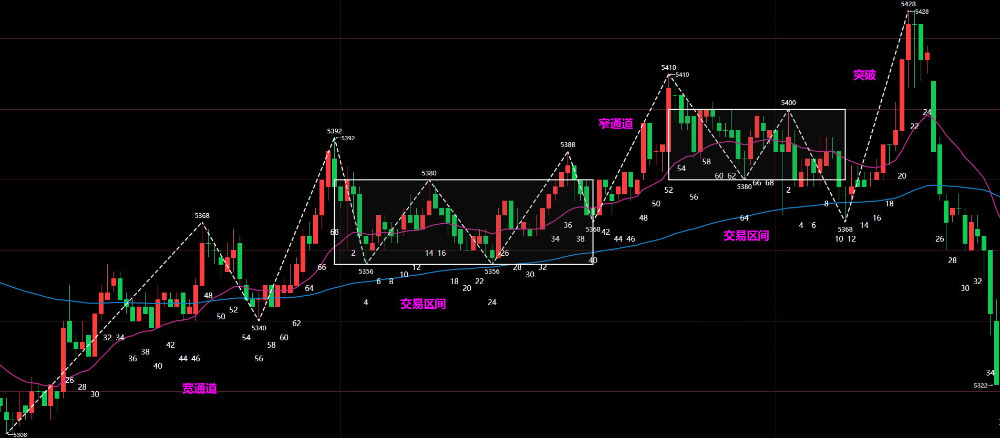

##### 宽通道和交易区间的界限是模糊的

宽通道如果斜率较大，那么很明显是趋势。但如果宽通道如果斜率较小，虽然高低点都同向运动，但特征序列重合较高，此时显示为弱趋势，和交易区间就很接近了。

对于斜率较小、特征序列重合较高的宽通道，在和交易区间的分辨中模糊是正确的。

如图是甲醇2605合约5分钟走势图，可以看到可以有两种划分方式：

方式一：以上涨趋势看，高低点都抬高，所以交易区间以第一次破坏趋势条件进行划分。

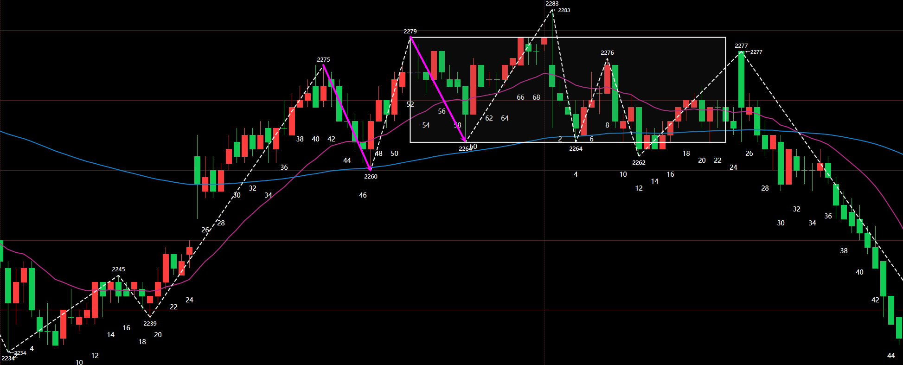

方式二：特征序列的重合度较高，所以也可以认为其包含在交易区间内部。

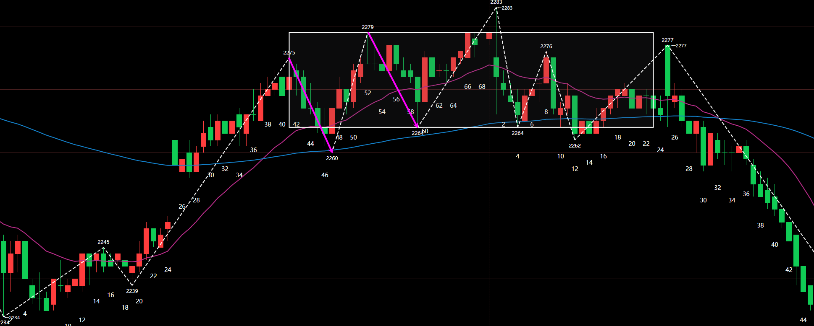

#### 第二段陷阱

**在交易区间中，80%的突破会失败**。

某些时候看到价格经过两次上涨或下跌段要突破前高或前低时，会出现假突破导致价格重新回到交易区间中。

**在交易区间中，看到价格强势突破高低点后贸然追多或追空，会导致被套**。同时由于对高低点的突破，会让挂单的空头或多头止损离场。

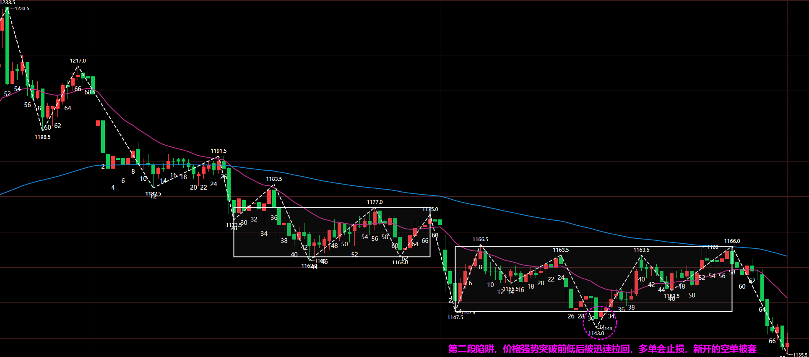

#### 交易区间的终结

1.突破回调不进入交易区间内

2.突破或窄通道超过交易区间2倍幅度位置

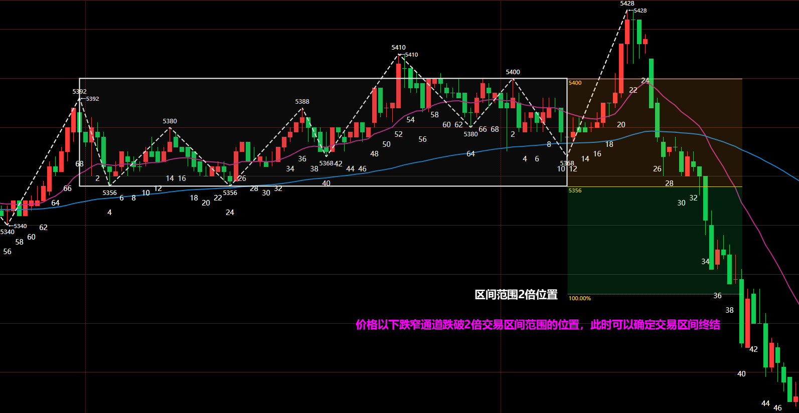

### 通道

#### 突破演变为通道

**回调是通道的开始**。当出现回调时候，可以确认突破状态结束了，然后根据回调的尺度来判定后续是窄通道还是宽通道。

| 回调类型   | 特征                                                         | 结果           |
| ---------- | ------------------------------------------------------------ | -------------- |
| 浅回调     | 回调3根K线以内，上涨突破的回调未下破EMA20，下跌突破的回调未上破EMA20，未达新段构成标准 | 演变为窄通道   |
| 深回调     | 回调5~20根K线，上涨突破的回调下破EMA20，下跌突破的回调上破EMA20，达到新段的构成标准 | 演变为宽通道   |
| 无休止回调 | 回调超过20根K线，上涨突破的回调下破EMA20，下跌突破的回调上破EMA20，达到新段的构成标准 | 演变为交易区间 |

#### 小心宽通道的第三推

- 宽通道作为牛旗熊旗

- 宽通道作为顶底

1.当宽通道作为牛旗时，反向通道作为回调，那么第三推意味着整个反向通道回调的结束。

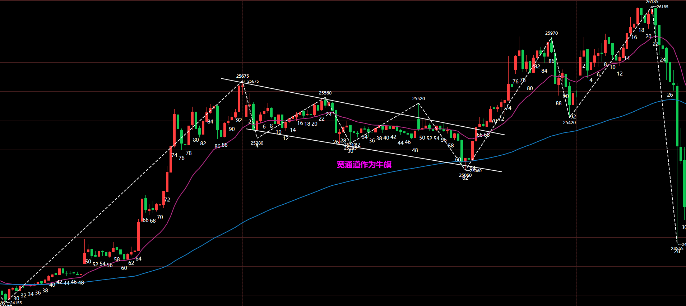

#### 通道演变为交易区间

宽通道和交易区间的共同点都是多段结构，不同点是宽通道还是趋势类型，是有明确方向的，交易区间是盘整类型，无明确方向。

**通道演变为交易区间的过程，就是趋向性逐步减弱的过程**。

## 主趋势反转

### 主趋势定义

主趋势定义：由突破、窄通道、宽通道单个或多个组成的趋同方向。

我们知道市场的状态是不断变化的，那么**主趋势的划分标准则是把状态趋同的合并到一起**，而交易区间属于过渡状态，划分到哪边都行。

下面给出例子说明：

- 向上突破-上涨宽通道-交易区间-向上突破-上涨窄通道：主趋势为上涨，虽然经过交易区间，但仍延续。
- 向上突破-上涨窄通道-交易区间-向下突破-下跌宽通道：主趋势一开始为上涨，在交易区间附近转换为下跌。
- 向上突破-上涨宽通道-向下突破-下跌宽通道：主趋势一开始为上涨，向下突破结束了上涨主趋势，主趋势转换为下跌。

当然，在划分主趋势过程中，还可以参考上个周期的EMA20，对上个周期的EMA20的突破可能就意味着主趋势反转。

主趋势反转（MTR）：出现反向突破、反向窄通道、反向宽通道完成对旧有的主趋势完成确定性占据，使其不能和旧的市场状态合并，说明主趋势发生了反转。

### 主趋势反转的左侧图形

#### 三推楔形

##### 1.标准三推楔形结构

如图是纸浆2605合约5分钟走势图，此处通道构成三推楔形，可以明显看到上涨力量衰弱，随后上涨通道结构结束，开启下跌趋势。

##### 2.头肩顶/头肩底

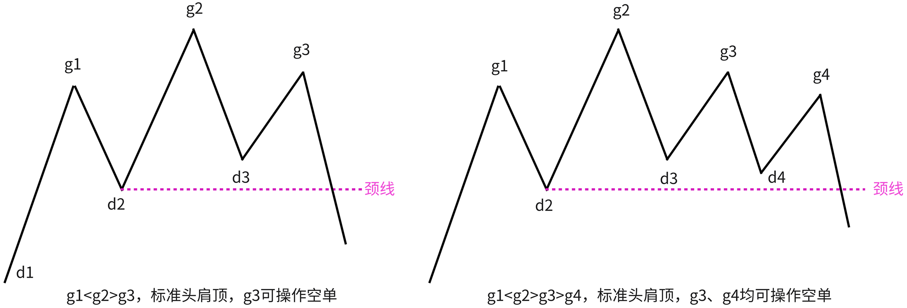

如图是甲醇2605合约5分钟走势图，走势在进入交易区间后，形成头肩顶结构。从后续看，当前头肩顶完成趋势反转。

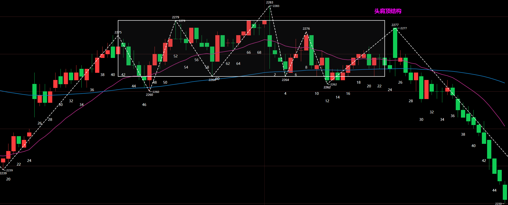

#### 双顶/双底

##### 1.标准双顶/双底

如图是焦煤2605合约5分钟走势图，可以看到第一处是以双底结构完成趋势反转的，两次价格到达同一位置附近时候受到较强支撑，最终促成趋势反转。

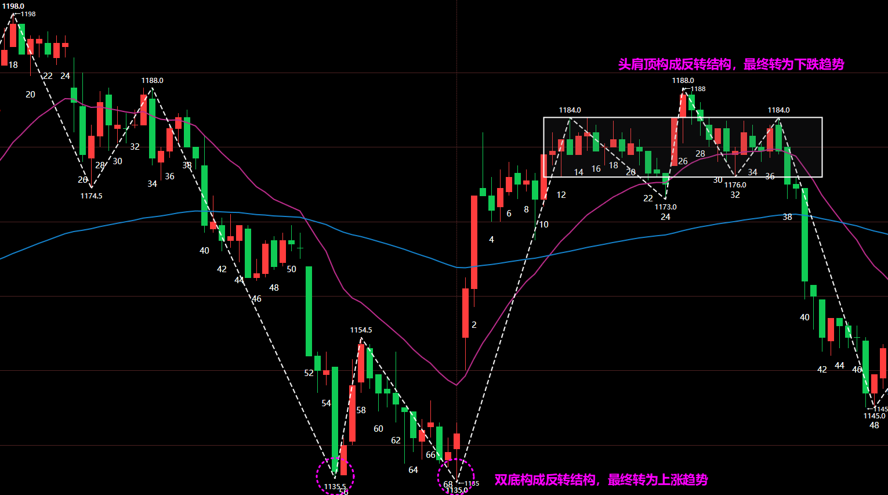

如图是焦煤2605合约5分钟走势图，可以看到虽然第二次上涨段最高价比前上涨段低，但也构成双顶反转结构，最终转为下跌趋势。

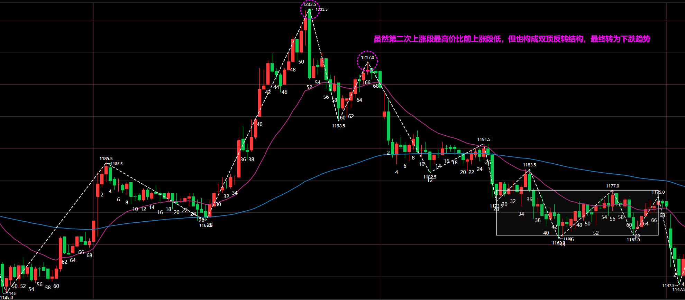

##### 2.双顶/双底后加速

如图是甲醇2605合约5分钟走势图，可以看到构成双顶结构，但趋势并没有再次反转，而是随后迎来一段加速上涨，耗尽最后一点多头力量，随后趋势反转开启下跌。

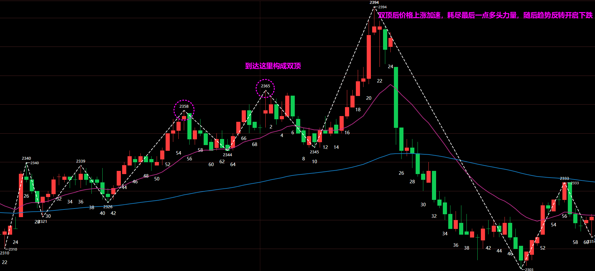

#### 二次衰竭

如图是多晶硅2605合约5分钟走势图，可以看到价格在上涨趋势后逐渐演变为交易区间，但**在交易区间内，两次上涨段高点依次降低，构成多头二次衰竭结构**，此处是不错的开空位置。

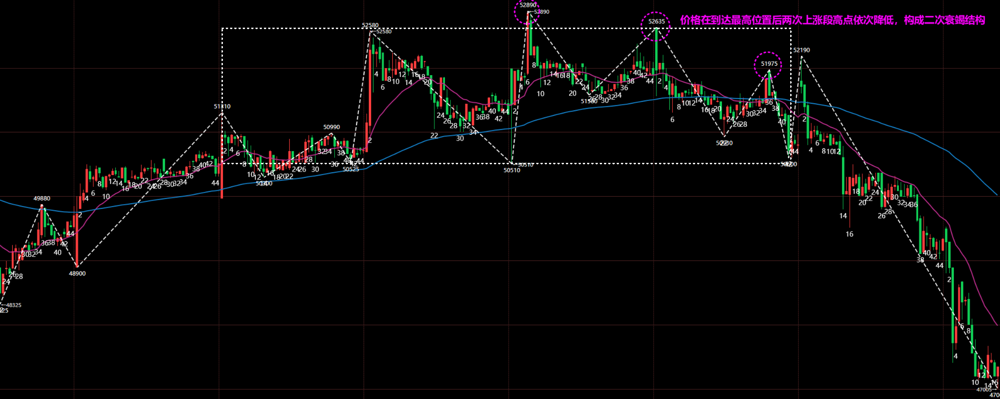

## 多级别分析

### 小级别引领大级别理念是错误的

在早期学习缠论过程中，受到走势递归思想的影响，有种大小周期关联的想法，这种想法贯穿了我早期的交易理念：小周期引领大周期，大周期走势是由小周期递归形成的。

这种理念自然而然会生出一个问题：既然小周期引领大周期，那只关注小周期罢了，还看大周期有何意义？

于是为了回答这个问题，会以一种大周期走势限制小周期思路去看。但仔细想想，仍然是不对的，这种思路对于新趋势第一段是不适用的，此时大小周期的理念出现了矛盾。

其实周期本就是人主观设定的，从来没有小周期引领大周期，小的慢慢形成大的。压根就不存在时间角度的先后，大小周期变化两者的同时的，只不过这种变化在小周期是更明显些，就是说**同一种变化在不同时间周期窗口的分割不同造成的显现差别。**

所以说小周期引领或生长为大周期的理念根源上就是错误的，所以纠结这个注定是无用功。那么如何正确理解大小级别之间的关系呢？我觉得可以看作是整体和局部的关系。

### 推动段和回调段

推动段：以EMA为基准，远离EMA的段就是推动段。

回调段：以EMA为基准，接近EMA的段就是回调段。

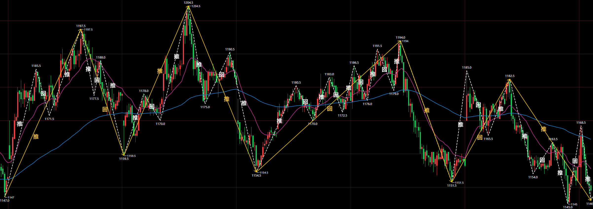

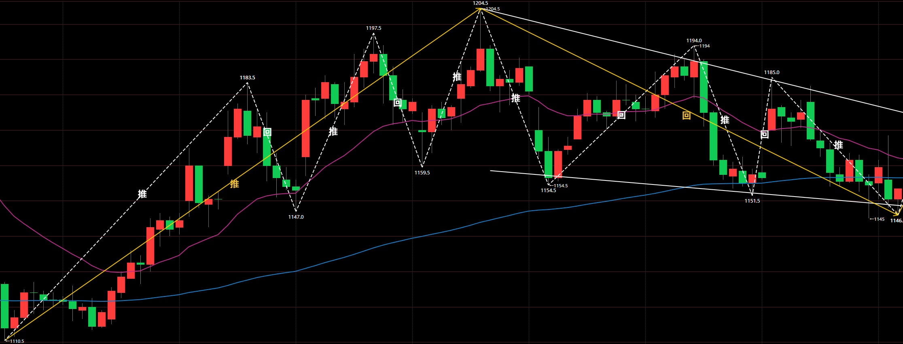

## 交易操作

### 波段交易和剥头皮交易

波段交易（Swing Trading）

- 目标：追求**大利润**，强调**优良的盈亏比**（通常寻求利润至少是风险的2倍）。
- 胜率：接受相对**较低的胜率**（如40%），依靠少数大赚的交易来覆盖多数小亏损。
- 持仓：愿意持仓较长时间（如10-20根K线以上），并**承受趋势中的回调**（小反转）。

剥头皮交易（Scalping）

- 目标：追求**高胜率**（60%-90%），赚取**快速的小利润**。
- 盈亏比：接受**较差的盈亏比**（利润通常等于甚至小于初始风险）。
- 持仓：快速进出（通常在1-5根K线内），不愿承受回调或利润回撤。

> [!CAUTION]
>
> 由于剥头皮交易本身的特点对交易者自身要求较高，所以**要尽可能多做波段**，少做甚至不做剥头皮交易。

### 市场背景和交易方式

交易操作的第一步，也是最重要的一步，就是**判断当前市场处于何种状态？是否正演变为其他状态？**

在现实的市场中，市场状态的演变不一定是相邻的，很有可能是跳跃式的。比如当前是多头窄通道状态，经过回调后产生不破前高的第3段，后续就可能直接演变为下跌宽通道状态。

| 市场背景             | 交易方式                                 |
| -------------------- | ---------------------------------------- |
| 宽幅交易区间         | 剥头皮交易，区间上1/3开空，区间下1/3开多 |
| 窄幅交易区间         | 不操作                                   |
| 多头宽通道 | 波段交易，区间下1/2开多，不开空     |
| 空头宽通道 | 波段交易，区间上1/2开空，不开多 |
| 多头窄通道           | 波段交易，回调K线做多 |
| 空头窄通道           | 波段交易，回调K线做空 |
| 多头突破             | 波段交易，收阳线做多 |
| 空头突破             | 波段交易，收阴线做空 |

### 开仓缘由和平仓缘由

#### 基准位定义

上涨段：以倒数第二根阳线或最后一根大阳线的最低点为基准位。

下跌段：以倒数第二根阴线或最后一根大阴线的最高点为基准位。

#### 开仓：强势阳K或阴K构成真突破

既然是真突破，那么需要被突破的目标，目标一般是两种：

1. 交易区间的上下轨
2. EMA20和EMA120

出现大阳线或大阴线，且大阳线的上影线很短，大阴线下影线很短，让另一方套牢，就是真突破。

如图是焦煤2605合约5分钟走势图，可以看到箭头位置以大阳线突破前高，同时也突破了EMA20和EMA120，价格由之前在EMA中纠缠转变为站上EMA，所以此时开多。

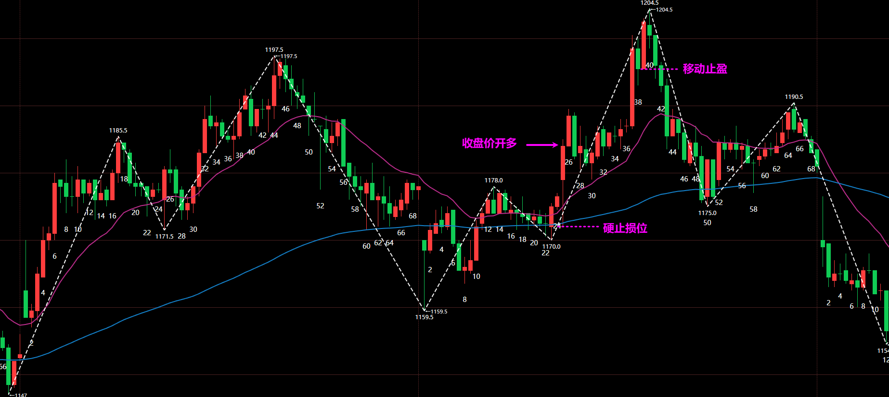

#### 开仓：EMA阻力+对基准位实体反向突破

开仓信号要同时符合如下两个条件：

1. 做多要在EMA受到支撑；做空要在EMA受到阻力。
2. 做多就是终结下跌段，因此K线收盘价高于基准位才能开多；做多就是终结上涨段，因此K线收盘价低于基准位才能开空。

如图是苹果2605合约5分钟走势图，出现两个阳线且最终收盘价高于下跌段基准位，并受到EMA20支撑，因此开多。

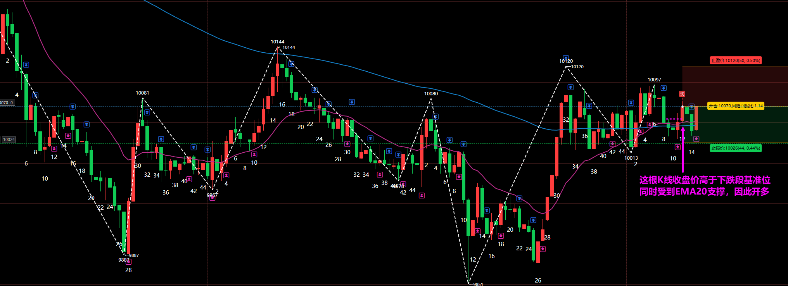

#### 平仓：跟随移动止盈

跟随移动止盈：观察基准处有没有被实体K线打到，如果K线收盘打到，那么就离场。

如图是烧碱2605合约5分钟走势图，可以看到：

①处移动止盈位没有被打到

②处移动止盈位是插针打到，实体收盘价依然在其下方，所以不离场

③处移动止盈位被阳线实体打到，所以立刻离场。

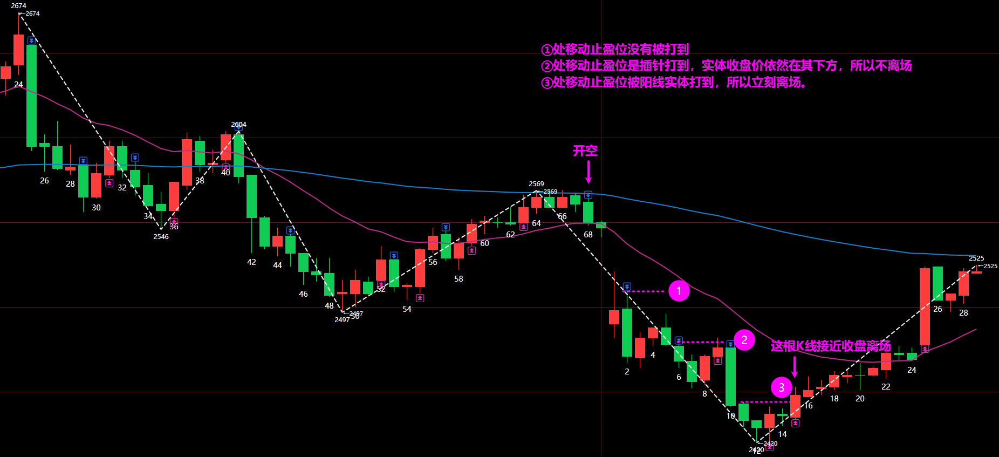

#### 平仓：关键位置限价单离场

关键位置：

1. 前高或前低附近
2. 交易区间上下轨附近
3. EMA

如图是甲醇2605合约5分钟走势图，当持仓空单操作对EMA120的回补时，可在EMA120下方挂止盈单，这样价格下跌到该位置会限价单离场。

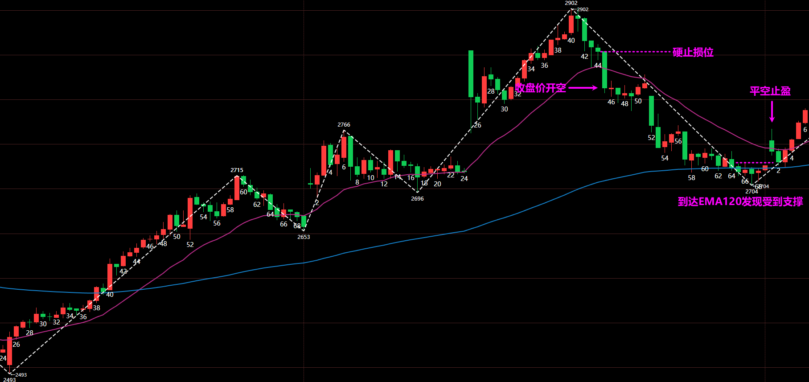

### 交易模式

#### 操作宽通道

宽通道是多段结构，可双向交易，但一般来说还是**顺宽通道方向**操作。价格行为中讲对于宽通道是以中轨线划分上下区域，上方区域做空，下方区域做多。但实际操作下，逆势交易其实并不好操作，所以我觉得大多数情况下对于宽通道，还是要顺势交易。

当然，宽通道作为更大周期的旗形回调，此时可以逆势交易，这属于操作主趋势反转。

宽通道是市场中非常常见的状态，也是最常用的操作模式。

> [!TIP]
>
> 左侧背景：
>
> - 价格原先以`价格>EMA20>EMA120`状态运行，当前位置开始回补EMA20并受到支撑，开仓点位置**高于上一个阶段性低点**，于是开多。
> - 价格原先以`价格<EMA20<EMA120`状态运行，当前位置开始回补EMA20并受到压力，开仓点位置**低于上一个阶段性高点**，于是开空。
>
> 开仓信号：
>
> - EMA阻力+对基准位实体反向突破
>
> 硬止损线：段的高低点
>
> 止盈：
>
> - 跟随移动止盈

入场后一般会出现2种情况：

1.入场后按照预期方向运动，出现大幅盈利。

如图是烧碱2605合约5分钟走势图，可以说是非常标准的宽通道走势了，而且入场信号明确，止损空间也不大。

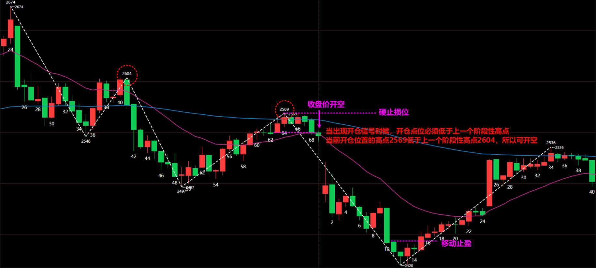

2.入场后按照预期方向运动一小段，最终又返回原先方向，说明当前可能转换为交易区间状态，因此要止损离场。

宽通道开仓点入场后转换为交易区间，那么开仓点往往是窄交易区间的下轨，此时很容易被套牢，所以一旦看到有转换为交易区间的态势，就要果断止损离场。

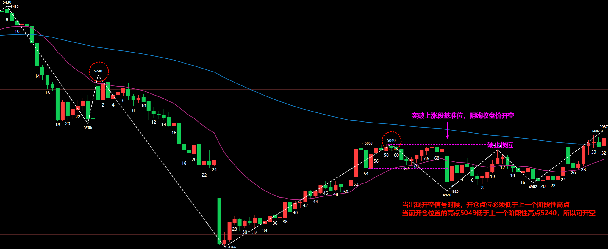

---

当然这种操作思路也能用于更高周期，**当在5分钟周期图上看到受到EMA120阻力时，此时需切换到30分钟周期操作**，仍旧是按照这套信号。

如图是焦煤2605合约30分钟走势图，在5分钟周期看到的是EMA120受到支撑，在30分钟周期看到的是EMA20受到支撑，所以按照30分钟图操作。价格开始回补EMA20并受到支撑，出现开仓信号后做多。

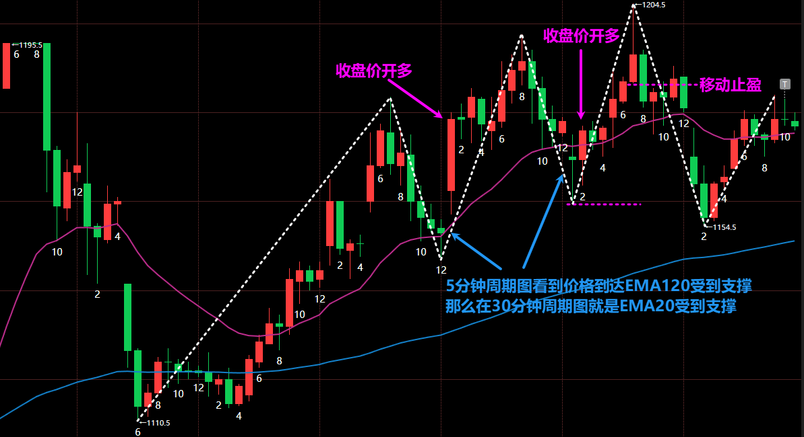

#### 操作窄通道

窄通道在更小周期看就是宽通道，所以操作窄通道思路和宽通道一样。                                                                                                                                                                                                                                                                                                                                                                                                                                                                                                                                                                                                                                                                                                                                                                                                                                                                                                                                                                                                                                                                                                                                                                                                                                                                                                                                                                                                                                                                                                                                                                                                                                                                                                                                                                                                                                                                                                                                                                                                                                                                                                                                                                                                                                                                                                                                                                                                                                                                                                                                                                                                                                                                                                                                                                                                                                                                                                                                                                                                                                                                                                                                                                                                                                                                                                                                                                                                                                                                                                                                                                                                                                                                                                                                                                                                                                                                                                                                                                                                                                                                                                                                                                                                                                                                                                                                                                                                                                                                                                                                                                                                                                                                                                                                                                                                                                                                                                                                                                                                                                                                                                                                                                                                                                                                                                                                                                                                                                                                                                                                                                                                                                                                                                                                                                                                                                                                                                                                                                                                                                                              

> [!TIP]
>
> 左侧背景：
>
> - 价格原先以`价格>EMA20>EMA120`状态运行，当前位置出现阴线回补（EMA4），择机开多。
> - 价格原先以`价格<EMA20<EMA120`状态运行，当前位置出现阳线回补（EMA4），择机开空。
>
> 开仓信号：
>
> - 次周期，EMA阻力+对基准位实体反向突破
>
> 硬止损线：入场阳K最低点；入场阴K最高点
>
> 止盈：
>
> - 跟随移动止盈

如图是焦煤2605合约30分钟走势图，开仓位置其实是1分钟周期受到EMA20支撑，那么在5分钟周期就是EMA4受到支撑，因此开多。

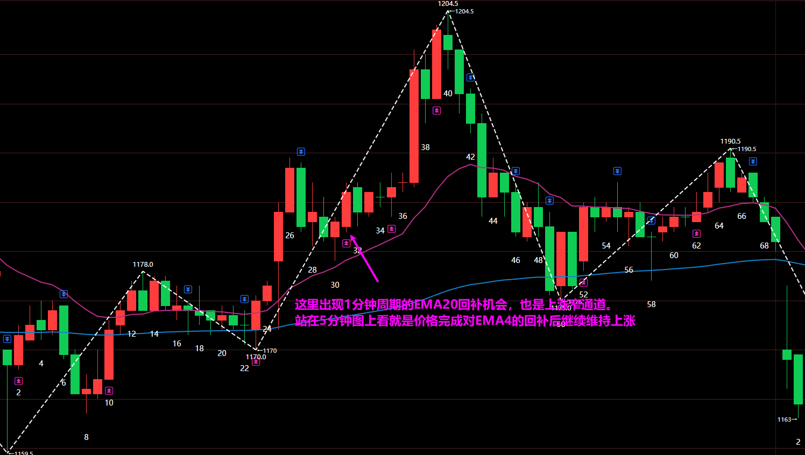

在EMA20回补EMA120的过程中，有时候也会出现窄通道的操作机会。

如图是甲醇2605合约5分钟走势图，价格本来维持宽通道上涨，但在新的位置EMA20支撑失败，此时观察到EMA20和下方EMA120空间不小，且出现强势阴K，说明**原先的上涨宽通道转换为了下跌窄通道**，因此可开空。

#### 操作突破

突破的左侧背景不是必须的，只不过大多数情况都是有的，按照定义突破就是连续较强的K线组合，和背景无关。但从交易视角看，有些突破值得操作，有些则不值得操作。**左侧背景的要求，对交易区间或较小斜率宽通道的突破是最合适的**。

一般来说，**处于开盘时机时候容易出现突破机会**，当出现突破时，等待突破K线收盘，然后以收盘价开仓。

> [!tip]
>
> 左侧背景：价格原本在**交易区间**或者是**斜率较小的宽通道**内部徘徊，当前以大阳线或大阴线突破。
>
> 开仓信号：出现**强势阳K或阴K**，以收盘价开仓。
>
> 硬止损：
>
> - 开仓阳K最低价；开仓阴K最高价
> - 突破行为50%的位置
>
> 止盈：
>
> - 跟随移动止盈

入场后一般会出现3种情况：

1.突破区间后出现连续阳线或连续阴线，入场即浮盈，延续突破的市场状态。

如图是氧化铝2605合约5分钟走势图，可以看到价格下破交易区间下轨后出现连续阴线，那么此时任意位置开空都是正确的。

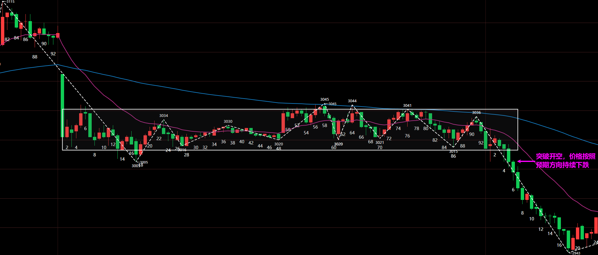

2.突破区间后对突破行为50%左右的回调，随后仍旧按照预期运动。

> [!IMPORTANT]
>
> 回调类型：一般是反向K线或反向段作为回调。

如图是纯碱2605合约5分钟走势图，可以看到交易区间范围是1241~1252，以大阴线突破交易区间下轨，但并不是连续阴线，而是出现几根反向K线构成次级别回调到50%位置，随后价格按预期方向运动的。

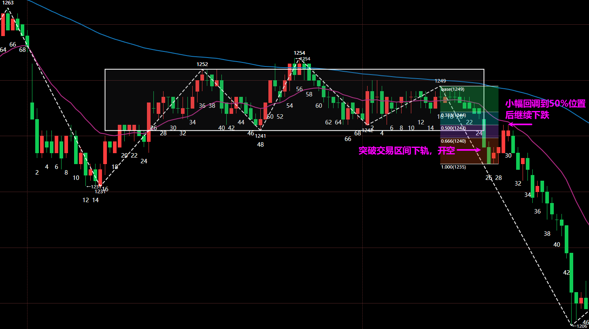

如图是氧化铝2605合约5分钟走势图，可以看到交易区间在2926~2950，以大阴线突破交易区间下轨，由于阴线的下影线较长，所以可以等待一根K线后再开仓。开仓后价格回调到50%位置就停止了，空单可以继续拿着，最终价格按照预期下跌。

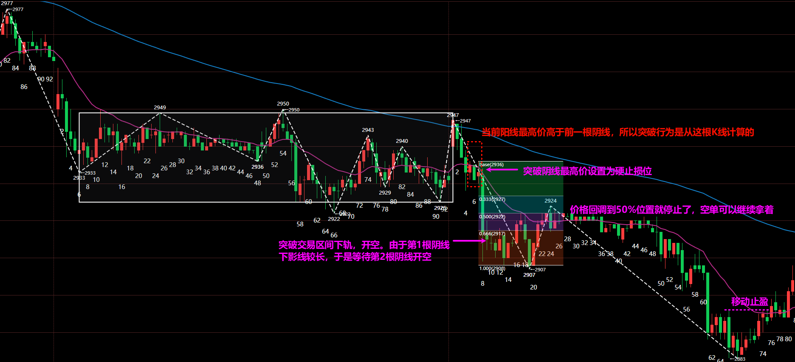

3.突破区间后价格开始反向，最终突破失败，追单会被套牢。

如图是纯碱2605合约5分钟走势图，可以看到交易区间范围是1233~1257，大阴线突破交易区间下轨，但最终价格反而上涨，这时候开的空单被套牢。

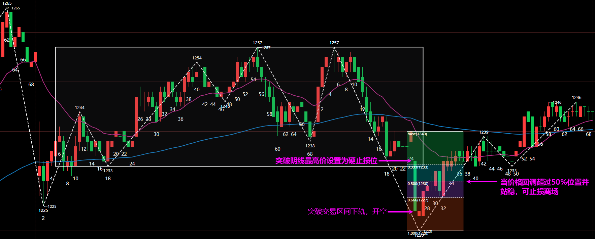

#### 操作交易区间

交易区间也是多段结构，在交易区间上1/3做空，下1/3做多，短线交易，此时要快进快出，有一点利润就离场。

对于窄幅交易区间，是限价单市场，所以我觉得可以不操作，而**能操作的是宽幅交易区间**。

> [!TIP]
>
> 左侧背景：宽幅交易区间
>
> 开仓信号：
>
> - 价格处于区间上1/3：对上涨段基准位实体反向突破开空
> - 价格处于区间下1/3：对下跌段基准位实体反向突破开多
>
> 硬止损：段的高低点。
>
> 止盈：
>
> - 跟随移动止盈
> - 限价单：交易区间上下轨挂止盈限价单

如图是沪铝2604合约5分钟走势图，绘制出交易区间后，操作高抛低吸，由于是在交易区间，所以不能奢求利润太多，价格能到另外一边1/3区域则可止盈离场。

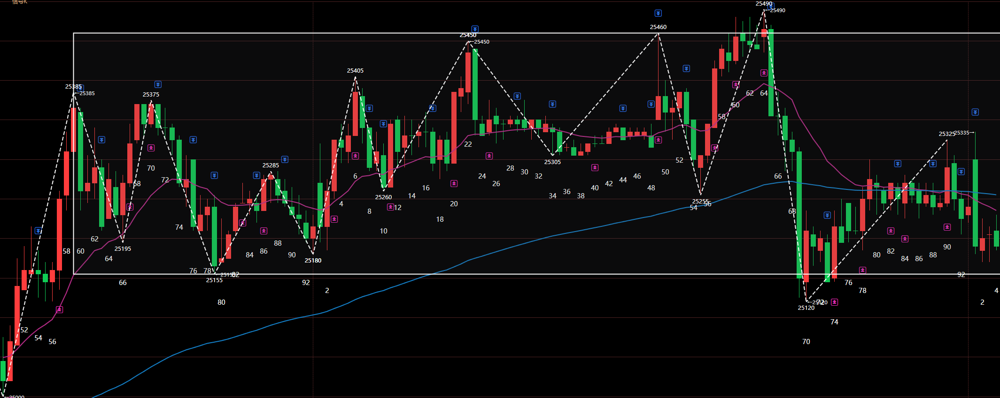

#### 操作主趋势反转

主趋势在更高级别看其实就是一段结构，也就是窄通道，但在本级别看是多段结构，因此当出现主趋势反转的左侧图形时，就是开反向单，赌主趋势方向反转。

> [!tip]
>
> 左侧背景：
>
> - 价格原先以`价格>EMA120`状态运行，当前位置开始回补EMA120并受到支撑，出现主趋势反转的左侧图形，于是开多。
> - 价格原先以`价格<EMA120`状态运行，当前位置开始回补EMA120并受到压力，出现主趋势反转的左侧图形，于是开空。
>
> 开仓信号：
>
> - EMA阻力+对基准位实体反向突破
>
> 硬止损：
>
> - 段的高低点
>
> 止盈：
>
> - 跟随移动止盈

如图是焦煤2605合约30分钟走势图，价格本来在EMA120上方运行的，当前位置开始回补EMA120，并出现三推楔形，因此可开多赌大级别下跌段的结束，开启新的大级别上涨段。

> [!CAUTION]
>
> 值得注意的是，操作主趋势反转，要操作回调段的反转，而不是推动段的反转。

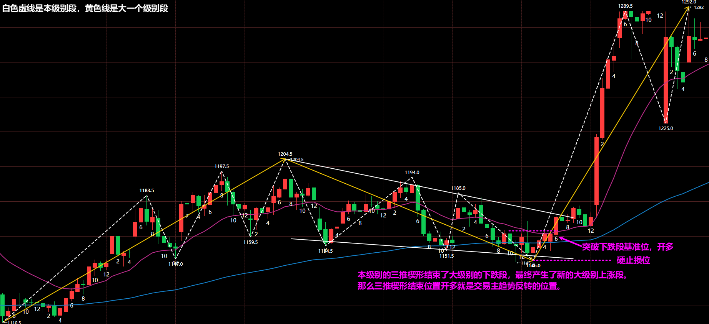

### 市场充满诱惑

#### 1.异向的突破

如图所示也是突破，可以看到是阳线构成的向上突破，收盘价<EMA20<EMA120，**突破方向与均线排列方向不一致，所以是不能操作的**。

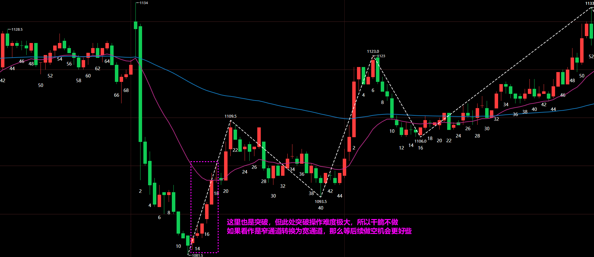

#### 2.逆势操作主趋势反转

我在早期交易热衷于抄底摸顶，由于是做主趋势反转，一旦做成之后就是爆赚，但胜率极低。30分钟周期处于较强时间的上涨，通过5分钟的段结构找主趋势反转抄底是极其错误的！正确操作应该是顺着30分钟周期方向每次回调后开空。

如图是玻璃2605合约5分钟走势图，可以看到顶部是出现头肩顶结构了，但该处是不适合做空的，胜率特别低！不要去抄底摸顶。

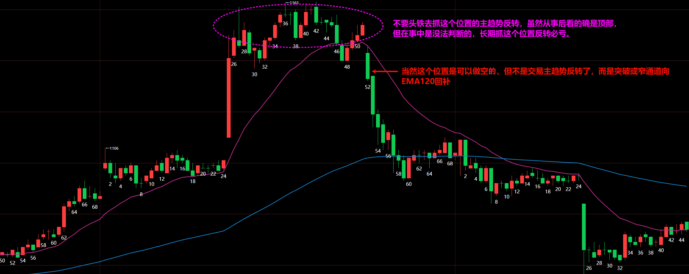

如图是玻璃2605合约30分钟走势图，可以看到是个宽通道上涨，那么头铁位置不能摸顶做空，而标箭头位置受到30分钟的EMA20支撑，可择机做多。

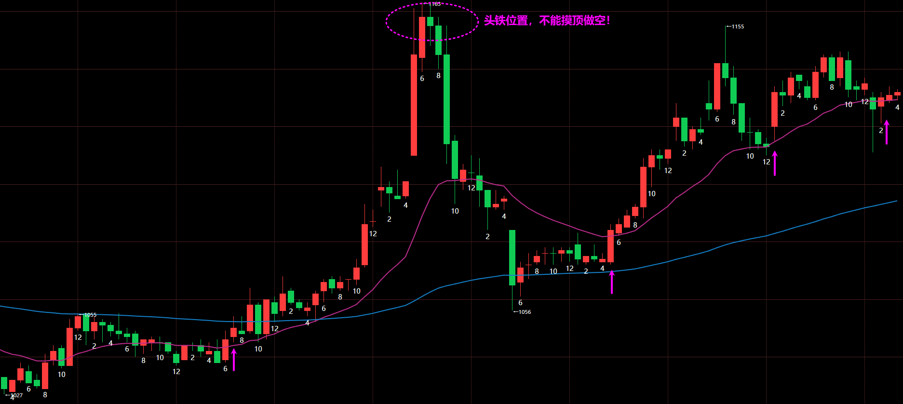

#### 3.使用错误的交易模式

在某些时候，会忘记某种交易模式的必要条件，看错成其他模式，导致最终亏损。

如图是氧化铝2605合约，在之前交易时候，误认为是操作宽通道，但仔细观察可发现，开仓点位置是**高于上一个阶段性高点**的，即2973高于2966，所以这个位置就不符合宽通道特征了。当前位置符合交易区间的特征，应该使用交易区间的操作模式。

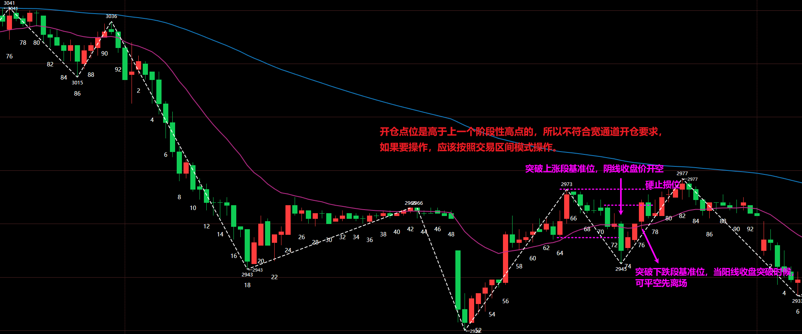

#### 4.没按开仓信号提前入场

很多时候按照开仓信号入场，会错过一些机会，但从整体而言，遵守开平仓信号会过滤掉更多不值得操作的似是而非的机会，所以按照开仓信号入场非常重要，而按照平仓信号则是为了保住利润。

如图是氧化铝2605合约5分钟走势图，可以看到在指定位置是开了空单的，但不符合开仓信号，因为收盘价并没有覆盖基准位，所以这单交易本来就不应该操作的，就不会有后续的亏损。

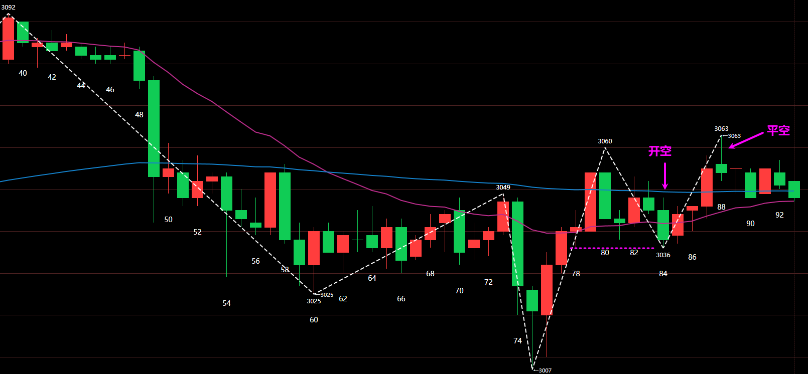

### 仓位管理

## 风险控制

### 风险的来源

交易的风险我认为主要就来源于2方面：

1. 市场出现剧烈波动，使得交易者短时间难以反应过来，多为隔夜跳空、暴涨暴跌。
2. 交易者自身状态偏离，开始情绪化交易，而非遵循交易系统原则。

### 隔夜持仓风险

做日内交易，每天15:00收盘、23:00收盘前要把所有单子都平仓，外盘的原油、金银、有色都是在运转的，**隔夜跳空风险主要来源于外盘和收盘后的消息**。

> [!CAUTION]
>
> 隔夜持仓意味着要承担无法预测的跳空风险，而**跳空往往会造成扛单**。

2026/3/23下午，我开仓了氧化铝2605合约的多单，开仓时候价格在EMA120上方，同时受到EMA20支撑，所以操作的是宽通道模式，预期后续上涨，当天收盘没有平仓，就拿着预期夜盘跳空高开。

但不幸的是，氧化铝在夜盘时候大幅度跳空低开并在5分钟收盘大阴线，账户出现爆亏，当天非常不舒服，以至于报复性开仓了纯碱，导致另一笔亏损。

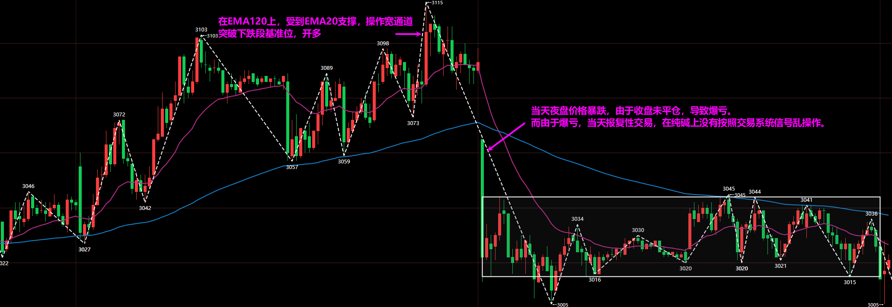

2026/3/27下午，我开仓了不锈钢2605合约多单，开仓时候以为是对交易区间突破后回撤，预期后续上涨，由于是接近收盘时间开仓，所以没有平仓。

不幸的是，不锈钢在夜盘开始15分钟连续下跌，此时开始了扛单，期望价格回升，但最终还是没有回到成本线，最终是超出成本的亏损离场。

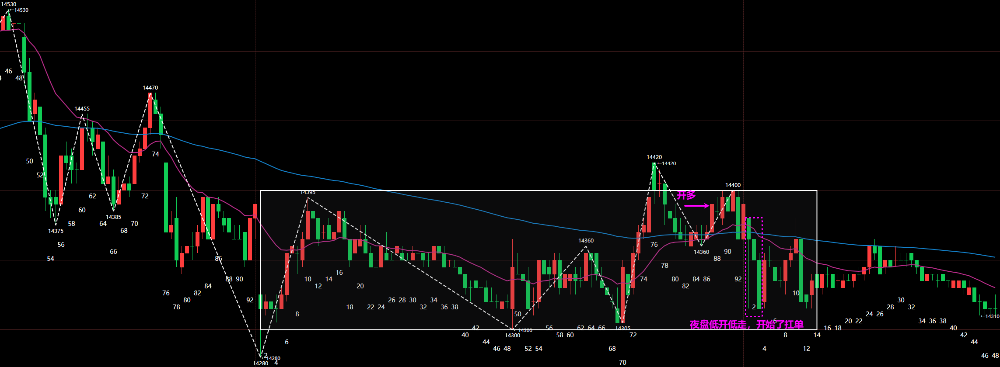

### 交易者心理状态风险

除了市场本身的风险，那么所有的风险就来源于人性，即交易者本身。很多时候从时候看就明明不该去做，但在当时就那样做的，是人性驱使着去那么做的，所有说**交易者自身的心理状态是非常重要的**！其重要性甚至大于市场本身。

#### 心理的不适感

交易中最难是等待，等待分为两个部分，一个是等待交易机会出现，另一个是等待行情演变。

做日内交易，盯盘找机会，因此需要等待，很多时候等待一个开仓机会，需要较长时间，这个过程是未持仓的，所以其实还好。而很多时候盲目开仓，是因为其他交易单亏损较多或者赚钱了开始得瑟，受情绪控制而不按交易系统开仓。所以这种情况相对容易控制些，本来没有持仓，如果心理不适，就不做罢了。难的是持仓等待行情演变，开仓了就有了心理成本，但价格不一定总是按照预期较大幅度运动。

开仓后浮亏，不爽！

开仓后上下震荡，感觉花那么长时间等待机会没结果，不爽！

浮盈后开始回撤，不爽！

连续亏损，非常不爽！

**亏损造成的心理极度不适感才是在这个市场大多数人亏损的原因**。这种亏损不仅仅是账户金额上，还有等待开仓和持仓盯盘的时间成本，忙活了这么久，最终一毛没赚，反而亏了，就会很不爽。

在持仓过程中，只有一种情况是爽的，那就是价格按照预期方向较大幅度运动，账户开始大幅浮盈，觉得努力没有白费。其他时候都是不爽的，最终就是没有很快浮盈就会不爽。但可惜的是，市场出现突破和窄通道的时机毕竟占少数情况，大部分情况就是宽通道和交易区间，所以大部分情况心理就很不舒服。每次开仓，都是预期盈利的，这是废话，不预期盈利，难道预期亏损？可正是这些盈利预期导致自身情绪被牵着。

仔细想想，我舒不舒服，和市场行情走向有个屁关系，市场行情不会因为我的个人意志转移，那我所谓的情绪在交易中毫无价值，甚至是绊脚石。所以要放弃预期，不再关注每笔交易的得失，更应该去关注操作是否符合交易系统的标准，开仓结构、开仓信号符合不？平仓离场符合标准不？这才是最重要的。

#### 心理状态的失控

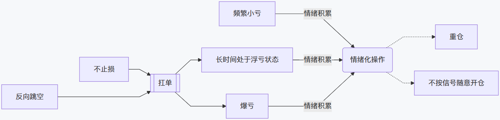

#### 每日定额止损

### 慢即是快

没有人能做到100%胜率，所以交易中必然有亏损单子，亏了就亏了，不必纠结，只要符合交易系统标准，那就是合理存在的。

在交易市场中，这三件事是由重到轻：

- 最重要的是少亏钱
- 次要的是赚钱
- 最不重要的是某次大赚

没有人能完美开仓在趋势启动位置，平仓在趋势完结位置，很多时候浪费一些行情也是很正常的。刻意的去纠结操作在完美位置，反而会造成操作变形，让系统变得过拟合。比起赚多少，更重要的是尽量少亏损，当亏损控制好了，回撤就控制好了，那么当盈利单出现，就会带动账户增长。

定额止盈和定额止损

