# 期货短线交易系统 v3 版

## 回调

### 回调的形成及要求

回调的形成：上涨/下跌 **趋势** 中，多头/空头投资者为了防止风险过大会逐步获利了结，市场就会出现回调，并可能陷入横盘整理。

回调的最低要求：

- 上涨趋势中的回调：指某根 K 线的最低点低于前一根 K 线的最低点。
- 下跌趋势中的回调：指某根 K 线的最高点高于前一根 K 线的最高点。

回调交易的目的：**回调是趋势中的暂时停顿，为交易者提供高胜率的入场机会**。

### 回调的 3 种模式

1.反向 K 线作为回调

常见于窄通道行情，回调不足以改变趋势。因此回调是不错的入场点。

2.反向段作为回调

常见于宽通道行情，回调不足以改变趋势，但回调力度比反向 K 线更强。由于整体没有改变趋势，回调是不错的入场点。

3.反向通道作为回调

出现反向通道或交易区间构成回调，这种回调在更高周期图上看就是反向段。出现反向通道时候，趋势方向其实已经改变了，这是站着更高周期看的。

如图是纸浆 2605 合约 5 分钟走势图，可以看到三种回调方式：

如图是纸浆 2605 合约 30 分钟走势图，可以看到在 5 分钟图上的反向通道构成的回调，在 30 分钟图上就是反向段。

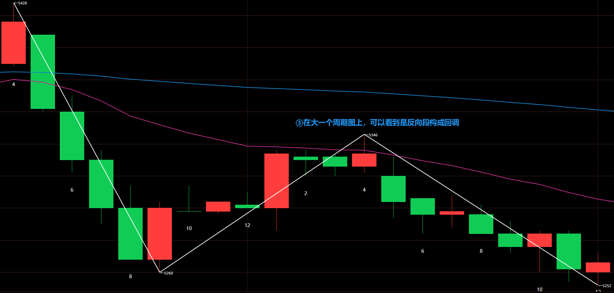

### 50%是回调的关键位置

核心逻辑：在一段趋势段的 50%位置，**顺势交易者和逆势交易者的潜在盈亏比是相同的**（1:1）（目标为前期高/低点，止损为波段起/终点）。

概率优势：在趋势背景下，顺势方的胜率更高（例如 60% vs 40%）。这使得 50%水平成为一个具有数学优势的、机构非常青睐的入场点。

应用：交易者常在上涨趋势的 50%回调位挂限价单买入，或在下降趋势的 50%反弹位挂限价单卖出。

## 市场结构定义

### 市场的 4 种状态

市场状态：

- 趋势
  - 突破：一段结构，方向明确，该段由 **一系列强趋势 K 构成**，K 线之间重叠很少，几乎没有回调。
  - 窄通道：一段结构，方向明确，该段 **回调短暂（1~3 根 K 线）且幅度浅**，回调依托于 EMA4（次级别 EMA20）。
  - 宽通道：多段结构，方向明确，段作为回调，回调依托于 EMA20。
- 盘整
  - 交易区间：多段结构，**方向不明**，持续 20 根 K 线以上整理，**80%突破尝试会失败**。

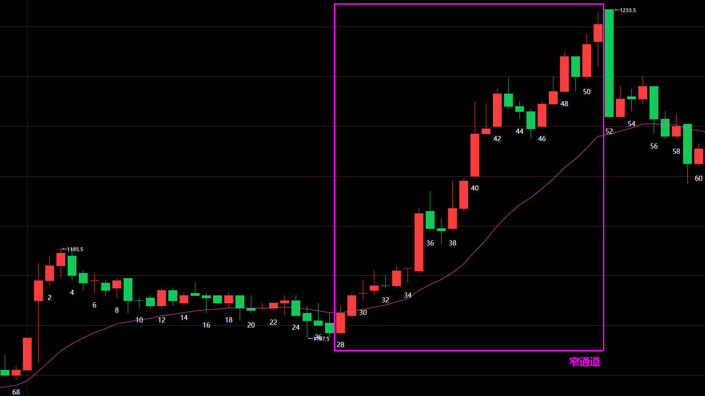

### 走势段

#### 段的起点定义

走势段起点的定义：选取最小级别图，在该图上以价格上穿下穿 EMA20，且顶底之间满足最少 5 根 K 线，就构成段。

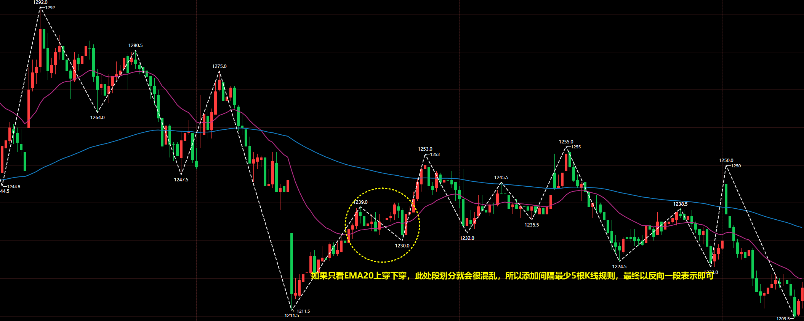

特殊处理：强势跳空也可以看作是一段。

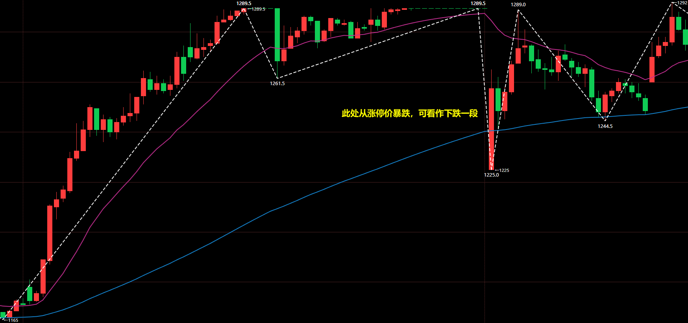

#### 递归段

定义好了段的起点，那么走势就能划分成一段一段的结构了，此时将段之间组合起来，就能构成市场状态。

而更大级别段，又是由多个市场状态组合而成的。

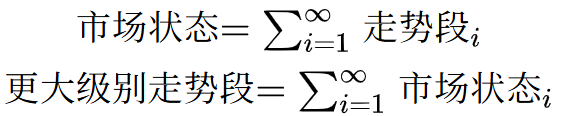

#### 市场状态视角的走势段

站在市场状态视角，它是由一个或多个走势段构成的，所以内部的走势段按照功能分为 3 种：趋势推动段、趋势回调段、区间内部段。

| 市场周期   | 特征                                                         |
| ---------- | ------------------------------------------------------------ |
| 趋势推动段 | 1.市场状态为突破或窄通道，当前段即是趋势推动段。 2.市场状态为宽通道，与通道方向相同，远离 EMA20 的段即是趋势推动段。 |
| 趋势回调段 | 1.市场状态为突破或窄通道，没有。 2.市场状态为宽通道，与通道方向相反，回到 EMA20 的段即是趋势回调段。 |
| 盘整内部段 | 市场状态为交易区间，无论上涨段还是下跌段，都是盘整内部段。   |

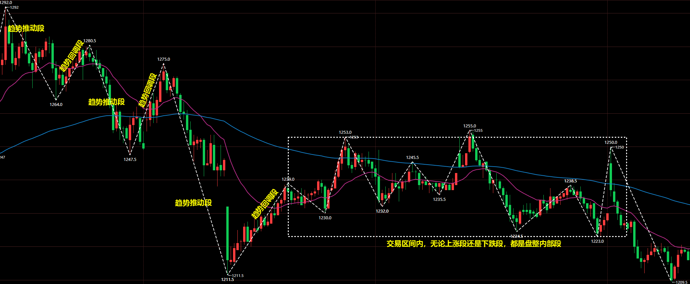

#### 走势段视角的市场状态

4 种市场状态，大类上就是趋势和盘整，盘整没有方向，趋势有上涨和下跌之分。那么 **当市场状态组合成更大级别走势段的最基本要求就是趋向相同**。

上涨走势段内部不能有下跌的市场状态，可以有盘整；下跌走势段内部不能有上涨的市场状态，可以有盘整。

> [!CAUTION]
>
> 注意：交易区间可以拆分给两个相反段进行划分，因为很多时候 **段的转向结点附近往往是次级别交易区间**。

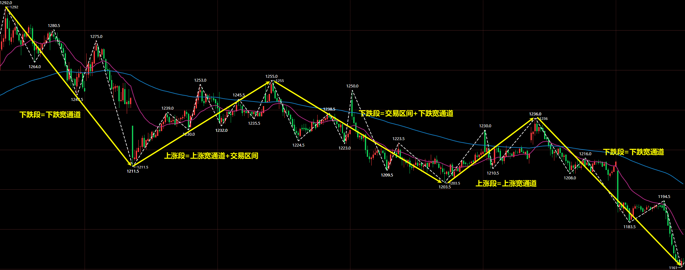

### 趋向性

#### 趋向性定义

趋向性定义：**特征序列重叠范围越大，趋向性越弱；特征序列重叠范围越小，趋向性越强。** 特征序列没有重叠范围，趋向性非常强。

趋向性排序：

1. 突破、窄通道
2. 回调构成的特征序列没有重叠的宽通道
3. 回调构成的特征序列小于 50%重叠的宽通道
4. 回调构成的特征序列大于 50%重叠的宽通道；交易区间

#### 宽通道和交易区间的界限

宽通道的特征序列重叠范围很小甚至没有，那就是非常标准的趋势状态，此时高低点非常明显的向同一个方向运动。

宽通道的特征序列重叠范围很大，趋向性弱，就更接近交易区间。

如图是甲醇 2605 合约 5 分钟走势图，可以看到可以有两种划分方式：

方式一：以上涨趋势看，高低点都抬高，所以交易区间以第一次破坏趋势条件进行划分。

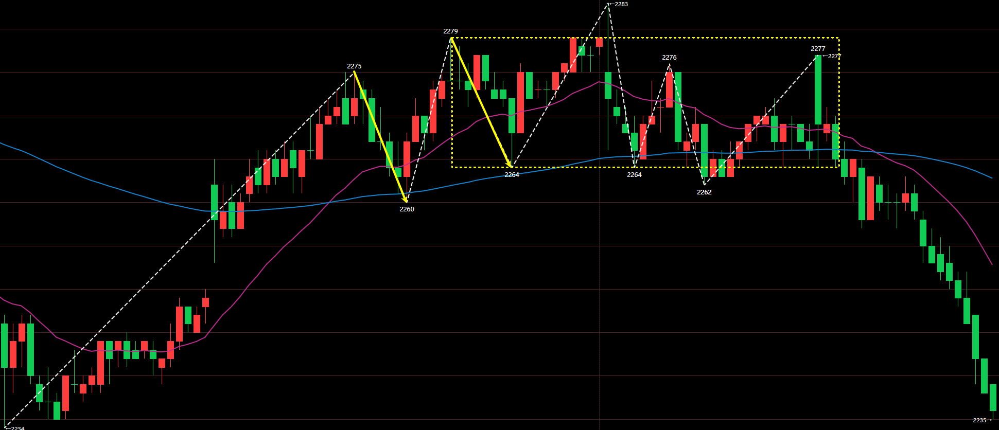

方式二：特征序列的重合度较高，所以也可以认为其包含在交易区间内部。

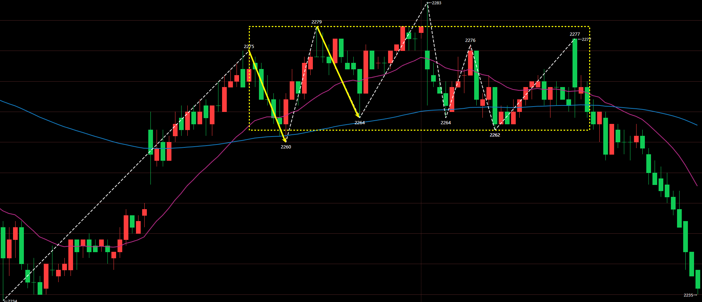

### 市场状态问题

#### 交易区间

##### 1.区间范围的动态确定

对于交易区间，范围 **上轨定义为次高点，下轨定义为次低点**。

**在上涨趋势中，以下跌段为起始段；在下跌趋势中，以上涨段为起始段。**

如图是纸浆 2605 合约 5 分钟走势图，到达 ① 时，高点低点都抬高，所以仍旧是宽通道；到达 ② 时，高点没有抬高了，此时开始构筑交易区间，区间为白色；到达 ③ 时，交易区间范围逐渐扩大，区间为黄色；到达 ⑤ 时，交易区间范围逐渐扩大，区间为紫红色。

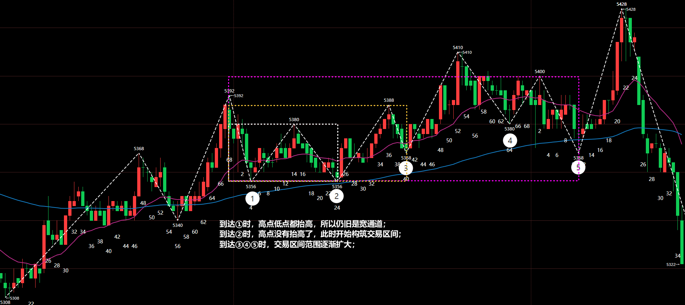

##### 2.划分的多义性

还是以上面的纸浆 2605 合约 5 分钟走势图为例，同一张图可以有多种划分方式，这些方式都是可以的。

由于斜率较小的宽通道和交易区间很近似，所以很多时候会有多种划分方式。

方式一：把前面两段划分给宽通道，交易区间范围缩小，价格可以看到大概在交易区间中运行，所以这种划分方式会更贴切走势一些。

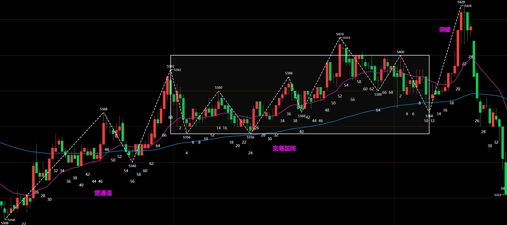

方式二：以中间某段连接两个交易区间，显示出价格重心上移的现象，也是可以的。

##### 3.交易区间常常突破失败

**在交易区间中，80%的突破会失败**。

某些时候看到价格经过两次上涨或下跌段要突破前高或前低时，会出现假突破导致价格重新回到交易区间中。

**在交易区间中，看到价格强势突破高低点后贸然追多或追空，会导致被套**。同时由于对高低点的突破，会让挂单的空头或多头止损离场。

#### 宽通道

##### 1.小心通道的第三推

- 宽通道作为牛旗熊旗

- 宽通道作为顶底

1.当宽通道作为牛旗时，反向通道作为回调，那么第三推意味着整个反向通道回调的结束。

### 走势段反转

走势段的划分对市场状态最基本要求就是趋向相同，绝大多数情况，**走势段终结（反转）的前兆就是当前方向的趋向性变弱**，而趋向性减弱无法是两种情况：

1. 市场状态由趋势转变为交易区间
2. 市场状态仍旧是趋势，但趋向性减弱

#### 1.三推楔形

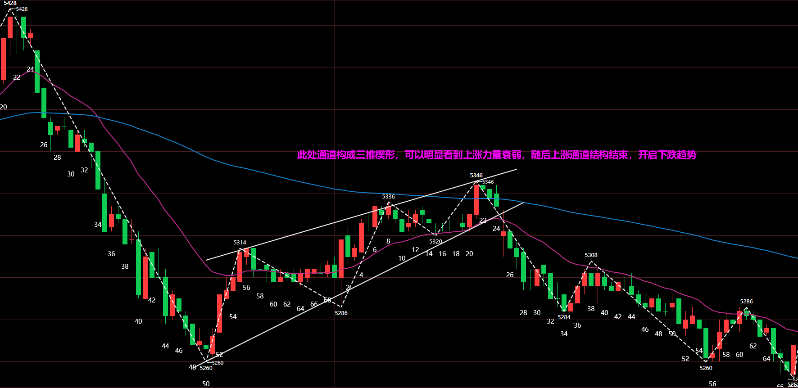

#### 2.头肩顶/头肩底

#### 3.突破交易区间后回拉

---

|                    | 5F 突破/窄通道                       | 5F 宽通道（特征序列重合 <=50%）                                                               | 5F宽通道（特征序列重合> 50%）                                                     | 5F 交易区间                       |
| ------------------ | ------------------------------------ | -------------------------------------------------------------------------------------------- | -------------------------------------------------------------------------------- | -------------------------------- |
| 30F 趋势推动段       | 顺趋势方向等 K 线回调操作              | 顺趋势方向等回调到 EMA20 操作                                                                 | 顺趋势方向等回调到 EMA20 操作                                                      | 不操作 |
| 30F 趋势回调段       | 关注 EMA120，价格突破该位置后出现反转图形操作 | 关注 EMA120，价格突破该位置后出现反转图形操作 | 关注 EMA120，价格突破该位置后出现反转图形操作 | 关注 EMA120，价格突破该位置后出现反转图形操作 |
| 30F 盘整内部段       | 1.上 1/3 只做空，下 1/3 只做多 2.在交易区间上下沿根据反转结构操作 | 1.上 1/3 只做空，下 1/3 只做多 2.在交易区间上下沿根据反转结构操作 | 1.上 1/3 只做空，下 1/3 只做多 2.在交易区间上下沿根据反转结构操作 | 不操作 |

> [!CAUTION]
>
> 注意：经和 ChatGPT 沟通，趋势回调段的顺段方向不操作，还有 5F 交易区间也不操作。

> [!TIP]
>
> 总结下就是：趋势推动段做顺势，趋势回调段做反转，盘整内部段做反转。
>
> 做反转就得看关键位有受阻迹象，趋势回调段是基于 EMA120，盘整内部段是基于交易区间上下轨。

## 交易操作

### 交易盈利的逻辑

在市场中，究竟因何而盈利，我思考了许久，得出了答案：市场惯性。就是说当前是宽通道上涨，那么后续大概率会延续这种上涨状态；当前市场是交易区间，那么后续大概率会在交易区间内上下运动，突破行为都是假突破，最终价格会回到交易区间中。那么操作方向就是市场惯性的方向。

但任何市场状态终究会结束，宽通道上涨会因为趋向性减弱变成交易区间，交易区间也会在某次真突破后变成通道，所以对 30F 状态的观察有一点是非常重要的，那就是当前状态有没有结束迹象。除此之外，在宽通道就是推动段做顺势，回调段做反转，而交易区间则是上轨空下轨多。

### 多级别分析

#### 小级别引领大级别理念是错误的

在早期学习缠论过程中，受到走势递归思想的影响，有种大小周期关联的想法，这种想法贯穿了我早期的交易理念：小周期引领大周期，大周期走势是由小周期递归形成的。

这种理念自然而然会生出一个问题：既然小周期引领大周期，那只关注小周期罢了，还看大周期有何意义？

于是为了回答这个问题，会以一种大周期走势限制小周期思路去看。但仔细想想，仍然是不对的，这种思路对于新趋势第一段是不适用的，此时大小周期的理念出现了矛盾。

其实周期本就是人主观设定的，从来没有小周期引领大周期，小的慢慢形成大的。压根就不存在时间角度的先后，大小周期变化两者的同时的，只不过这种变化在小周期是更明显些，就是说 **同一种变化在不同时间周期窗口的分割不同造成的显现差别。**

所以说 **<u>小周期引领或生长为大周期的理念根源上就是错误的</u>**，所以纠结这个注定是无用功。那么如何正确理解大小级别之间的关系呢？我觉得可以看作是整体和局部的关系。

#### 分析步骤

4H 市场状态--> 4H 构筑段--> 30F 市场状态--> 30F 构筑段--> 5F 市场状态--> 5F 构筑段

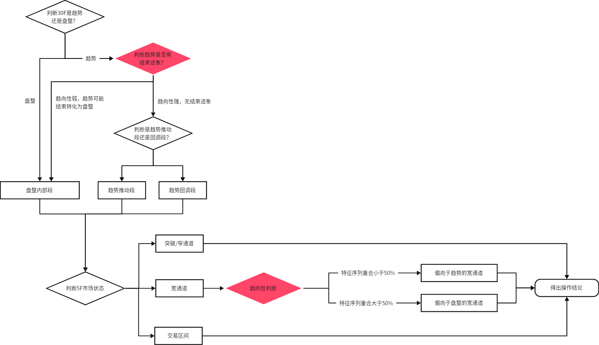

#### 操作分类

当前的 30F 走势段就分成了 3 类：

- 趋势推动段：交易顺势
- 趋势回调段：交易反转，在受到 5F 的 EMA120（30F 的 EMA20）阻力时候操作反转
- 盘整内部段：交易反转，在交易区间上 1/3 或下 1/3 操作反转。

开仓的三要素：

- 趋势：走势段将要运动的方向
- 阻力：EMA20、EMA120
- 信号：基准位实体突破、反转结构

### 开仓缘由和平仓缘由

#### 订单类型

| 订单类型 | 描述 | 使用场景 |
| -------- | ---- | -------- |
| 市价单   |      |          |
| 限价单   |      |          |
| 止损单   |      |          |

#### 基准位定义

上涨段：以倒数 1~3 根大阳线的最低点为基准位。

下跌段：以倒数 1~3 根大阴线的最高点为基准位。

#### 开仓：EMA 阻力+对基准位实体反向突破

开仓信号要同时符合如下两个条件：

1. 做多要在 EMA 受到支撑；做空要在 EMA 受到阻力。
2. 做多就是终结下跌段，因此 K 线收盘价高于基准位才能开多；做多就是终结上涨段，因此 K 线收盘价低于基准位才能开空。

如图是铁矿石 2609 合约，在宽通道的每次回调到 EMA20，都是可以择机做多的。

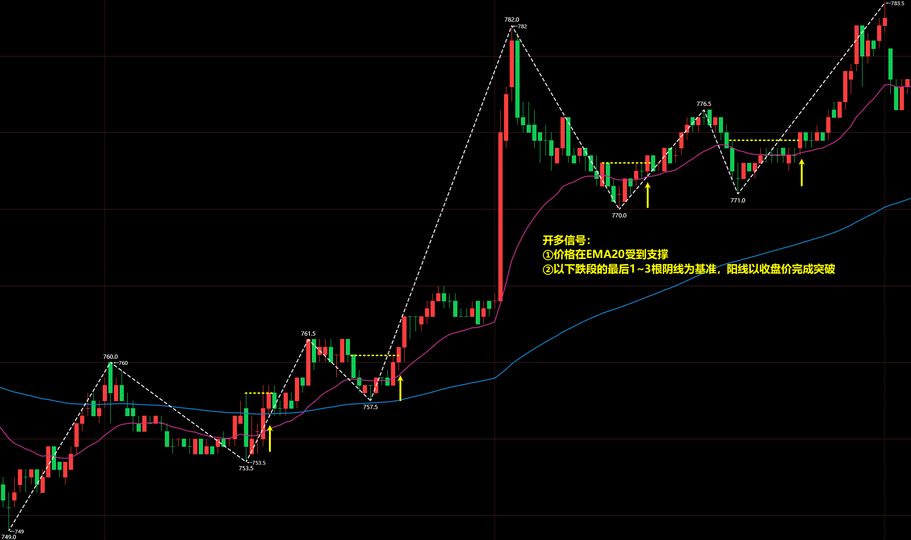

#### 开仓：EMA 阻力+反转结构

开仓信号要同时符合如下两个条件：

1. 做多要在 EMA 受到支撑；做空要在 EMA 受到阻力。
2. 出现反转图形结构。
   1. 三推楔形：楔形第三推反向开仓。
   2. 头肩顶/头肩顶：往往是交易区间，出现高点不新高，低点不新低，则可以开仓。
   3. 突破交易区间后回拉：回拉再次进入交易区间时候可开仓。

反转图形有三种，下图展示了两种：

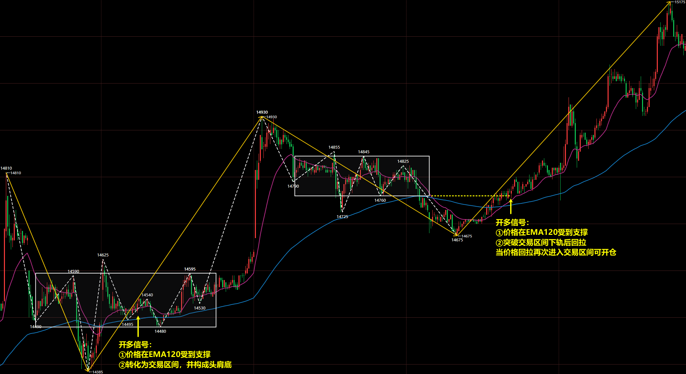

#### 平仓：跟随移动止盈

跟随移动止盈：观察基准处有没有被实体 K 线打到，如果 K 线收盘打到，那么就离场。

如图是烧碱 2605 合约 5 分钟走势图，可以看到：

① 处移动止盈位没有被打到。

② 处移动止盈位是插针打到，实体收盘价依然在其下方，所以不离场

③ 处移动止盈位被阳线实体打到，所以立刻离场。

#### 平仓：关键位置限价单离场

关键位置：

1. 前高或前低附近
2. 交易区间上下轨附近
3. EMA

如图是甲醇 2605 合约 5 分钟走势图，当持仓空单操作对 EMA120 的回补时，可在 EMA120 下方挂止盈单，这样价格下跌到该位置会限价单离场。

### 30F 趋势推动段

交易趋势回调段的关键在于能否在 EMA20 成功受到阻力。

#### 5F 宽通道

> [!TIP]
>
> 左侧背景：
>
> - 30F 市场状态：窄通道、宽通道
> - 30F 走势段：趋势推动段
> - 5F 市场状态：宽通道
>
> 开仓信号：
>
> - EMA20 阻力+对基准位实体反向突破
>
> 硬止损线：段的高低点
>
> 止盈：
>
> - 跟随移动止盈
> - 关键位置限价单离场

如图是铁矿石 2609 合约，30F 市场状态是窄通道，当前是 30F 上涨趋势推动段。价格走到 ① 处，5F 是非常标准的宽通道，所以可按照交易系统开多。

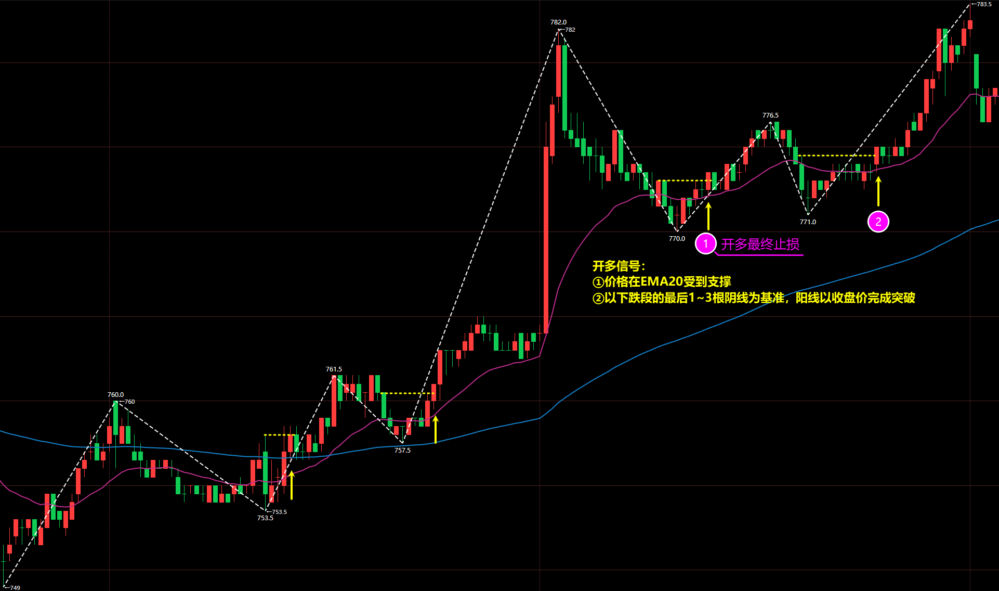

#### 5F 交易区间

> [!TIP]
>
> 左侧背景：
>
> - 30F 市场状态：窄通道、宽通道
> - 30F 走势段：趋势推动段
> - 5F 市场状态：交易区间
>
> 开仓信号：
>
> - 首次特征序列重叠可操作，后续不行
> - 顺推动段方向突破交易区间
> - 可选：交易区间挂推动段方向的限价单
>
> 硬止损线：段的高低点
>
> 止盈：
>
> - 跟随移动止盈
> - 关键位置限价单离场

上图的铁矿石 2609 合约，② 处看到的就是 5F 交易区间了，由于 **② 处低点要比 ① 处高**，且是 **首次特征序列重叠**，所以可再次开多。

如果是 5F 交易区间，多次出现特征序列重叠，那么就不操作，或者选择在交易区间下轨挂限价单入场。

---

如图是乙二醇 2605 合约，30F 市场状态是宽通道，当前是 30F 上涨趋势推动段。价格形成了 5F 交易区间，那么首次特征序列重叠位置是可以开多的，但后续就不要操作了。最终价格经过 5F 交易区间后转为了下跌。

> [!CAUTION]
>
> 交易区间形成时间越久，多空突破的概率越均等，所以首次特征序列重叠可操作，后续就不能。

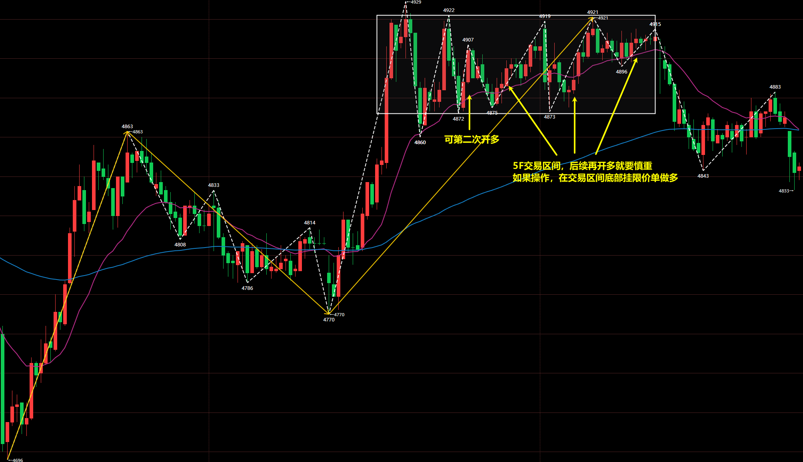

### 30F 趋势回调段

交易趋势回调段的关键在于能否在 EMA120 成功受到阻力，并且出现反转结构。

#### 5F 宽通道

> [!TIP]
>
> 左侧背景：
>
> - 30F 市场状态：宽通道
> - 30F 走势段：趋势回调段
> - 5F 市场状态：宽通道
>
> 开仓信号：
>
> - EMA120 阻力+反转结构
>
> 硬止损线：段的高低点
>
> 止盈：
>
> - 跟随移动止盈
> - 关键位置限价单离场

如图是乙二醇 2605 合约，开仓位置价格开始回调，并在 EMA120 受到支撑，形成三推楔形反转结构，因此可开多，交易趋势回调段的反转。

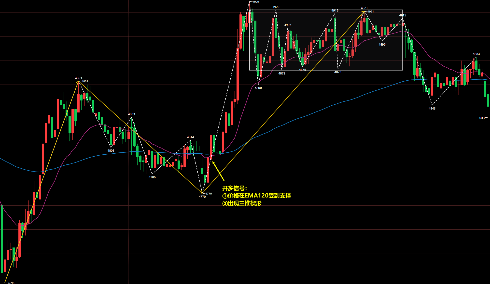

#### 5F 交易区间

> [!TIP]
>
> 左侧背景：
>
> - 30F 市场状态：宽通道
> - 30F 走势段：趋势回调段
> - 5F 市场状态：交易区间
>
> 开仓信号：
>
> - EMA120 阻力+反转结构
>
> 硬止损线：段的高低点
>
> 止盈：
>
> - 跟随移动止盈
> - 关键位置限价单离场

如图是不锈钢 2606 合约，在第一个位置，价格回调到 EMA120 受到支撑，出现头肩底，所以可开多，但可惜失败了。随后价格走强，确定在 EMA120 受到支撑，所以突破交易区间上轨是可以再次开多的。

第二个位置，价格回调到 MA120 受到支撑，价格突破交易区间下轨并迅速拉回，当价格回到交易区间内部时候，可以开多。

### 30F 盘整内部段

