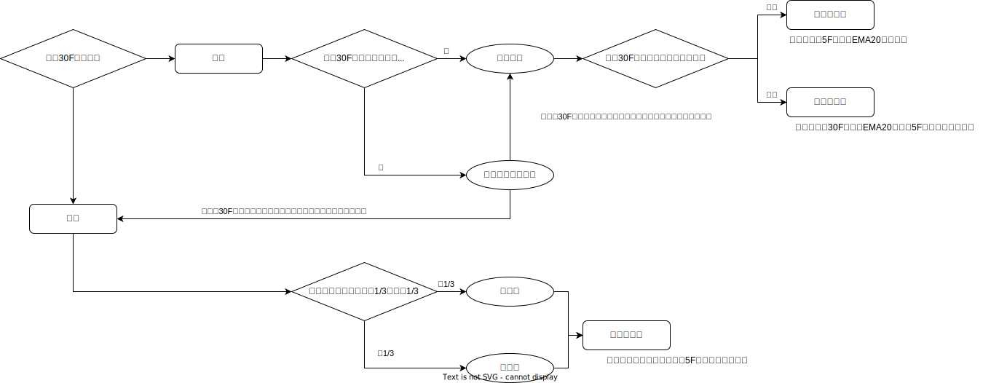
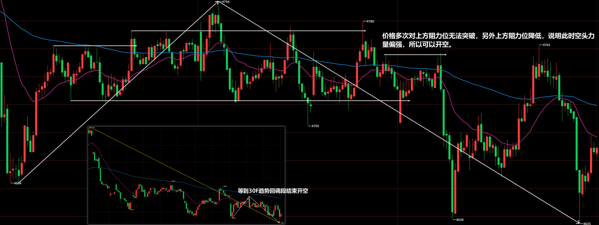
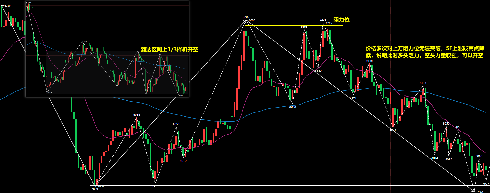

# 期货短线交易系统 v4 版

## 市场结构定义

### 市场的 4 种状态

市场状态：

- 趋势
  - 突破：一段结构，方向明确，该段由 **一系列强趋势 K 构成**，K 线之间重叠很少，几乎没有回调。
  - 窄通道：一段结构，方向明确，该段 **回调短暂（1~3 根 K 线）且幅度浅**，回调依托于 EMA4（次级别 EMA20）。
  - 宽通道：多段结构，方向明确，段作为回调，回调依托于 EMA20。
- 盘整
  - 交易区间：多段结构，**方向不明**，持续 20 根 K 线以上整理，**80%突破尝试会失败**。

### 走势段

## 回调

### 回调的形成及要求

回调的形成：上涨/下跌 **趋势** 中，多头/空头投资者为了防止风险过大会逐步获利了结，市场就会出现回调，并可能陷入横盘整理。

回调的最低要求：

- 上涨趋势中的回调：指某根 K 线的最低点低于前一根 K 线的最低点。
- 下跌趋势中的回调：指某根 K 线的最高点高于前一根 K 线的最高点。

回调交易的目的：**回调是趋势中的暂时停顿，为交易者提供高胜率的入场机会**。

### 回调的三种模式

1.反向 K 线作为回调

常见于窄通道行情，回调不足以改变趋势。因此回调是不错的入场点。

2.反向段作为回调

常见于宽通道行情，回调不足以改变趋势，但回调力度比反向 K 线更强。由于整体没有改变趋势，回调是不错的入场点。

3.反向通道或交易区间作为回调

出现反向通道或交易区间构成回调，这种回调在更高周期图上看就是反向段。出现反向通道时候，趋势方向其实已经改变了，这是站在更高周期看的。

## 动力学

### 冲力

```
0:0;

// 观察的K线根数，可调整（如5、10、14
N:=9;
净动能:= (2*C - H - L)/REF(C,1)*100;
总能耗:= SUM(ABS(净动能), N);
// 期末净动能百分比
价格净变化:= (C - REF(C,N)) / REF(C,N) * 100;
冲力系数:= IF(总能耗>0.01, 价格净变化 / 总能耗, 0);

// MACD参数
SHORT:=5;
LONG:=20;

冲力5日平滑: EMA(冲力系数, SHORT), COLORWHITE;
冲力20日平滑:= EMA(冲力系数, LONG), COLORYELLOW;
DIFF:= 冲力5日平滑 - 冲力20日平滑, COLORRED;
DEA:= EMA(DIFF, N), COLORGREEN;
冲力变化速率: (DIFF - DEA) * 2, COLORGRAY;

冲力变化速率死叉零轴:= 冲力变化速率<=0 AND REF(冲力变化速率, 1)>0;
冲力变化速率金叉零轴:= 冲力变化速率>=0 AND REF(冲力变化速率, 1)<0;
DRAWICON(冲力变化速率死叉零轴, 冲力5日平滑, 'ICO4');
DRAWICON(冲力变化速率金叉零轴, 冲力5日平滑, 'ICO3');
```

### 假突破和真突破

假突破定义：价格对某一价位突破后失败，又回到原先位置。

市场中充满了假突破，可以说大部分突破行为最终都是假突破，在假突破位置追涨杀跌，就会被套住，然后频繁止损。**假突破能实现流动性清洗，让本来持仓的单子被迫挂单成交。**


真突破：价格对某一价格突破后短时间内没用再回到原先位置。

真突破出现时候往往是两种情况：

1. 价格以大阳线或大阴线突破，随后价格走了很远没回来。
2. 价格突破后出现 K 线回调，最终走了很远没回来。


### 水平阻力位的价格行为

阻力位定义：**价格两次以上** 到达同一水平位置价格受阻。

受阻行为：价格到达某一关键水平位置后出现假突破，K 线会出现长上影线/长下影线，或者 2~3 根反包 K 线。

**阻力位附近的价格行为观察是非常重要的**！因为价格可能突破，也可能再次受阻导致价格反向。


### 交易区间的力量分析

1.到达阻力位后返回，说明维持 **均衡** 交易区间状态

2.**下跌段低点未接触到下方阻力位就返回，说明偏多；上涨段高度未接触到上方阻力位就返回，说明偏空。阻力位抬高，说明偏多；阻力位降低，说明偏空。**【主要判断力量不均衡的方式】

如图是 PTA2609 合约 5 分钟走势图，可以看到在两个阻力位限定的交易区间内部，出现下跌段未接触下方阻力位就返回，说明偏多。


如图是焦煤 2609 合约 5 分钟走势图，可以看到是交易区间，价格以突破后，**支阻互换且低点抬高，说明多头偏强**，是不错的开多位置。


3.穿过阻力位置，构成真突破

如图是菜油 2609 合约 5 分钟走势图，① 处出现真突破上破阻力位，说明多头偏强。随后在 ② 处构建了新的上方阻力位，相对于之前上方阻力位抬高，说明多头偏强。那么此时是绝对不能做空的。


### EMA 阻力位

在趋势行情中，5F 的 EMA20、30F 的 EMA20 是可以作为本级别的阻力位的，宽通道的回调往往是到达 EMA20 受阻后继续延续之前方向运动。

> [!CAUTION]
>
> 在盘整行情中，不能使用 EMA 阻力位。

如图是菜油 2609 合约 5 分钟走势图，可以看到是一段非常明显的趋势行情，虽然后续趋向性不断衰弱，但仍旧是在回调到 EMA20 受阻后继续维持上涨趋势的。


### 阻力和反转

## 交易操作

### 操作视角的确定



根据流程图最终就是确定为三种操作：

- 趋势推动段：5F 回调到 EMA20 受阻开仓。
- 趋势回调段：30F 回调到 EMA120 受阻开仓，操作 5F 反转结构。
- 区间内部段：交易区间上 1/3 或下 1/3，5F 出现反转结构开仓。

### 反转结构

#### 1.三推楔形

三推楔形的特点是斜率较小的宽通道，且最后一推要构成假突破，当符合这样的结构时候，预示着反转。

如图是豆一 2609 合约 30F 走势图，可以看到 4H 回调段经过 30F 构成的三推楔形完成终结，最终迎来一段较大幅度的上涨。


#### 2.交易区间过渡

大部分时候，30F 走势段反转时候内部的 5F 结构会经历交易区间的纠缠才会选择方向。**在 5F 交易区间过渡时候，不要匆匆忙忙的开仓，要等到旧力量衰弱，新力量增强的时候开仓。**

以反转做空为例，要满足 2 个条件：

1. 价格多次对上方阻力位无法突破
2. 上方阻力位降低，或者 5F 线段高点降低

如图是乙二醇 2609 合约走势图，可以观察到 30F 的趋势回调段结束是经历了较长时间的交易区间的，那么明确的开仓信号就是价格 **多次对上方阻力位无法突破，上方阻力位降低的时候**，此时说明空头的压制较强甚至得寸进尺，多头力量此时很弱，于是可开空。



如图是塑料 2609 合约走势图，可以观察到 30F 的上涨区间内部段的结束是经历交易区间的。当价格 **多次对上方阻力位无法突破，5F 上涨段高点降低的时候**，说明多头乏力，空头力量较强，可以开空。



#### 3.突破交易区间后回拉

有些时候，价格会突破交易区间然后会拉，从 K 线间隔数量上看又不是假突破，但是有假突破的意味的，就是流动性清洗。当价格后续回到区间内时候则可以开仓。

如图是不锈钢 2607 合约 5F 走势图，可以看到价格下破交易区间下轨间隔一段时间后回拉，此时可开多。


### 开仓缘由和平仓缘由

#### 基准位定义

上涨段：以倒数 1~3 根大阳线的最低点为基准位。

下跌段：以倒数 1~3 根大阴线的最高点为基准位。

#### 开仓：EMA20 阻力+对基准位实体反向突破

开仓信号要同时符合如下两个条件：

1. 做多要在 EMA 受到支撑；做空要在 EMA 受到阻力。
2. 做多就是终结下跌段，因此 K 线收盘价高于基准位才能开多；做空就是终结上涨段，因此 K 线收盘价低于基准位才能开空。

如图是铁矿石 2609 合约，在宽通道的每次回调到 EMA20，都是可以择机做多的。


#### 开仓：EMA120 阻力+反转结构

开仓信号要同时符合如下两个条件：

1. 做多要在 EMA 受到支撑；做空要在 EMA 受到阻力。
2. 出现反转图形结构。

#### 平仓：跟随移动止盈

跟随移动止盈：

- 目标持仓 5F 线段：基准网被反向打到就要止盈离场。
- 目标持仓 30F 线段：等到 5F 走势受到阻力。

#### 平仓：关键位置限价单离场

关键位置：

1. 线段的高低点
2. 交易区间上下轨附近
3. EMA

### 开仓模式

#### 趋势推动段

#### 趋势回调段

#### 区间内部段

#### （假突破）趋势回调段转区间内部段

#### （真突破）区间内部段转趋势推动段

