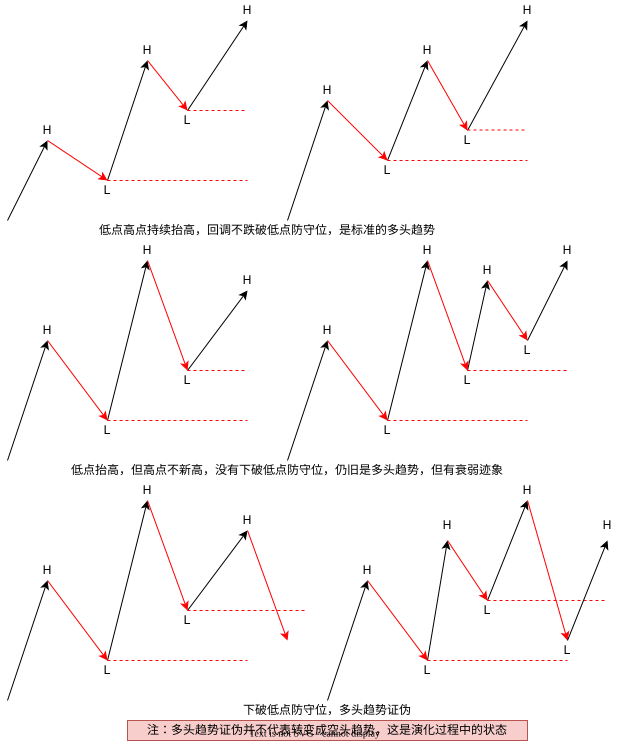
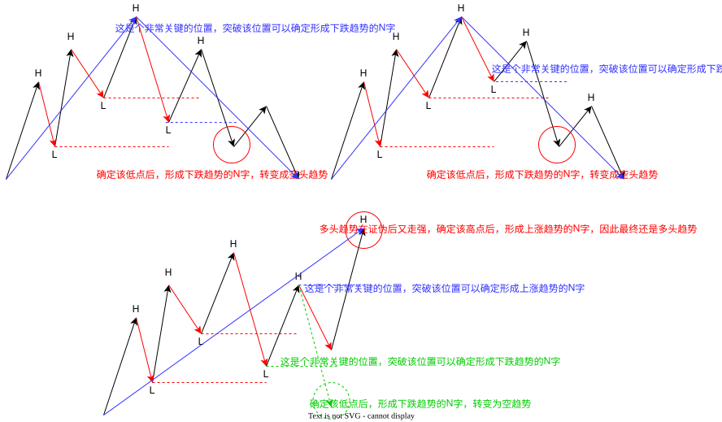
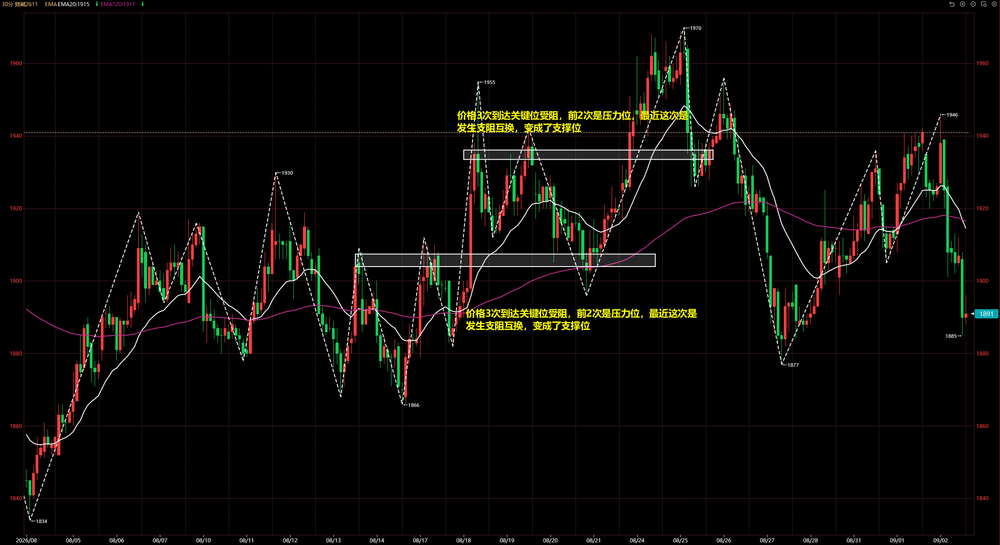
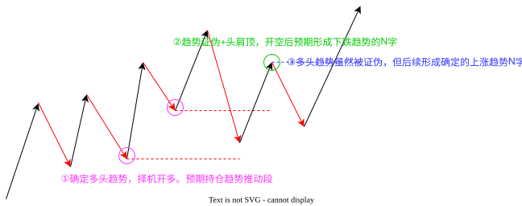
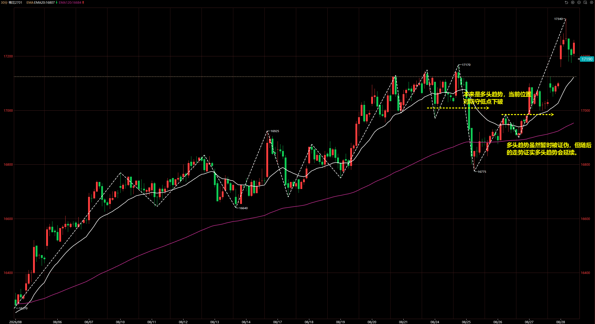
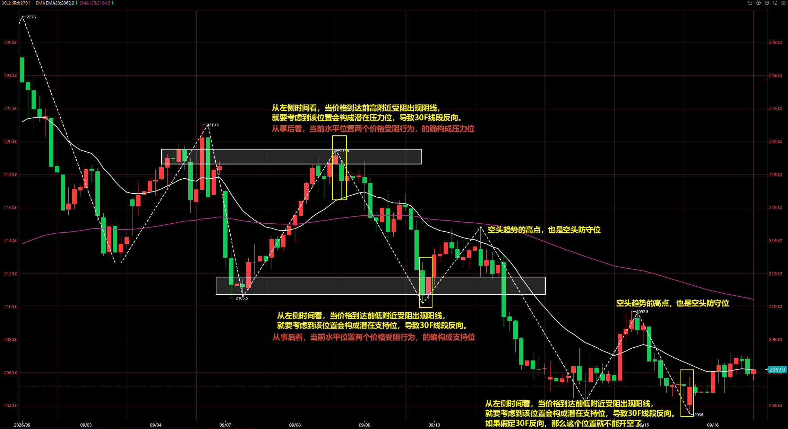
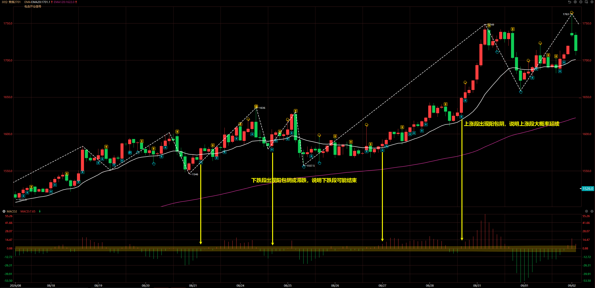

# 趋势交易系统 v7 版

## 价格图形

### 线段定义

### 走势方向划分

多头趋势定义：低点高点都持续抬高，回调不跌破低点防守位。

空头趋势定义：低点高点都持续降低，回调不突破高点防守位。



当某个方向的 **趋势证伪后，不代表转变为另一个方向的趋势，而是趋势转变的中间演化态。证伪的趋势在后续仍有可能继续在之前的趋势方向延续。**




### 关键位

关键位定义：**价格独立两次以上** 到达同一水平位置价格受阻。

受阻行为：价格到达某一关键水平位置后出现假突破，K 线会出现长上影线/长下影线，或者 2~3 根反包 K 线。

支阻互换：一个区域如果曾经作为压力位阻止价格上行，后来被突破，之后再次回踩并转为支撑，意味着多空双方在该区域上完成了一次结构身份的互换。

如图是烧碱 2611 合约 30F 走势，可以观察到两处位置都是价格 3 次到达关键位受阻，前 2 次是压力位，最近这次是发生支阻互换，变成了支撑位。



## 持仓量

持仓量分析最重要的是行为一致性，当持仓量行为出现不一致的时候，操作需要慎重！

## 交易操作

### 大级别

#### 走势结构

① 确定趋势

当前是 **非常明确的多头或空头趋势行情，始终没有真突破防线。那么只单向操作，等待趋势回调段结束，或者在趋势推动段中途上车。**

② 趋势证伪+头肩顶/头肩底

趋势关键防线被突破，也就是 **趋势被证伪，后续构成头肩顶或头肩底，可择机交易反转**。

多头趋势的防守低点被下破，多头趋势被证伪。随后的上涨段高点低于前高，此时构成头肩顶，在右肩可开空。

空头趋势的防守高点被上破，空头趋势被证伪。随后的下跌段高点高于前低，此时构成头肩底，在右肩可开多。

③ 趋势证伪后延续

趋势关键防线被突破，也就是 **趋势被证伪，但随后形成确定 N 字结构延续之前的趋势。**

多头趋势的防守低点被下破，多头趋势被证伪。空头的进攻未能创下新的低点，反而形成多头的 N 字结构，此时说明多头趋势虽然阶段性证伪，但后续仍旧回到多头趋势状态，因此可开多。



如图是棉花 2701 的 30F 走势，可以看到本来是多头趋势的，但防守低点被下破后就不能做多了，也不能做空。到达 16755 后开始一段上涨，而该 30F 上涨段结束是可以开空的，因为符合 ② 的开仓结构。

随后价格走强并形成上涨趋势的 N 字，所以看作是又回到多头趋势状态，符合 ③ 开仓结构，所以可择机开多。



#### 重点关注的关键价位

① 已有标准阻力位

由至少两次独立的价格受阻行为构成已有的标准阻力位。

② 线段高低点，潜在形成阻力位

当价格到达线段高低点时候，要小心在该位置是否受阻，进而导致线段反向。



#### 进入自选池

通过下面的麦语言代码在主图标记受阻 K 线和包含 K 线：

```
十字星:=CLOSE=OPEN;

// 阳包阴线
最近阴线位置:=BARSLAST(ISDOWN OR 十字星);
最近阴线最低价:=REF(LOW, 最近阴线位置);
最近阴线最高价:=REF(HIGH, 最近阴线位置);
最近阴线实体高价:=REF(MAX(OPEN, CLOSE), 最近阴线位置);
阳包阴:=HIGH>最近阴线最高价 AND CLOSE>最近阴线实体高价;
// 首个阳包阴线
首个阳包阴:=阳包阴 AND BARSLASTCOUNT(阳包阴) <= 2;

// 阴包阳线
最近阳线位置:=BARSLAST(ISUP OR 十字星);
最近阳线最低价:=REF(LOW, 最近阳线位置);
最近阳线实体低价:=REF(MIN(OPEN, CLOSE), 最近阳线位置);
阴包阳:=LOW<最近阳线最低价 AND CLOSE<最近阳线实体低价;
// 首个阴包阳
首个阴包阳:=阴包阳 AND BARSLASTCOUNT(阴包阳) <= 1;

DRAWTEXT(首个阳包阴, LOW * 0.999, '⏫'), COLORFF00C6D1;
DRAWTEXT(首个阴包阳, HIGH * 1.001, '⏬'), COLORFFFFD000;

// 平均实体长度
实体高度:=ABS(OPEN - CLOSE);
平均实体高度:=MA(实体高度, 320);
// 上影线长度
上影线长度:=IF(ISUP, HIGH-CLOSE, HIGH-OPEN);
// 下影线长度
下影线长度:=IF(ISUP, OPEN-LOW, CLOSE-LOW);
// 是否长上影线
是否长上影线:=IF(上影线长度>2 * 平均实体高度, 1, 0);
// 是否长下影线
是否长下影线:=IF(下影线长度>2 * 平均实体高度, 1, 0);
DRAWTEXT(是否长下影线,LOW*0.999,'👆'),COLORFF00C6D1;
DRAWTEXT(是否长上影线,HIGH*1.001,'👇'),COLORFFFFD000;
```

大级别走势结构能确定操作方向，那么无非就是两种情况，以多头趋势为例：

① 当前是下跌段，那么当 **出现阳包阴或滞跌** 就加入自选。伴随 MACD 绿柱缩短更佳。

② 当前是上涨段，**不是阴包阳** 且 **离前高点较远** 就加入自选。MACD 可以是绿柱缩短、也可以是红柱变长，不能是红柱缩短。

无论是哪种，目标都是抓顺大级别方向的上涨段。



### 操作级别结构

#### 趋势结构

#### 阻力结构

### 开仓信号

### 止损和止盈

#### 初始止损

#### 移动止损

